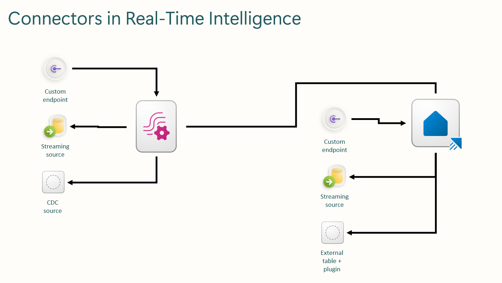

## Module 3 - Connectors

### Introduction

The Real-Time Intelligence suite in Microsoft Fabric has a lot of connectors. These connectors are in place to enable you to read data from a various number of sources.

The sources are mainly configured using the Eventstream service in a workspace. There is also a set of functionalities directly in the Eventhouse.

In this module, we will dive into the whereabouts of each methods and show you how to work with the different connectors. We will also discuss the technical details for each method (not all connectors) and show you what to take into account when working with the services.

### Architectural deep dive

The way the services in Eventstream is build, is based on a general approach to the standard services in Azure from:

- Azure EventHub: This service is the message broker for each message coming to the Eventstream and makes sure to accept the message and send it onwards to the Streaming Analytics service (if neeeded) or directly to the configured destination in the Eventstream.
- Azure EventGrid: This service is the role of listening to events happening (Storage Account Event, Workspace Events etc.) and send the messages and event details onwards to the EventHub for futher processing.
- Azure Streaming Analytics: This service can be utilized in the Eventstream, if you are implementing any transformations to the data flowing through the service. If you are not transforming the data, this service will not be used. Even though it is always provisioned, it might not actually be used.

These three services are the backbone of the Eventstream service and are provisioned based on streaming or event based sources. A detailed rundown of the Eventstream service will also be made later in Module 4 - Ingestion.

When selecting to create connectors, you have 3 options for each of the connector endpoints between Eventstream and Eventhouse. They are:

1. Custom endpoint
2. Streaming services
3. CDC (For Eventstream) / plugins (for Eventhouse)

As illustration it can look something like this:



#### Custom endpoint

When connection to a custom endpoint is made the internal EventHub is exposed and you get the connection information to use in the custom code to send data to the EventHub for Eventstream processing or directly to the Eventhouse for direct storage.

This connection is a PUSH connector - the connector accepts all incoming data and passes it on to the Eventstream

#### Streaming services

When a connection to a streaming service (like Googe pub/sub, Kafka, EventHub, etc.) the connection is created as a messaging connector directly to the Eventstream/Eventhouse.

This connection is a PULL connector - the Eventstream/Eventhouse is (on a clock frequense) reading data from the source.

#### CDC (Eventstream only)

Implementing Change Data Capture (CDC) involves integrating real-time data streams from various sources into the platform for continuous processing and analysis. Eventstream facilitates this by enabling the ingestion of data from multiple databases, such as Azure SQL Database, PostgreSQL, MySQL, and Azure Cosmos DB. These sources can be configured to capture and monitor row-level changes, ensuring that only new or modified data is ingested, thereby optimizing performance and storage

Except Cosmos DB, other CDC connectors like SQL Server, PostgreSQL, MySQL are based on Debezium framework for capturing change data. Debezium based connectors can pull both historical snapshot from database and new CDC in Eventstream.

This connection is a PULL connector - the Eventstream is (on a clock frequense) reading data from the source.

#### External table and plugin (Eventhouse only) 

External tables and plugins provide a powerful mechanism for querying data stored outside the database, such as in Azure Blob Storage, Azure Data Lake Storage, or even external databases. The implementation of external tables involves defining a schema and a connection to the external data source using external data connections and data formats like CSV, Parquet, or JSON. These tables act as metadata pointers and do not ingest data into Eventhouse but allow on-demand querying via the external_table() or externaldata() functions. Plugins, such as the SQL, CosmosDB, or Event Hub plugins, extend Eventhouse's querying capabilities by enabling live access to these external systems. Under the hood, Eventhouse uses connector services and scalable compute resources to fetch and parse data in real-time, applying query optimization and caching where possible to ensure performance and efficiency.

This connection is a PULL connector - the Eventhouse is (on a clock frequense) reading data from the source.

### Technical deep dive

From a high level perspective, two types of connectors exist in Real-Time Intelligence. Connectors from Eventstream and connectors for Eventhouse.

Connectors for Eventstream are the ones found in the “source” section of Eventstream.
These connectors are always expanding and contains sources for Microsoft out-of-the-box sources and sources from 3rd party providers, like Google pub/sub, Confluent Kafka etc.

Every time a connector is created in Eventstream, a new connection between the underlying EventHub and the source is created. This connection has a list of properties. The most important of this property, is the configuration of either pulling the data from the source, or accepting the push of data from the source.
Even though it might be interesting to be able to configure this setting your self, it is not possible. It all comes down to the way the connection is developed by the underlying service in Azure.

For instance, when configuring a CDC source from a database, the connection is querying the CDC change feed in a schedule, and reads the data when there is new data to get. This then again implies, that the connection keeps a track of the watermark for the source and each table in the database.

<div class="info" data-title="Note">

> When working with CDC feeds from any source, it is important to configure the CDC on the specific database. Or else the connection will not get any data from the source, even though it will create itself wiht no error.

</div>

A differnet example is the connection to a data-emitting source. A source which sends data out to "the world" by itself. In this case the connection accepts the emitted data from the source, and pipes it directly to the EventHub and through to the Eventstream for futher processing.

Connectors for Eventhouse are built on top of the Azure Data Explorer database engine and can only be configured using the KQL script language.
These connectors are not as extensive as the ones found for Eventstream.

When creating connectors directly in the KQL database, the KQL engine uses different SDKs to connect to the source.

The list of sources and SDKs can be found on [Microsoft Learn](https://learn.microsoft.com/en-us/azure/data-explorer/integrate-overview?tabs=connectors#detailed-descriptions).

The third option when working with connections is the cross-tenant data connection. This type of connection gets data from an EventGrid or EventHub in a different tenant thant the one the KQL database is currently residing in. To create such a connection you can only use the [Create Data connections API](https://learn.microsoft.com/en-us/rest/api/azurerekusto/data-connections/create-or-update?view=rest-azurerekusto-2024-04-13&tabs=HTTP).

### Schemas and throughput

Schemas will be configured for direct ingestion to the Eventhouse only. For data which is pushed to the Eventhouse, the schema will not be defined in other way than the destination table in the Eventhouse.
Schema validation is a part of the Ingestion module and will be handled there.

When defining Eventhouse connectors, you must also define a schema to support that specific ingestion.
This is done in an _ingestion mapping_ in the Eventhouse itself. These exists on two levels: Database mapping and database, table mapping. The last mapping is fixed to a specific table in the database, where as the first one is only tied to a specific database.

An ingestion mapping consists of the columns and the corresponding data type - for instance:

```kusto

.create table DestinationTable ingestion csv mapping "MappingOne"
'['
'   { "column" : "rownumber", "DataType":"int", "Properties":{"Ordinal":"0"}},'
'   { "column" : "rowguid", "DataType":"string", "Properties":{"Ordinal":"1"}}'
']'

.create database DestinationDatabase ingestion csv mapping "MappingTwo"
'['
'   { "column" : "rownumber", "DataType":"int", "Properties":{"Ordinal":"0"}},'
'   { "column" : "rowguid", "DataType":"string", "Properties":{"Ordinal":"1"}}'
']'

```

Notice the difference in the **table** and **database** in the code above.

<div class="info" data-title="Note">

> When working with JSON format the ingetsion mapping has a special structure and syntax. Please follow [this link](https://learn.microsoft.com/en-us/kusto/management/json-mapping?view=azure-data-explorer) to read more.

</div>

#### Schemas best practices

When working with connectors and ingestion, it is good practice to work with _typed_ columns when applicable. So try to avoid the dynamic datatype. If working with dynamic data type and some JSON fields are often used for searching and aggregration, then do an explicit convertion before storing and save it as string, long or ind for faster performance.

When working with datetime columns, these should always be stored as the datetime data type. Long and int can also store datetime, but the storeage and performance will not be as effective as the datetime format.

If a column can be converted from decimal to real, then do that. It will help the engine in the aggregation.

Any identity columns in the source data should be converted to a string. Strings are much faster than int and other number formats, as the index on data is build to work with strings ootb.

Use as narrow tables as possible for ingestion and in the same time try to denormalize data to limit joins.

### Monitoring and pricing

Monitoring of connectors is not available, please see the Module for Ingestion to get the introduction to the ingetsion errors and monitoring.

Pricing for connectors are free, they are only pointers to data and sources, and does not generate cost in themselfes. It cost money when you use them to read data from the source. It that case the pricing is 0.611 CUs per hour.

_Note from Microsoft learn on CU for connections:_

The CU consumption of the Eventstream connector is for charging computing resources when pulling real-time data from sources, excluding Azure Event Hubs, Azure IoT Hub, and Custom endpoints. Data from Azure Event Hubs and Azure IoT Hub is pulled using the Eventstream Processor.
Connector CU consumption is designed to correlate with throughput. When throughput increases, the number of vCores increases (autoscale), resulting in higher CU consumption. Currently, connector autoscaling is unavailable, so only one vCore is used per connector source.

### Hands-on lab

#### Ingest data from SQL server to Eventhouse

In this lab you will have the task to read data from a SQL server in Azure and be able to live query data from the SQL server and join it to data already existing in the KQL database.

##### Situation

You are the Real-Time Intelligence developer of Fabricam and the infrastructure is built to have a Master Data services application in a SQL server. The SQL data is ingesting live and the business have the following requirements:

1. The Master Data from the SQL server must be read live
2. The SQL server has a table named Production.Product which must be used.
3. The KQL query must have a join with the Master Data to create the needed insights in a Real-Time Dashboard

Your task is to create a connection to the SQL server directly from the KQL engine (not using an Eventstream or one-time ingestion).

The information you have are the following:

SQL Server: pragmaticworkspublic.database.windows.net
Database: Adventureworks
SQL server username: PWStudent
SQL server password: PW5tud3nt

Stored procedure name: Production.Product

Create the connection to the SQL server in such a way that it can be used to live query data and joined in a KQL query for further processing.

Use the live connection to create a query which uses the newly created connection in a KQL statement. The statement can be made in your own liking, as long as it uses both data from the SQL server and the existing KQL database.

#### Read data from JSON file to Eventhouse

In this task, you will build a ingestion process directly in the KQL database. So no use of Evenstrem, shortcuts or other "built-in" connectors.

The JSON file has a floating schema, and the existing schema is as follows:

{
ProductKey
,age
,name
,email
,phone
,address
,about
,registered
,latitude
,longitude
,tags
,friends
,greeting
,favoriteFruit
}

Your task is:

1. Create a connection to the JSON file and make sure to expand the needed business columns from the JSON file.
2. The needed buisness columns are:
   1. Name
   2. email
3. For all other columns, the JSON payload must be loaded to the KQL database in the same table.
4. Every new key-value pair from the JSON must also be accepted in the connection and be stored in the destination table

Use [this file](./modules/assets/datafiles/import.json) to complete the task described above.

---
