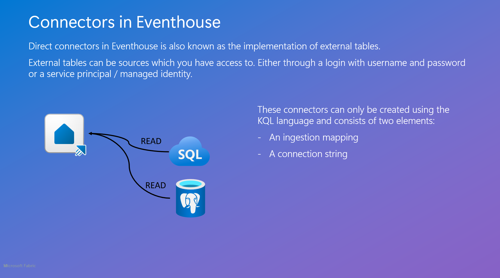

## Module 3 - Connectors

### Introduction

The Real-Time Intelligence suite in Microsoft Fabric has a lot of connectors. These connectors are in place to enable you to read data from a various number of sources.

The sources are mainly configured using the Eventstream service in a workspace. There is also a set of functionalities directly in the Eventhouse.

In this module, we will dive into the whereabouts of each methods and show you how to work with the different connectors. We will also discuss the technical details for each method (not all connectors) and show you what to take into account when working with the services.

### Architectural deep dive

The way the services in Eventstream is build, is based on a general approach to the standard services in Azure from:

- Azure EventHub: This service is the message broker for each message coming to the Eventstream and makes sure to accept the message and send it onwards to the Streaming Analytics service (if neeeded) or directly to the configured destination in the Eventstream.
- Azure EventGrid: This service is the role of listening to events happening (Storage Account Event, Workspace Events etc.) and send the messages and event details onwards to the EventHub for futher processing.
- Azure Streaming Analytics: This service can be utilized in the Eventstream, if you are implementing any transformations to the data flowing through the service. If you are not transforming the data, this service will not be used. Even though it is always provisioned, it might not actually be used.

These three services are the backbone of the Eventstream service and are provisioned every time you create an Eventstream. A detailed rundown of the Eventstream service will also be made later in Module 4 - Ingestion.

### Technical deep dive

From a high level perspective, two types of connectors exist in Real-Time Intelligence. Connectors from Eventstream and connectors for Eventhouse.

Connectors for Eventstream are the ones found in the “source” section of Eventstream.
These connectors are always expanding and contains sources for Microsoft out-of-the-box sources and sources from 3rd party providers, like Google pub/sub, Confluent Kafka etc.


Connectors for Eventhouse are built on top of the Azure Data Explorer database engine and can only be configured using the KQL script language.
These connectors are not as extensive as the ones found for Eventstream.



### Schemas and throughput

Schemas will be configured for direct ingestion to the Eventhouse only. For data which is pushed to the Eventhouse, the schema will not be defined in other way than the destionation table in the Eventhouse.
Schema validation is a part of the Ingestion module and will be handled there.

When defining Eventhouse connectors, you must also define a schema to support that specific ingestion.
This is done in an _ingestion mapping_ in the Eventhouse itself. These exists on two levels: Database mapping and database, table mapping. The last mapping is fixed to a specific table in the database, where as the first one is only tied to a specific database.

An ingestion mapping consists of the columns and the corresponding data type - for instance:

```kql

.create table DestinationTable ingestion csv mapping "MappingOne"
'['
'   { "column" : "rownumber", "DataType":"int", "Properties":{"Ordinal":"0"}},'
'   { "column" : "rowguid", "DataType":"string", "Properties":{"Ordinal":"1"}}'
']'

.create database DestinationDatabase ingestion csv mapping "MappingTwo"
'['
'   { "column" : "rownumber", "DataType":"int", "Properties":{"Ordinal":"0"}},'
'   { "column" : "rowguid", "DataType":"string", "Properties":{"Ordinal":"1"}}'
']'

```

Notice the difference in the **table** and **database** in the code above.

<div class="info" data-title="Note">

> When working with JSON format the ingetsion mapping has a special structure and syntax. Please follow [this link](https://learn.microsoft.com/en-us/kusto/management/json-mapping?view=azure-data-explorer) to read more.

</div>

#### Schemas best practices

When working with connectors and ingestion, it is good practice to work with _typed_ columns when applicable. So try to avoid the dynamic datatype. If working with dynamic data type and some JSON fields are often used for searching and aggregration, then do an explicit convertion before storing and save it as string, long or ind for faster performance.

When working with datetime columns, these should always be stored as the datetime data type. Long and int can also store datetime, but the storeage and performance will not be as effective as the datetime format.

If a column can be converted from decimal to real, then do that. It will help the engine in the aggregation.

Any identity columns in the source data should be converted to a string. Strings are much faster than int and other number formats, as the index on data is build to work with strings ootb.

Use as narrow tables as possible for ingestion and in the same time try to denormalize data to limit joins.

### Monitoring and pricing

Monitoring of connectors is not available, please see the Module for Ingestion to get the introduction to the ingetsion errors and monitoring.

Pricing for connectors are free, they are only pointers to data and sources, and does not generate cost in themselfes.

### Hands-on lab

#### Ingest data from SQL server to Eventhouse

#### Read data from JSON file to Eventhouse

---
