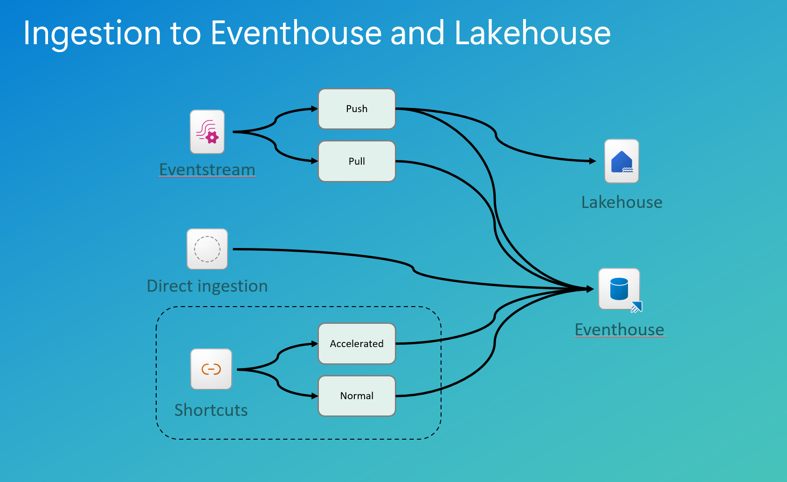

## Module 4 - Ingestion

### Introduction

When ingesting data to the Real-Time Intelligence solution, you have several options.

- Using an Eventstream to get data
- Direct ingest to the Eventhouse
- Shortcuts from outside the Eventhouse*

<div class="info" data-title="Note on shortcuts">

> Shortcuts in themselfes can be discussed if they are an ingestion. From a technical point of view shortcuts are only pointers to data and not actual ingestion. Not even the accelerated shortcuts, as they are cached on disk outside of the Eventhouse.

</div>

**Move shortcuts as a seperate section as they are not ingestion and double click on the scenarios. Highlight that we have more than one destionation - also OneLake and Lakehouse. Add ingestion mapping and mapping transformations**

This module dives into the details of each method and will give you insights to the technical implementation and give you and understanding on how and when to choose what method.

The lab will challenge you in the ingestion methods, and help you understand the throughput and details of each method through hands on experience.

### Architectural deep dive

With the three highlevel approaches to ingestion, we have a possible architecture (with selections) which looks like this:



#### Eventstream ingestion

When ingesting data to the Eventhouse using the Eventstream service, the connectors (as discusses in Module 2) will have to be set up and read/accept the data from the sources.

The only way to manipulate data at ingestion time is through the Eventstream. The other two methods is a 1:1 copy from source to destination.

The Eventstream has two methods of handing over data to the destination. Either through a **pull** method or through a **push** method.

The pull method is also the fastest method, as it is the destination table which pulls the data from the Eventstream. The underlying Eventhub is used for this method, where the data is stored in temporary storage and the Eventhouse service polls the endpoint and received the data from the Eventhub.

The push method is the only method available when doing any transformations to the incoming data. The transformations are, under the covers, handled by an Azure Streaming Analytics job and that job then pushes the data to the destionation.

When manipulating data in the Eventstream service, we have the tranformations part of the Eventstream processor.

#### Shortcuts

To enhance the performance of queries over external data, Microsoft Fabric offers a feature known as query acceleration for OneLake shortcuts. This feature allows users to define a policy specifying the number of days to cache data from external delta tables, thereby improving query performance and reducing latency. It applies to data from various sources, including Azure Data Lake Store Gen1, Amazon S3, Google Cloud Services, and Azure Blob Storage.

#### Direct ingestion

When speaking of direct ingestion, we have a source, for which it is possible to connect directly from the Eventhouse and read the data. These sources are, but not limited to, SQL Server, EventHub, EventGrid etc.

### Technical deep dive

#### Eventstream

The eventstream has settings for throughput and retention. Retention is a way of configuring the days in which the messages will be stored in case of an issue in the destination.
The throughput can be configured from Low, through Medium to High.

- Low gives you 4 partitions on the Eventhub
- Medium gives you 16 partitions in the Eventhub
- High gives you 32 partitions in the Eventhub

When changing the throughput of the Eventstream it will have an impact on the cost of the Eventstream. This due to the underlying compute for each partition in the Eventhub and from this the number of messages the Eventstream is processing.

With "Low" set in "Event throughput setting", the processor CU consumption rate starts at 1/3 base-rate (0.778 CU hour) and autoscale within 2/3 base-rate (1.555 CU hour), 1 base-rate (2.333 CU hour), 2 base-rates, and 4 base-rates.

With "Medium" set in "Event throughput setting", the processor CU consumption rate starts at 1 base-rate and autoscale within multiple possible base-rates.

With "High" set in "Event throughput setting", the processor CU consumption rate starts at 2 base-rates and autoscale within multiple possible base-rates.

For more details on the cost of Eventstream, please see the official documentation from Microsoft Learn right [here](https://learn.microsoft.com/en-us/fabric/real-time-intelligence/event-streams/monitor-capacity-consumption)

The throughput does not in itself boost the overall throughput of ingestion in the Eventstream area. Every throughput has 3 limitations:

1. The inlet (in this case the Event hub)
2. The Azure Analytics Job
3. The speed of the destination

So when configuring the throughput of the Eventstream, also remember to think of the other two areas of the total throughput configuration for a better and overall technical implementation.

#### Schema registry

Schema registry in Microsoft Fabric’s Real-Time Intelligence plays a critical role in ensuring that incoming streaming data adheres to a predefined structure before it's processed or routed to downstream systems. When data is ingested from streaming sources such as Azure Event Hubs, IoT Hub, or Kafka, the schema registry attempts to infer the schema based on sample events or allows users to manually define it. This schema typically includes field names, data types, and expected structures. Once the schema is set, Eventstream continuously validates incoming events against it in real-time. If incoming events deviate—such as missing required fields, having unexpected types, or containing structural inconsistencies, they can be flagged, rejected, or optionally rerouted to a dead-letter destination for debugging and remediation. This mechanism helps maintain data quality and protects downstream systems like Eventhouse and Lakehouse from ingesting malformed data.

Technically, schema validation is implemented using a combination of schema definitions and runtime checks embedded in the ingestion method. Users can define strict or relaxed validation rules, depending on the use case, with options to enable automatic schema evolution or enforce rigid typing.

Schema validation supports JSON schema validation and may extend to support formats like Avro or Parquet as needed. A key consideration during implementation is to ensure that schema changes in upstream systems are coordinated with the Eventstream pipeline; otherwise, even minor alterations like renaming a field or changing a data type can break the pipeline. Additionally, high-throughput environments must be optimized to handle validation errors at scale without introducing latency.

To maintain reliability, it’s recommended to use schema registries or maintain a versioned schema strategy, especially in enterprise-grade solutions.

#### Shortcuts


The accelerated shortcuts works by reading the data from the source to a storage inside the Eventhouse (in the KQL database level) as shards and gives the enduser and application the speed of the KQL database.
This apporach demands the engine to read data from the source as a direct ingestion to the KQL database. This process will also consume CUs from the Fabric capacity and will, behind the scenes, autoscale the cluster to have a fast ingestion for the initial load.
Updates to the data in the shortcut, from the source, is automatically handled by the engine and the processing of data resumes for reading the new data.

When the shortcut is created, you can alter the caching period of the data. By default data is kept in memory for 36500 days. These days are automatic calculated based on the internal storage metadata and the modifiedDate column for each row in the shortcut.

This can be changed by editing the Data policies on each shortcut.


Or by altering the shortcut’s data policy in KQL script:

```kql
.alter external table lineitem_accelerate policy query_acceleration '{"IsEnabled": true, "Hot": "1.00:00:00"}'

```

With the _Hot_ variable to define the timespan needed for chaching.

When you create a shortcut with acceleration enabled, the underlying Kusto engine begins to load the data from the source to memory. Depending on the size of the data, this can take a while.

To get a status of this process, you can execute the following command:

```kql
.show external table lineitems600m_accelerate operations query_acceleration statistics
```

#### Direct ingestion

When ingesting data using the direct ingestion mode, you are configuring the database to read the data from the source directly, basicly using a KQL query.

At normal situtations any KQL query will only run for 4 mins by default which can be overwritten to max 10 mins - whereas the ingestion queries are running on a different node in the cluster and will not have this limit of the 10 minute exetution time.
**Brians waits for slides from Devang to rewrite the above paragraph**

Other than that, the direct ingestion is pretty straight forward.

#### Ingestion mapping

Ingestion mapping in Microsoft Fabric Real-Time Intelligence is a vital mechanism that defines how incoming streaming data is transformed and structured as it's ingested into destination stores like KQL Database (Eventhouse), Lakehouse, or Data Warehouse. When data flows through Eventstream, ingestion mappings specify how source fields from raw event payloads (often in formats like JSON, Avro, or CSV) are extracted and assigned to columns in the destination schema.

This mapping process enables fine-grained control over field selection, renaming, type casting, and data reshaping, ensuring that only relevant and correctly typed data is stored. In practical terms, this allows developers to map nested fields, apply default values, flatten complex JSON structures, and handle missing or optional attributes — all without writing custom transformation code.

From an implementation standpoint, ingestion mappings are configured either through the Eventstream UI or programmatically using KQL commands or REST APIs.

Users define column-to-field relationships, specify data formats, and apply validation rules. These mappings are then associated with a specific output destination, ensuring consistent data transformation for all events routed through that stream.

Supported file formats for ingetsion mappings can be found in [Microsoft Learn](https://learn.microsoft.com/en-us/kusto/management/mappings?view=microsoft-fabric)

You can create ingestion mappings directly when creating the ingestion or create the mapping as a reusable mapping and then referenc it in the ingtesion.

##### Mapping in ingestion

Below example is using a mapping directly in the ingestion command:

```kql
.ingest into table RawEvents ('https://kustosamplefiles.blob.core.windows.net/jsonsamplefiles/simple.json') 
    with (
            format = "json",
            ingestionMapping =
            ```
            [ 
              {"column":"timestamp","Properties":{"path":"$.timestamp"}},
              {"column":"deviceId","Properties":{"path":"$.deviceId"}},
              {"column":"messageId","Properties":{"path":"$.messageId"}},
              {"column":"temperature","Properties":{"path":"$.temperature"}},
              {"column":"humidity","Properties":{"path":"$.humidity"}}
            ]
            ```
          )
```

##### Reusable mapping and referencing mapping in ingetsion

Below example show the creation of a reusable mapping and the use of that mapping in an ingestion command:

**Mapping:**

```kql
.create table RawEvents ingestion json mapping 'RawEventMapping' 
    ```
  [ 
    {"column":"timestamp","Properties":{"path":"$.timestamp"}},
    {"column":"deviceId","Properties":{"path":"$.deviceId"}},
    {"column":"messageId","Properties":{"path":"$.messageId"}},
    {"column":"temperature","Properties":{"path":"$.temperature"}},
    {"column":"humidity","Properties":{"path":"$.humidity"}}
  ]
    ```
```

**Use of the above mapping:**

```kql
.ingest into table RawEvents ('https://kustosamplefiles.blob.core.windows.net/jsonsamplefiles/simple.json') 
  with (
          format="json",
          ingestionMappingReference="RawEventMapping"
        )
```

It’s important to monitor mapping consistency during schema changes in upstream sources; mismatches can lead to ingestion failures or silent data loss. Additionally, for high-throughput pipelines, efficient mapping practices—such as avoiding deeply nested structures and minimizing real-time transformations—help reduce latency and resource usage.

A good practice is to regularly test ingestion mappings against live data samples and maintain versioned configurations to support rollback and debugging in dynamic environments.

#### Mapping transformations

Mapping transformations in Microsoft Fabric Real-Time Intelligence allow users to reshape, enrich, and filter streaming data before it is routed to a destination such as a KQL Database (Eventhouse) or Lakehouse.
These transformations are part of the Eventstream pipeline and are typically applied in a no-code or low-code environment using the Eventstream visual editor. It can also be applied in the direct ingestion methods described above in this module.

Users can define rules to rename fields, extract nested JSON attributes, change data types, add calculated fields, or remove irrelevant information. This ensures that downstream systems receive clean, structured, and relevant data, optimized for analytics and storage. Mapping transformations are executed in real-time, which means they must be efficient and lightweight to avoid introducing latency into the pipeline.

From a technical standpoint, mapping transformations are implemented within the Eventstream canvas as configurable blocks or as defined code in the definition of the mapping in the Eventhouse.

Each transformation is applied sequentially to events as they pass through the stream. Users define transformations such as “rename column,” “convert to datetime,” or “parse JSON path,” and these are stored as part of the Eventstream and Eventhouse ingestion configuration.

##### Example usages

**Dropping a mapped field**

Given below JSON object

```JSON
{
    "Time": "2012-01-15T10:45",
    "Props": {
        "EventName": "CustomEvent",
        "Revenue": 0.456
    }
}
```

A drop of the *props* object is done with this code:

```json
[
    { "Column": "Time", "Properties": { "Path": "$.Time" } },
    { "Column": "EventName", "Properties": { "Path": "$.Props.EventName" } },
    { "Column": "Props", "Properties": { "Path": "$.Props", "Transform":"DropMappedFields" } },
]
```

Under the hood, Microsoft Fabric ensures these mappings are executed with minimal processing overhead. However, it’s important to watch for pitfalls like mismatched data types, schema drift in source events, or overly complex transformation chains that could degrade performance. Additionally, since these transformations run in real time, testing them on sample data and validating output before pushing to production is crucial. Incorporating schema validation alongside transformations helps ensure data integrity and resilience as the upstream schema evolves.

### Hands-on lab

#### Build ingestion with a mapping transformation of a JSON file

Using the file from the Module 3 - connectors, import the file using mapping transformations which does the following:

1. Drop the 3 columns: friends, registered and favoriteFruit
2. Ingest the rest of the columns as normal "exploded" columns - one for each key/value pair
3. Handles any changes in the future structure of the file and makes sure to add a new column which holds new key/value pairs in case of schema drift

You can find the file [here](/modules/assets/datafiles/import.json).

#### Come up with a solution for ingesting large volume data and find the correct settings for all 3 areas of throughput

In pairs of two people, discuss and draw solutions to the 2 scenarios below. Present to the team to your right and discuss the differences in solutions.

1. Streaming data from Google pub/sub
   1. Data is streamed live from a website trafic
   2. Trafic is estimated to flow at a rate of 12.700 messages a second
2. JSON files from storage account
   1. JSON must be imported on a schedule - every 10 mins (filenames indicate the timestamp, take only the latest)
   2. JSON must be exploded for all elements of the key/value pairs
   3. Mapping of the JSON must be able to be used in other ingestion configurations on the same KQL database

---
