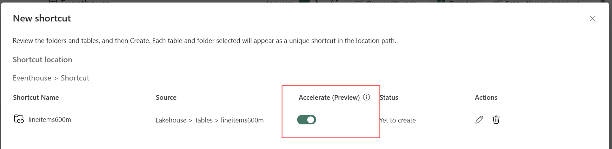

## Module 4 - Ingestion

### Introduction

When ingesting data to the Real-Time Intelligence solution, you have several options.

- Using an Eventstream to get data
- Direct ingest to the Eventhouse
- Shortcuts from outside the Eventhouse

This module dives into the details of each method and will give you insights to the technical implementation and give you and understanding on how and when to choose what method.

The lab will challenge you in the ingestion methods, and help you understand the throughput and details of each method through hands on experience.

### Architectural deep dive

With the three highlevel approaches to ingestion, we have a possible architecture (with selections) which looks like this:


#### Eventstream ingestion

When ingesting data to the Eventhouse using the Eventstream service, the connectors (as discusses in Module 2) will have to be set up and read/accept the data from the sources.

The only way to manipulate data at ingestion time is through the Eventstream. The other two methods is a 1:1 copy from source to destination.

The Eventstream has two methods of handing over data to the destination. Either through a **pull** method or through a **push** method.

The pull method is also the fastest method, as it is the destination table which pulls the data from the Eventstream. The underlying Eventhub is used for this method, where the data is stored in temporary storage and the Eventhouse service polls the endpoint and received the data from the Eventhub.

The push method is the only method available when doing any transformations to the incoming data. The transformations are, under the covers, handled by an Azure Streaming Analytics job and that job then pushes the data to the destionation.

When manipulating data in the Eventstream service, we have the tranformations part of the Eventstream processor.

#### Shortcuts

To enhance the performance of queries over external data, Microsoft Fabric offers a feature known as query acceleration for OneLake shortcuts. This feature allows users to define a policy specifying the number of days to cache data from external delta tables, thereby improving query performance and reducing latency. It applies to data from various sources, including Azure Data Lake Store Gen1, Amazon S3, Google Cloud Services, and Azure Blob Storage.

#### Direct ingestion

When speaking of direct ingestion, we have a source, for which it is possible to connect directly from the Eventhouse and read the data. These sources are, but not limited to, SQL Server, EventHub, and [Brian to find more sources]

### Technical deep dive

#### Eventstream

The eventstream has settings for throughput and retention. Retention is a way of configuring the days in which the messages will be stored in case of an issue in the destination.
The throughput can be configured from Low, through Medium to High.

- Low gives you 4 partitions on the Eventhub
- Medium gives you 16 partitions in the Eventhub
- High gives you 32 partitions in the Eventhub

The throughput does not in itself boost the overall throughput of ingestion in the Eventstream area. Every throughput has 3 limitations:

1. The inlet (in this case the Event hub)
2. The Azure Analytics Job
3. The speed of the destination

So when configuring the throughput of the Eventstream, also remember to think of the other two areas of the total throughput configuration for a better and overall technical implementation.

#### Shortcuts



The accelerated shortcuts works by reading the data from the source to a storage inside the Eventhouse (in the KQL database level) as shards and gives the enduser and application the speed of the KQL database.
This apporach demands the engine to read data from the source as a direct ingestion to the KQL database. This process will also consume CUs from the Fabric capacity and will, behind the scenes, autoscale the cluster to have a fast ingestion for the initial load.
Updates to the data in the shortcut, from the source, is automatically handled by the engine and the processing of data resumes for reading the new data.

When the shortcut is created, you can alter the caching period of the data. By default data is kept in memory for 36500 days. These days are automatic calculated based on the internal storage metadata and the modifiedDate column for each row in the shortcut.

This can be changed by editing the Data policies on each shortcut.


Or by altering the shortcut’s data policy in KQL script:

```kql
.alter external table lineitem_accelerate policy query_acceleration '{"IsEnabled": true, "Hot": "1.00:00:00"}'

```

With the _Hot_ variable to define the timespan needed for chaching.

When you create a shortcut with acceleration enabled, the underlying Kusto engine begins to load the data from the source to memory. Depending on the size of the data, this can take a while.

To get a status of this process, you can execute the following command:

```kql
.show external table lineitems600m_accelerate operations query_acceleration statistics
```

#### Direct ingestion

When ingesting data using the direct ingestion mode, you are configuring the database to read the data from the source directly, basicly using a KQL query.

At normal situtations any KQL query will only run for 10 mins - whereas the ingestion queries are running on a different node in the cluster and will not have this limit of the 10 minute exetution time.

Other than that, the direct ingestion is pretty straight forward.

### Hands-on lab

#### Have people build a direct ingestion

#### Have people come up with a solution for ingesting large volume data and find the correct settings for all 3 areas of throughput

---
