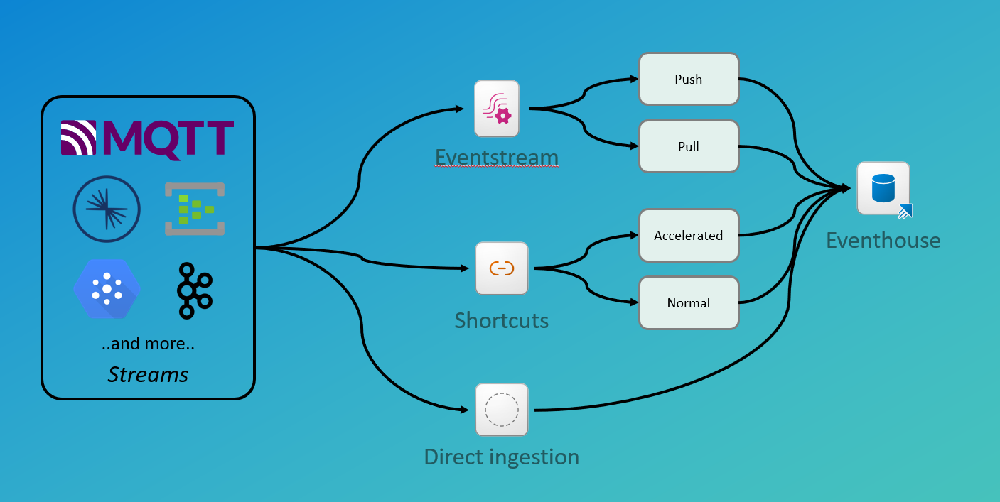

## Module 4 - Ingestion

### Introduction

When ingesting data to the Real-Time Intelligence solution, you have several options.

- Using an Eventstream to get data
- Direct ingest to the Eventhouse
- Shortcuts from outside the Eventhouse

This module dives into the details of each method and will give you insights to the technical implementation and give you and understanding on how and when to choose what method.

The lab will challenge you in the ingestion methods, and help you understand the throughput and details of each method through hands on experience.

### Architectural deep dive

With the three highlevel approaches to ingestion, we have a possible architecture (with selections) which looks like this:

#### Eventstream ingestion

When ingesting data to the Eventhouse using the Eventstream service, the connectors (as discusses in Module 2) will have to be set up and read/accept the data from the sources.

The only way to manipulate data at ingestion time is through the Eventstream. The other two methods is a 1:1 copy from source to destination.

The Eventstream has two methods of handing over data to the destination. Either through a **pull** method or through a **push** method.

The pull method is also the fastest method, as it is the destination table which pulls the data from the Eventstream. The underlying Eventhub is used for this method, where the data is stored in temporary storage and the Eventhouse service polls the endpoint and received the data from the Eventhub.

The push method is the only method available when doing any transformations to the incoming data. The transformations are, under the covers, handled by an Azure Streaming Analytics job and that job then pushes the data to the destionation.

When manipulating data in the Eventstream service, we have the tranformations part of the Eventstream processor.

#### Shortcuts

Accelerated shortcuts:

- Ways of working
- Underlying processing after creation
- Throughput and scaling of the nodes

Normal shortcuts (non accelerated):

- Ways of working
- Scaling and speed

#### Direct ingestion

When speaking of direct ingestion, we have a source, for which it is possible to connect directly from the Eventhouse and read the data. These sources are, but not limited to, SQL Server, EventHub, and [Brian to find more sources]

### Technical deep dive

Eventstream - meeting with Xu Jiang April 14

- Low = 4 partitions
- Medium = 16 partitions
- High = 32 partitions

Throughput has 3 parts: the inlet (the event hub) the processing, the ASA job and lastly the destination speed.
Custom endpoint has the hightest throughpout as a destination. See the documentation for details (Eventstream -> Configure settings)
Notice the throughput when using pull and push to Eventhouse

When choosing "Eventstream before ingestion" the Eventhouse does a streaming mode and the max throughput is only theoretical.

For Event Hub and IoT Hub source:

- An ASA job is created to pull the data and send it to the Eventstream
- This also enables vNET, as the Streaming connector is not vNET enabled
- MS is working os using the Messaging Connectors to read data from EH and IoT Hub

### Implementations

### Troubleshooting

### Orchestration and optimization

### Schemas and throughput

### Monitoring and pricing

### Hands-on lab
