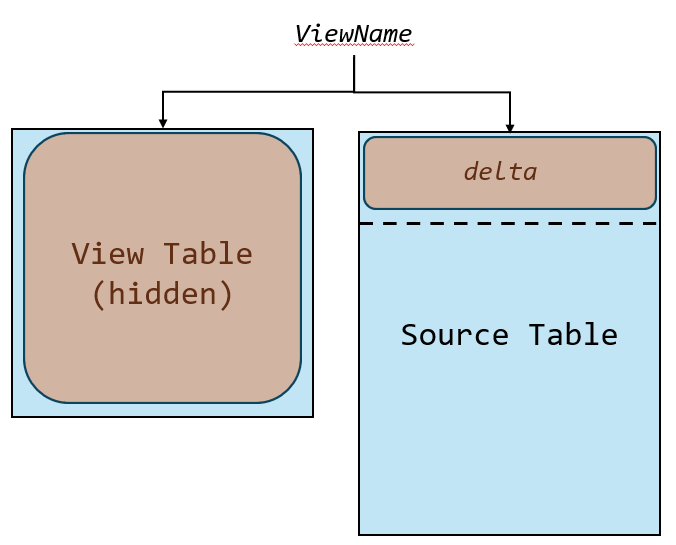
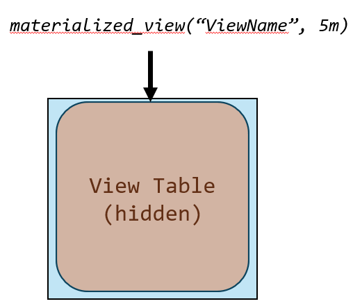

## Module 5 - Data modelling

### Introduction

In the landscape of real-time analytics, the fidelity and flexibility of your data model can be the decisive factor between a scalable solution and a bottlenecked architecture. This module focuses on the advanced practices of data modeling within the Microsoft Fabric Real-Time Intelligence platform, enabling precise, performant, and production-grade implementations.

Real-time systems differ fundamentally from traditional Business Intelligence Systems. They must ingest, transform and serve analytical insights with sub-minute latency—often against massive, high-cardinality, high-granular datasets. This requires a new class of modeling techniques tailored to streaming - first architectures.

This module delivers expert-level guidance on structuring data for streaming and hybrid workloads in Fabric’s KQL-based ecosystem, especially Eventhouse and KQL Database. It bridges theory and implementation through deep dives into update policies, materialized views and external tables, alongside schema strategies for performant Power BI Reports. These concepts are foundational to driving low-latency queries, minimizing compute cost and suppoReal-Time Intelligenceng downstream consumers like dashboards and aleReal-Time Intelligenceng systems.

#### Business Value

This module is designed for architects, data engineers, and advanced BI professionals who are:

- Designing real-time intelligence systems in production,
- Troubleshooting high-latency or high-cost query workloads,
- Building Power BI semantic models directly over streaming or near real-time KQL data sources,
- Working with complex schema evolution, externalized data references, and time-sensitive joins.

By mastering these advanced techniques, paReal-Time Intelligencecipants will avoid common pitfalls — like improper caching policies, poorly scoped materializations, or inefficient joins - that we’ve seen derail real-world Real-Time Intelligence implementations.

### Architectural deep dive

Data modeling in Microsoft Fabric’s Real-Time Intelligence (Real-Time Intelligence) must be aligned with the architecture of Eventhouse, KQL Database, and the broader Fabric ecosystem. This section provides a blueprint for how real-time models are constructed in a high-concurrency, high-throughput architecture.

#### Fabric Real-Time Intelligence Architectural Context

At the core of the Real-Time Intelligence stack lies Eventhouse, a KQL-based data service optimized for high-frequency, time-series data. Eventhouse ingestion scales elastically, and data is indexed on ingest, paReal-Time Intelligencetioned, and stored in compressed extents for optimal query performance.

Data models in this environment are not just schemas — they are performance-critical assets. Modeling decisions directly affect:

- Costs (in terms of compute and latency),
- Query plan efficiency (especially under load),
- Retention policy tuning, and
- Downstream semantic model fidelity that can be used by Power BI.

#### The medallion Architecture

The Medallion Architecture is a layered data architecture designed to streamline the flow of data from raw ingestion to refined, business-ready insights. It is classically divided into three zones:

- **Bronze Layer:** Raw, immutable, ingested data in its original form. Useful for full-fidelity reprocessing and audit scenarios.
- **Silver Layer:** Cleaned, filtered, and optionally joined data. This layer applies business rules, deduplication, and enrichment logic.
- **Gold Layer:** Aggregated, curated datasets intended for direct consumption by business intelligence tools, ML models, or APIs.

Each layer improves data quality and readiness, and decouples concerns of ingestion, transformation, and analytics.

##### How the Medallion Architecture Maps to a KQL Database

In Microsoft Fabric Real-Time Intelligence, KQL Databases (backed by Eventhouse) naturally support this tiered architecture, though the layering is implemented through logical constructs and processing pipelines, rather than through physical storage separation. Here's how it aligns:

| Medallion Layer | Fabric Real-Time Intelligence / KQL DB Implementation                                                                                                                       |
| --------------- | --------------------------------------------------------------------------------------------------------------------------------------------------------------------------- |
| Bronze          | Raw data ingested via Eventstream, Direct Ingestion, or External Tables. Raw event tables (with update policies off) typically reside here.                                 |
| Silver          | Implemented using Update Policies or Materialized Views that apply cleaning, deduplication, joins, and derived fields. Acts as the refined source for analytical workloads. |
| Gold            | Optimized aggregation or business-specific shaping, via additional Materialized Views, Functions, or export to Power BI using semantic models designed for performance.     |

##### Architectural Elements in Real-Time Intelligence that Enable the Medallion Model

- **Update Policies:** Automatically transform Bronze to Silver during ingestion. Supports branching raw streams into multiple shaped outputs.

- **Materialized Views:** Serve as performant Silver-to-Gold bridges; offline-processed, indexable aggregations that minimize query time and cost​​.

- **External Tables:** Can act as an extended Bronze layer, enabling real-time access to cold or remote data (e.g., from OneLake or SQL) without full ingestion​.

- **Power BI Integration:** Gold-layer data is often consumed in Power BI models, where star-schema design and dual storage mode are used to optimize slicing/filtering performance​.

**Key Considerations**

- KQL databases do not enforce strict layer boundaries—the medallion model is applied through query logic, schema design, and ingestion policies.
- Retention policies can be configured per layer - e.g., Bronze (short), Silver (medium), Gold (long) - to optimize cost.
- Query performance and COGS benefits are significant in Silver/Gold due to pre-aggregation and filtering in materialized views.
- KQL’s hidden extent management and delta + materialized combination model ensures that even recent, non-materialized records are reflected in queries, enabling near-real-time freshness without sacrificing performance.

#### Key Architectural Components for Modeling

##### 1. Datatypes

Datatypes in Microsoft Fabric Real-Time Intelligence are foundational to data modeling. They define not only how data is stored and queried in KQL-based services like Eventhouse, but also how efficiently that data is joined, filtered, compressed, and consumed downstream (e.g., in Power BI). From an architectural perspective, datatypes:

- Determine compression strategy and extent shaping, impacting storage efficiency and query scan times.
- Affect join behavior and broadcast strategies in large distributed queries.
- Shape the semantic layer compatibility, especially for time-based models and dynamic data.
- Influence update policy and materialized view design, since transformations must respect and preserve type semantics.

In Real-Time Intelligence solutions, incorrect or inconsistent type usage - particularly with `datetime`, `timespan`, or `dynamic` can lead to performance degradation, broken filters in Power BI, and failed ingestion operations.

##### 2. Update Policies

Update policies are executed during ingestion time. They transform or enrich data as it lands and project it into derived tables. From an architectural perspective, this enables:

- Schema simplification at query time
- Filtering
- Normalization (e.g., from wide raw logs to fact/dimension schemas),
- Transformations, extracting columns
- Forking a source to several target tables

Update policies are executed synchronously at ingest, so they affect ingestion latency and capacity. Therefore, they must be lean, deterministic, and designed with ingestion slot constraints in mind.

##### 3. Materialized Views

Materialized views provide pre-aggregated views of a source table. They are defined over a single source table, with single summarize statement. They have a well defined schema and can be queried, just like any other table or function in the database. They exist as physically stored datasets and are automatically updated in the background. In architecture, they serve as:

- Query acceleration layers for common query patterns (e.g., arg_max per session, count by 15-minute bins),
- Mechanisms to reduce cost per query by offloading work from interactive query time,
- Foundations for Power BI models where freshness of the semantic model is bound to the materialization frequency.

They can be used for

- Downsampling

```kql
T
| summarize count() by bin(Timestamp, 1d))
```

```kql
T
| summarize dcount(User), avg(Duration) by bin(Timestamp, 1h))
```

- Last entity by update time

```kql
T
| summarize arg_max(Timestmap, *) by Id
```

- De-Duplication

```kql
T
| summarize take_any(*) by Dimension1, Dimension2…DimensionN
```

The internal materialized view architecture includes delta tracking and cursor-based processing, allowing the system to maintain freshness without reprocessing the full dataset. Query-time joins against MVs are optimized through filter pushdown and rewrite rules.

Although materialized views are a handy tool to reduce query time and pre-calculate you should not have too many of them because multi-tenancy is required. Always think about if it would be possible to replace a materialized view by a real table and an update policy.

##### 4. External Tables

External tables expose datasets that reside in external storage (ADLS, Blob, SQL) or OneLake, allowing you to query operational data without ingesting it. From an architectural perspective, this:

- Enables schema-on-read for low-frequency or archival datasets,
- Supports cross-system joins (e.g., enrichment from dimension data in SQL),
- Reduces storage cost by eliminating unnecessary ingestion.

PaReal-Time Intelligencetion pruning and pre-filtering play a critical role in maintaining performance. Effective modeling requires aligning the external table’s path structure with likely filter predicates.

##### 5. PaReal-Time Intelligencetioning Policies

PaReal-Time Intelligencetioning policies define how extents (immutable data shards) are organized post-ingestion to optimize query performance. From an architectural perspective, this:

- Enables paReal-Time Intelligencetion pruning by datetime or high-cardinality string keys (e.g., TenantId, AccountId),
- Reduces data movement across nodes in distributed queries and joins,
- Improves compression and caching efficiency for time-series and multi-tenant scenarios.

Policies can be configured to assign paReal-Time Intelligencetioned extents using `ByPaReal-Time Intelligencetion` (co-location on same node) or `Uniform` (balanced distribution). Effective modeling requires aligning the paReal-Time Intelligencetion key with common filter patterns and join conditions.

##### 6. Modeling for Power BI

Power BI semantic models built atop KQL-Databases must accommodate latency, freshness, and cardinality. Key architectural considerations include:

- Using star schemas over flat tables to improve slicer/filter efficiency,
- Ensuring dimension tables are set to Dual mode when feasible to reduce joins on Direct Query paths
- Ensuring fact tables are set to DirectQuery mode
- Modeling datetime fields for efficient filtering (e.g., via time rounding or calendar relationships),
- Using KQL functions or materialized views as semantic objects for reuse and clarity.

Semantic models should be architected with DirectQuery for the fact tables and dual mode for the dimension tables to balance performance with real-time accuracy.

##### 7. OneLake Availibility

OneLake plays a pivotal role in unifying data access across Microsoft Fabric, enabling seamless integration of streaming data with analytical and operational workloads. In the context of Real-Time Intelligence (Real-Time Intelligence), OneLake serves not only as a persistent, queryable data layer but also as a critical component in reducing latency, cost, and complexity when managing event-driven architectures at scale.

This section dissects the architectural model that enables OneLake availability from Eventhouse, ensuring that data ingested in real time is efficiently exposed to downstream consumers in both raw and optimized formats.

**Architectural Flow**

At a high level, the architecture consists of the following stages:

1. Ingestion into Eventhouse (KQL DB)

   - Real-time data streams (via Eventstream or other pipelines) are ingested into Eventhouse in rowstore format for lowest latency.
   - This format is immediately queryable, enabling near-instant analytics post-ingestion.

2. Background Conversion to Columnstore

   - Behind the scenes, Eventhouse asynchronously converts rowstore data into columnar Parquet format for long-term analytics performance and compression efficiency.
   - These columnstore segments are co-located and made available through OneLake using shared storage pointers—avoiding data duplication.

3. Exposure in OneLake

   - The same Parquet-formatted data is made accessible through OneLake via logical shortcuts, either at the database level or for individual tables.

   - These OneLake representations appear as external tables for downstream compute engines (e.g., Spark, SQL, Power BI).

**Key Architectural Characteristics**

| Feature                          | Description                                                                                                                                                                                        |
| -------------------------------- | -------------------------------------------------------------------------------------------------------------------------------------------------------------------------------------------------- |
| Hot and Cold Tiering             | Data initially resides in hot SSD-backed storage (rowstore), then is tiered to colder columnstore Parquet segments optimized for cost and performance.                                             |
| Parquet Exposure                 | The columnstore segments are exposed in Open Parquet format for compatibility with external engines.                                                                                               |
| One Copy Design                  | No redundant storage—data is referenced, not duplicated. This enables zero additional storage cost for making Eventhouse data available in OneLake.                                                |
| Latency Tuning                   | Trickling ingestion patterns (low event rates) can introduce delays (up to 3 hours) before data appears in OneLake. Heavier ingestion rates optimize latency by triggering faster materialization. |
| Adaptive File Optimization       | Eventhouse determines optimal file size for Parquet segments to balance performance and cost. No additional tuning is required by users.                                                           |
| Schema and Retention Constraints | Once OneLake exposure is enabled, schema changes and data deletion are restricted. Users cannot alter table schemas or delete data unless they disable OneLake availability.                       |

**Architectural Best Practices**

- **Design for Append-Only Workloads:** Due to schema immutability, datasets exposed to OneLake should be modeled as append-only where possible.
- **Avoid Excessive Trickling:** Avoid scenarios with a very low ingestion rate over extended time (e.g., few events per second), as this will delay columnstore availability in OneLake.
- **Use Logical Shortcuts Strategically:** Expose only the datasets that require cross-engine visibility; over-exposing datasets can lead to cost and operational overhead.
- **Understand the Cold Path Behavior:** For long-term analysis or integrations with external engines (e.g., Spark ML or Lakehouse), design queries to leverage OneLake data via SQL or Lakehouse endpoints.

### Technical deep dive

#### 1. Datatypes

Datatypes in Microsoft Real-Time Intelligence (Eventhouse/KQL Database) are more than schema constraints - they directly affect storage efficiency, query performance, and downstream integration, particularly with Power BI and external consumers.

**Core Datatypes and Storage Behavior**

Fabric Real-Time Intelligence relies on a columnar storage engine, where each column is encoded and compressed independently. The choice of datatype influences both compression ratio and query execution plan:

- `datetime`: Always stored in UTC with nanosecond precision. Used extensively for filtering, binning, and temporal joins. Internally indexed for efficient range queries.

- `timespan`: Represents durations; supports arithmetic and comparisons. Appears as decimal in Power BI (in days), requiring careful modeling to preserve interpretability.

- `dynamic`: Stores JSON-like semi-structured data. Powerful for flexibility but expensive for parsing and filtering—avoid frequent projection or filtering on deep-nested fields.

- `string`: High-cardinality strings can inflate dictionary sizes and affect memory utilization. From its history, Kusto is aimed at working with strings, so if you have e.g. a number that is not calculated with store it as string. Use `hash()` where possible in joins or aggregations. The `hash()` function is recommended in scenarios where:

  - The actual string values are not needed in output,
  - You’re performing joins or group-bys where cardinality is high,
  - You need to reduce memory consumption and simplify value comparison.

- `int`, `long`, `real`, `decimal`: Fixed-precision numerics. Prefer `long` or `real` over `decimal` unless exact scale/precision is needed; decimal has a higher query-time cost.

**Modeling Implications**

- Avoid overuse of dynamic fields in hot paths; consider pre-flattening or projecting frequently used fields into dedicated columns via update policies.

- Be explicit with datetime handling when integrating with Power BI—timezone shifts (e.g., datetime_utc_to_local()) can degrade performance unless applied post-filtering.

- Normalize categorical fields used in slicers/joins into dimension tables (especially in Power BI) to avoid scanning large fact tables for distinct values.

- Enforce strong typing in ingestion paths—ambiguous schemas (e.g., mixing strings and numerics) can lead to costly type coercion at query time.

**Interop with Power BI**

When data is surfaced to Power BI:

- datetime → datetime (assumed UTC),
- timespan → decimal (duration in days),
- dynamic → string (Power Query may parse if JSON),
- bool, int, long, real → match directly.

Type conversions and representations may affect filter behavior and visuals e.g., duration in decimal form requires DAX formatting to be user-friendly.

##### 2. Update Policies

Update policies in KQL-Databases are server-side data transformation rules that automatically populate one or more target tables during ingestion of data into a source table. They are defined declaratively and executed in real time, enabling near-synchronous materialization of derived views, enriched datasets, or pre-aggregated snapshots—without requiring post-processing jobs.

**How Update Policies Work**

An update policy links a source table (where data is ingested) to one or more target tables (where processed results are written). The transformation logic is defined as a KQL function that runs at ingestion time. Architecturally, this means:

- The ingestion pipeline triggers the update policy as a side-effect of writing data to the source table.
- The output of the query is materialized into the target table in a transactionally consistent manner.
- Multiple target tables can be populated from the same source with different transformation logic.

**Common Use Cases**

- **Data filtering:** Routing only relevant records (e.g., where ErrorCode != 0) into a troubleshooting table.

- **Schema transformation:** Projecting or renaming columns to standardize downstream data structure.

- **Data enrichment:** Performing lookup joins against dimension tables to enhance the ingested records with descriptive metadata.

- **Data forking:** Distributing data from a raw ingestion table into multiple shaped, consumer-friendly tables based on business context (e.g., telemetry vs. alerts vs. billing).

**Technical Considerations**

- **Performance:** Since update policies execute at ingestion time, they directly impact ingestion throughput. Complex policies (e.g., joins, regex parsing) may throttle ingestion if not tuned.

- **Query behavior:** Policies must be ingestion-safe. That means they cannot use operators like `join kind=inner` on large tables without `hint.strategy=broadcast`, or call user-defined functions with unbounded logic.

- **Transformation Function:** Must take no parameters and be deterministic. Think of it as a logical view over newly ingested data.

- **Error handling:** If the update policy query fails, ingestion into the source table succeeds, but the target table is not updated. Failures are logged and can be monitored using .show ingestion failures.

- **Debugging:** Use `.get ingestion failures` or temporarily disable the policy and run the transformation logic manually to troubleshoot.

**Modeling Best Practices**

- Keep update policies idempotent and stateless — they should only process new ingested records, using ingestion-time context if needed.

- Precompute expensive transformations early via update policies if they are reused in queries, to offload query-time compute.

- Use the `.ingest inline` command or simulated ingestion to test policy logic before enabling in production.

- Avoid chaining update policies; Fabric does not support recursive execution between target tables with their own update policies.

**Example for an update policy**

In this example we enrich Logs using an update policy.

Step 1: Create the source table

```kql
.create table RawLogs (
    Timestamp: datetime,
    DeviceId: string,
    Message: string
)
```

Step 2: Create the Target Table

```kql
.create table EnrichedLogs (
    Timestamp: datetime,
    DeviceId: string,
    DeviceType: string,
    Region: string,
    Message: string
)
```

Step 3: Create a Dimension Table for enrichment

```kql
.create table Devices (
    DeviceId: string,
    DeviceType: string,
    Region: string
)
```

Step 4: Define a Transformation Function

```kql
.create function with (folder = "UpdatePolicies") EnrichRawLogs() {
    RawLogs
    | lookup kind=leftouter Devices on DeviceId
    | project Timestamp, DeviceId, DeviceType, Region, Message
}
```

Step 5: Attach the Update Policy to table `RawLogs`

```kql
.alter table RawLogs policy update
@'[{"IsEnabled": true, "Source": "RawLogs", "Query": "EnrichRawLogs()", "Destination": "EnrichedLogs"}]'
```

##### 3. Materialized Views

Materialized Views (MVs) in Microsoft Fabric Real-Time Intelligence are a performance-critical modeling construct that allow pre-aggregation and deduplication of high-volume data streams in a cost-effective and scalable manner. Unlike traditional views or on-the-fly aggregations, materialized views are physically materialized and maintained incrementally using a delta-and-cursor-based architecture.

This section explores the internal mechanics, refresh behavior, query execution path, and advanced considerations for using Materialized Views effectively in Eventhouse and KQL Database.

**Internal Architecture**

Materialized Views are backed by a hidden physical table that stores precomputed results. The system maintains two key components:

- **View Table:** The hidden storage table containing the materialized extents.

- **Delta (Source Tail):** Newly ingested records not yet materialized.


The cursor tracks how far materialization has progressed in the source table. During materialization:

- New data is read based on the cursor position.
- Overlapping data is soft-deleted.
- A single commit replaces the materialized extents.
- The cursor is advanced accordingly.

This allows the view to stay fresh without reprocessing the entire source table, which is critical for high-ingest scenarios​.

**Query Execution Logic**

When querying a materialized view, the system combines the hidden view table and the delta tail to produce the most up-to-date result.

Query Planner Behavior:

- Aggregates the delta (non-materialized records).
- Joins it with the materialized part.
- Applies rewrite rules and filter pushdown to optimize execution​.



This mechanism ensures consistency and freshness, even in between materialization cycles.

You can also use the `materialized_view("ViewName", max_age)` function to explicitly reference only the materialized part, skipping delta aggregation. The function has an optional `max_age` argument. If the view was not materialized in the last `max_age` the entire view will be queried. This improves performance at the cost of data freshness and is useful for:

- Serving pre-aggregated metrics to Power BI dashboards.

- Running high-concurrency read queries under SLA constraints.



**Constraints and Characteristics**

- Defined over a single source table with a single summarize statement.
- Cannot contain joins, unions, or multiple stages of computation.
- Schema is auto-inferred and updated unless schema auto-update is disabled.
- MV over another MV is supported only if the first view uses `take_any()` (i.e., for deduplication).

**Materialization Behavior and Capacity Limits**

Materialization is an asynchronous background job, triggered when capacity allows. Triggers are based on:

- Eventhouse capacity policy (per-cluster limit on concurrent materializations).
- Extent age and size of delta region.

To inspect the materialization status

```kql
.show materialized-view <ViewName> details
```

**Performance Tuning Tips**

- Use `bin()` and `arg_max()`/`take_any()` to support time-based aggregations and deduplication.
- Filter early and reduce cardinality before materialization to lower cost.
- Avoid defining more MVs than the system can refresh concurrently.

Consider paReal-Time Intelligencetioning policies on the source table if your view has predictable slice patterns (e.g., by customer, tenant, or time).

**Use Cases**

- **Sessionization:** `arg_max()` per session ID for last known state.
- **Downsampling:** `summarize count() by bin(Timestamp, 1m)` for real-time visualizations.
- **De-duplication:** `take_any()` for noisy or overlapping event streams.
- **Power BI acceleration:** Precompute aggregates to reduce DirectQuery load and improve responsiveness.

##### 4. External Tables

External tables in Microsoft Fabric Real-Time Intelligence (Real-Time Intelligence) are user-defined schema entities that reference data stored outside the native Kusto (Eventhouse/KQL DB) database.

They provide a critical architectural capability for real-time access, cross-system integration, and cost optimization without requiring ingestion into the database engine.

An external table behaves similarly to a regular KQL table in that it exposes a well-defined schema, supports paReal-Time Intelligencetions, and is addressable via standard KQL queries. However, the backing data is remote—stored either in cloud storage systems or SQL databases.

**External Table Types**

There are two primary external table types:

- **Storage External Tables:** Reference files stored in Azure Blob Storage,
  Azure Data Lake Storage Gen2, or Microsoft OneLake. Supported formats
  include Parquet, Delta, CSV, JSON, and Cosmos DB's Stream format.
- **SQL External Tables:** Reference relational database tables directly
  from systems such as Azure SQL Database, Cosmos DB, PostgreSQL, and MySQL.

Each type demands specific configuration:

- **Storage tables** require storage connection strings, path formats,
  and format specifications.
- **SQL tables** require SQL connection strings and native query mappings.

**How External Table Queries Work**

When querying an external table, the Fabric engine does not ingest the
data into Eventhouse. Instead, it issues an on-demand retrieval and
parsing operation:

- For **Storage External** Tables, file metadata is accessed first to plan
  efficient reads (especially for paReal-Time Intelligencetioned datasets).
- For **SQL External Tables**, queries are pushed down and executed
  against the external SQL database whenever possible (pushdown optimization).

PaReal-Time Intelligencetion pruning, format-specific readers (Parquet, Delta), and
optimized network retrieval are core backend mechanisms that ensure
minimal latency and resource consumption.

Example:

```kql
external_table("MyExternalStorageTable")
| where Timestamp > ago(1d)
| summarize count() by bin(Timestamp, 1h)
```

Behind the scenes, this pulls only the minimum required file segments
or database rows.

**PaReal-Time Intelligencetioning**

PaReal-Time Intelligencetions are fundamental for scaling external table performance:

- **Storage tables** often paReal-Time Intelligencetion by date or tenant ID in the folder
  path structure.
- **SQL external** tables rely on database indexes for paReal-Time Intelligencetioning,
  with optional KQL-side paReal-Time Intelligencetion hints.

Effective paReal-Time Intelligencetioning is crucial to avoid full scans and optimize query
latency and cost. PaReal-Time Intelligencetion keys must match query patterns for efficient pruning.

**Authentication**

Fabric supports multiple authentication models depending on the external system:

- Managed Identity for Azure resources.
- EntraID Principals for cross-service authentication.
- SQL Authentication for SQL databases.

Secure credential storage is enforced, and external table definitions
reference credential entities abstracted from the user.

**Query and Export**

External tables can be used for both query and export workflows:

- **Query:** Ad-hoc or scheduled queries reading from external
  sources in place.
- **Export:** Data in Eventhouse can be continuously or on-demand
  exported to external storage using Continuous Export.

<div class="important" data-title="Important">

> **Continuous Export into external tables must account for schema drift and file format constraints (only Parquet, Delta, CSV, and JSON supported).**

</div>

**Performance Considerations**

- **Cost Model:** No storage cost in Eventhouse; costs shift toward network, read transactions, and potentially compute from source systems​.
- **Performance Tip:** Frequent heavy queries over external tables might be more expensive and slower than ingesting the data. Evaluate query frequency and data freshness needs.
- **Query Acceleration:** Use Query Acceleration Policies where applicable (currently in preview) to speed up queries over OneLake shortcuts​.

**Common Pitfalls**

- High-latency storage or SQL servers severely affect query times.
- Poor paReal-Time Intelligencetioning leads to full scans and excessive resource usage.
- Schema mismatches between definition and actual data can cause query errors.
- Authentication failures if tokens expire or credentials are rotated incorrectly.

**Hidden Complexity**

While external tables seem straightforward conceptually, under the hood they involve:

- Distributed read scheduling
- PaReal-Time Intelligencetion pruning engines
- Intelligent format readers
- Secure and auditable access tracking
- Error retries and paReal-Time Intelligenceal query failure handling

Fabric hides these complexities from the user but understanding them helps optimize architecture designs.

##### 4. PaReal-Time Intelligencetioning Policies

PaReal-Time Intelligencetioning policies in Microsoft Fabric Real-Time Intelligence (Real-Time Intelligence) allow database administrators and solution architects to control the physical layout of data inside tables.

In a system designed for massive ingestion and low-latency querying, paReal-Time Intelligencetioning is critical for:

- Minimizing query scan footprint (I/O optimization)
- Accelerating aggregation and filtering
- Optimizing storage lifecycle management (retention policies)
- Reducing cost (compute and storage)

PaReal-Time Intelligencetioning is **declarative:** it is defined in advance as part of the table’s metadata, and the engine automatically applies it during ingestion and query processing.

**How PaReal-Time Intelligencetioning Policies Work**

PaReal-Time Intelligencetioning policies logically segment the ingested data into extents based on one or more columns.

An extent is the core internal storage unit in Kusto (Fabric Eventhouse) — it can be thought of as a "mini-table" with up to hundreds of megabytes of data.

When a paReal-Time Intelligencetioning policy is configured:

- During ingestion, data is bucketed based on the paReal-Time Intelligencetion key(s).
- During querying, only the relevant buckets (extents) are accessed, avoiding full table scans.
- During retention, paReal-Time Intelligencetion policies help the system efficiently delete or archive data.

**Types of PaReal-Time Intelligencetioning**

PaReal-Time Intelligencetioning in KQL databases is **column-based** and usually falls into two common scenarios:

1. **Time-based PaReal-Time Intelligencetioning**

   - Most critical for telemetry, log analytics, IoT, event data.
   - PaReal-Time Intelligencetion on a datetime column like Timestamp or EventTime.
   - Typically combined with `bin()` functions in queries for efficient time slicing.

   Example:

   ```kql
   .alter-merge table Events policy paReal-Time Intelligencetioning
   { "PaReal-Time IntelligencetionKeys": [ { "ColumnName": "Timestamp", "Kind": "UniformRange" } ] }
   ```

2. **Key-based PaReal-Time Intelligencetioning**

   PaReal-Time Intelligencetioning based on business keys, such as `CustomerID`, `DeviceID`, `Region`, or `TenantID`.
   Common for multitenant solutions to improve query isolation and minimize noisy neighbor effects.

   Example:

   ```kql
   .alter-merge table Metrics policy paReal-Time Intelligencetioning
   { "PaReal-Time IntelligencetionKeys": [ { "ColumnName": "TenantId", "Kind": "Hash" } ] }
   ```

**PaReal-Time Intelligencetion Key Kinds**
PaReal-Time Intelligencetion keys can have different paReal-Time Intelligencetioning strategies (Kind)​:

- **UniformRange** — Used for datetime or numeric columns. Buckets are ranges (e.g., one-day intervals).
- **Hash** — Used for categorical/text keys (e.g., `CustomerId`). Buckets are based on hash values.
- **None** — No paReal-Time Intelligencetioning.

Choosing the wrong kind (e.g., hashing timestamps) can severely degrade performance.

**How PaReal-Time Intelligencetioning Affects Queries**

During query compilation:

- The query engine applies paReal-Time Intelligencetion pruning: only relevant extents are scanned based on filter predicates.
- Example: A query filtered on `Timestamp > ago(1d)` automatically limits the scan to recent paReal-Time Intelligencetions.

Without a filter on the paReal-Time Intelligencetion key(s), full table scan occurs - leading to worse performance than expected.

<div class="warning" data-title="Critical Tip">

> **Always filter on paReal-Time Intelligencetion keys wherever possible for performance-sensitive queries.**

</div>

**Best Practices for Defining PaReal-Time Intelligencetioning Policies**

- **Time-based data:** Always paReal-Time Intelligencetion on a datetime column (e.g., event timestamp).
- **High cardinality dimensions:** PaReal-Time Intelligencetion on fields like `DeviceId` or `CustomerId` if you query by them.
- **Low cardinality caution:** Avoid paReal-Time Intelligencetioning on fields with very few unique values (e.g., Status = Active/Inactive) — it provides no benefit.
- **Multiple keys:** You can define multiple paReal-Time Intelligencetion keys, but be mindful of complexity and diminishing returns.
- **Retention and Cost:** Align paReal-Time Intelligencetioning keys with your retention policies for efficient aging-out of data.

**Common Mistakes**

- PaReal-Time Intelligencetioning on non-filtered columns: Leads to no pruning benefit.
- Over-paReal-Time Intelligencetioning: Too many paReal-Time Intelligencetions (e.g., by `UserId`) can create operational overhead and metadata bloat.
- Wrong paReal-Time Intelligencetion key type: Hash when uniform range would be better (especially for time series).

**Hidden Complexity**
Internally, the Fabric Eventhouse engine:

- Tracks paReal-Time Intelligencetions via extent metadata.
- Automatically merges small extents and splits large ones during background optimization cycles (Compaction, RepaReal-Time Intelligencetioning).
- Dynamically updates paReal-Time Intelligencetion pruning hints during query plan optimization.

Users **do not** manually manage paReal-Time Intelligencetions once policy is set - it's a fully managed, auto-optimized system.

##### 5. Modeling for Power BI

When building real-time analytics solutions in Fabric Real-Time Intelligence, modeling data properly for Power BI is essential to achieve:

- Fast and scalable reports
- Correct aggregations and slicing
- Efficient storage and memory usage
- Seamless end-user experiences

While raw data might be optimized for ingestion and storage in Eventhouse (KQL DB), it must be remodeled to match Power BI’s semantic and performance requirements​.

**Fabric to Power BI Connection Modes**

When connecting Power BI to Eventhouse (KQL DB) you typically use:

| Mode        | Description                                                 | When to Use                                                                        |
| ----------- | ----------------------------------------------------------- | ---------------------------------------------------------------------------------- |
| DirectQuery | Queries the Eventhouse database live at query time.         | Real-time freshness is critical. Data size too large to fit in memory.             |
| Import      | Imports a static snapshot of the data into Power BI memory. | When query latency from Eventhouse is high, or high-performance dashboards needed. |
| Dual        | Supports both import and DirectQuery dynamically.           | Best of both worlds; for filtering and small lookups.                              |
| DirectLake  | For lakehouse scenarios, not typical for KQL sources.       | Only when sourcing via OneLake or Delta tables.                                    |

**Best Practice:**

- Use **DirectQuery** or **Dual** for live real-time datasets.
- Use **Import** for heavy aggregations on large datasets that can tolerate some latency​.

**Importance of Star Schema**

A star schema remains best practice for Power BI models even when sourcing from KQL​:

- **Fact Tables:** Large tables capturing events (telemetry, transactions, logs).
- **Dimension Tables:** Smaller tables for descriptive attributes (users, devices, categories).

**Benefits:**

- Improved performance (Power BI query engine optimizations)
- Cleaner DAX and simpler relationships
- Enables Dual storage mode for dimensions, allowing fast slicing without live Eventhouse queries.

**Storage Mode Strategy**

Real-world guidance for fabric Real-Time Intelligence to Power BI modeling:

| Table Type                       | Recommended Storage Mode | Reason                                   |
| -------------------------------- | ------------------------ | ---------------------------------------- |
| Fact Table (Events, Logs)        | DirectQuery              | Real-time freshness; too big for import. |
| Small Dimensions (Lookup Tables) | Dual                     | Faster slicer/filtering; caches locally. |
| Large Dimensions                 | DirectQuery              | If size > 1M rows and freshness needed.  |

<div class="info" data-title="Key Tuning Tip">

> **Set dimensions that do not change often (e.g., country, device type) to Dual mode to avoid query latency during filtering​.**

</div>

**Key Tuning Tip:**

**Handling DateTime Columns**

Datetime modeling is non-trivial with KQL sources​​​:

- Always treat DateTime columns as UTC.
- Create a Calendar Table to filter by dates.
- Use datetime_utc_to_local() only carefully (performance penalty if used extensively​).
- Use relative time slicers in Power BI for "Last N hours/minutes" analysis​.

Example of generating a DateTime table (M Query):

```M
let
    StartDate = DateTime.From(Date.AddDays(DateTime.LocalNow(), -30)),TimeSeries = List.DateTimes(StartDate, 43200, #duration(0,0,1,0)),
    #"Converted to Table" = Table.FromList(TimeSeries, Splitter.SplitByNothing(), {"Timestamp"})
in
    #"Converted to Table"
```

**Query Pushdown and Native Query**

When using the Azure Data Explorer (Kusto) connector:

- Native Query folding is supported: KQL runs server-side.
- Avoid heavy Power Query (M) transformations post-load — push filtering and aggregation into KQL as much as possible.

Best practice:
Model complex transformations as Kusto Functions inside Fabric and reference them from Power BI.

**Monitoring Power BI Query Performance**

In large Real-Time Intelligence solutions:

- Use Performance Analyzer in Power BI Desktop.
- Watch for slow DirectQuery requests.
- Profile KQL query execution in Eventhouse side (.show queries).

Typical signs of bad modeling:

- High row retrieval counts
- Slow slicer/filter performance
- Repeated queries without result reuse

**Common Modeling Pitfalls**

- No star schema: Flat wide tables slow down slicers.
- DirectQuery everything: Even for small dimension tables — causes unnecessary latency.
- Local time conversions in visuals: Slows queries massively.
- Missing relationships: Forces Power BI to do expensive cartesian joins.
- Overuse of calculated columns: Instead, compute fields at the source using KQL.

**Hidden Complexity**

Behind the scenes:

- Power BI maintains a query cache even for DirectQuery datasets.
- Dual-mode tables automatically switch modes depending on query patterns.
- Advanced users can parameterize KQL queries via M dynamic parameters for multi-tenant or on-demand filtering.

### Implementations

Implementing effective data modeling practices in Fabric Real-Time Intelligence is critical to ensuring performance, scalability, and maintainability of real-time analytics solutions.
This section details how to implement key modeling elements, provides deep walkthroughs of functionality, and highlights critical design choices to be aware of.

#### Update Policied Implementation

Update policies automate transformation of ingested data by triggering materializations into other tables during ingestion​.

**Implementation Steps:**

1. Define a source table (raw ingestion).
2. Create a target table (transformed storage).
3. Attach an update policy to the target table with a transformation query.
4. Ensure the policy runs at ingestion or at batching intervals.

Example:

```kql
.alter table CleanEvents policy update
@'{
  "IsEnabled": true,
  "Source": "RawEvents",
  "Query": "RawEvents | extend CleanTime = tostring(datetime_column) | project CleanTime, OtherFields",
  "IsTransactional": true
}'
```

**Key Implementation Considerations:**

- The update query must be idempotent.
- Avoid complex joins in the update query (performance impact).
- Update policies increase ingestion costs, design carefully.

#### Materialized Views Implementation

Materialized views are offline, incremental aggregations over a source table​​.

**Implementation Steps:**

1. Design a summarize-based KQL query suitable for materialization.
2. Define a materialized view over a single source table.
3. Configure materialization schedule (automatic behind the scenes).

```kql
.create materialized-view DailyEventCounts on table Events
{
  Events
  | summarize Count = count() by bin(EventTime, 1d)
}
```

**Key Implementation Considerations:**

- Only one summarize per materialized view.
- Supports low-latency queries at the cost of some materialization overhead.
- Monitor for late-arriving data and lookback settings for re-materialization.

#### Export Policies Implementation

(If included — continuous export is optional)
Export policies allow continuous streaming of ingested data to external systems​.

**Implementation Steps:**

1. Define the external storage location and format (Parquet, Delta, CSV, JSON).
2. Create an export policy scoped to the source table.
3. Configure cursor management for delta-based exports.

```kql
.alter table Events policy continuous-export
@'{
  "IsEnabled": true,
  "ExportFormat": "parquet",
  "ExportPathPattern": "https://<storageaccount>.dfs.core.windows.net/container/exports/",
  "IntervalBetweenExports": "5m"
}'
```

**Key Implementation Considerations:**

- Align schema compatibility between source and export destination.
- Export costs are separate from query costs.
- Be mindful of storage transactions when expoReal-Time Intelligenceng at high frequency.

#### Joins in Fabric Real-Time Intelligence

Efficient joins are critical in KQL modeling, especially in real-time environments.

**Implementation Steps:**

1. Use hash joins for large table-to-large table joins.
2. Use broadcast joins when one side is very small.
3. Pre-aggregate or pre-filter as much as possible before the join.
4. If modeling for Power BI, minimize the number of joins by using star schemas.

```kql
EventData
| join kind=inner hint.strategy=hash (
    DeviceRegistry
) on DeviceId
```

**Key Implementation Considerations:**

- Excessive cross joins can lead to query throttling.
- Always align join keys by type (avoid implicit conversions).
- Push down filters to both sides of the join when possible.

#### Modeling for Power BI Implementation

Modeling for Power BI must align with both semantic and performance needs​.

**Implementation Steps:**

1. Expose datasets through Querysets or direct table access.
2. Use star schema modeling wherever possible.
3. Set storage modes:
   - Fact tables: DirectQuery
   - Dimension tables: Dual (if small) or DirectQuery (if large).
4. Handle DateTime columns carefully:
   - Always work in UTC inside Eventhouse.
   - Create Calendar/Time tables in Power BI.
5. Monitor query folding and optimize KQL for folding efficiency.

**Key Implementation Considerations:**

- Limit calculated columns inside Power BI; prefer precomputed fields in KQL.
- Be careful with slicers and filters on high-granularity DateTime columns.
- Tune visuals to minimize DirectQuery hits.

#### External Tables Implementation

External tables enable querying remote storage or SQL sources without ingestion​.

**Implementation Steps:**

1. Define an external table with connection parameters and schema mapping.
2. Reference external storage (e.g., ADLS, OneLake) or SQL sources.
3. Implement paReal-Time Intelligencetion pruning strategies for high-performance external queries.

Example (Storage External Table):

```kql
.create external table ExtEvents
(
    EventId: string,
    Timestamp: datetime
)
kind=storage
with (location="https://<storageaccount>.dfs.core.windows.net/container/events/", format="parquet")
```

**Key Implementation Considerations:**

- PaReal-Time Intelligencetion the data appropriately on storage side for query efficiency.
- Be mindful of authentication (Managed Identity or Service Principal).
- Storage transaction costs can be significant on large-scale external queries.

### Troubleshooting

Troubleshooting in the Data Modeling domain for Fabric Real-Time Intelligence focuses on diagnosing issues across:

- Update policies
- Materialized views
- External tables
- Power BI modeling
- PaReal-Time Intelligencetioning and join performance

In high-scale, real-time architectures, small misconfigurations can cause large performance and cost penalties.
This section describes how to identify, diagnose, and resolve common issues with clear, production-grade practices.

#### Troubleshooting Update Policies

| Symptom                                               | Possible Causes                                                | Resolution                                                                          |
| ----------------------------------------------------- | -------------------------------------------------------------- | ----------------------------------------------------------------------------------- |
| Update policy failures at ingestion                   | Syntax errors, missing columns, schema mismatch.               | Validate update query manually outside policy. Ensure all referenced columns exist. |
| Unexpected data duplication                           | Update policy is not idempotent.                               | Redesign update query to be idempotent (e.g., using `arg_max()` patterns).          |
| High ingestion cost or slowness                       | Update queries are too heavy (joins, complex transformations). | Simplify update logic; offload enrichment to post-ingestion ETL if necessary.       |
| PaReal-Time Intelligenceal updates or skipped batches | Source ingestion is faster than policy execution.              | Scale out ingestion cluster if necessary or redesign update flow to batch mode.     |

**Diagnostics Tools:**

- Inspect ingestion failures in Kusto ingestion failures blade.
- Use `.show ingestion failures` command.

#### Troubleshooting Materialized Views

| Symptom                                          | Possible Causes                                     | Resolution                                                                  |
| ------------------------------------------------ | --------------------------------------------------- | --------------------------------------------------------------------------- |
| Query over materialized view missing recent data | Delay in materialization; late-arriving data.       | Check materialization lag. Adjust lookback window if necessary.             |
| Query performance unexpectedly slow              | Delta part too large compared to materialized part. | Force more frequent materialization or optimize source ingestion.           |
| Materialized view refresh failures               | Schema drift or incompatible summarize queries.     | Check view definition for schema assumptions; avoid schema drift at source. |

**Diagnostics Tools:**

- `.show materialized-views` command.
- Inspect `LastProcessedTimestamp` and materialization error fields.

#### Troubleshooting External Tables

| Symptom                                  | Possible Causes                                                               | Resolution                                                                          |
| ---------------------------------------- | ----------------------------------------------------------------------------- | ----------------------------------------------------------------------------------- |
| Query failure on external table          | Authentication error, invalid path, corrupted file.                           | Verify connection strings, storage permissions, and file format compliance.         |
| Slow query performance                   | No paReal-Time Intelligencetion pruning, inefficient file format (e.g., CSV). | PaReal-Time Intelligencetion external data; prefer Parquet/Delta over text formats. |
| PaReal-Time Intelligenceal data returned | Misaligned schema between external source and external table definition.      | Explicitly map all columns and validate format before query.                        |

**Diagnostics Tools:**

- Monitor KQL query diagnostics (.show queries with failures).
- Storage account diagnostics (Azure Monitor).

#### Troubleshooting Power BI Modeling

| Symptom                               | Possible Causes                                                           | Resolution                                                                            |
| ------------------------------------- | ------------------------------------------------------------------------- | ------------------------------------------------------------------------------------- |
| Slow report performance (DirectQuery) | No star schema, inefficient slicers, high-granularity DateTime filtering. | Implement star schema; use Dual mode for small dimensions; reduce slicer cardinality. |
| Incorrect aggregations or joins       | Missing relationships; incorrectly modeled schema.                        | Validate relationships in Power BI Model View.                                        |
| Frequent "Query timeout" errors       | Inefficient KQL queries; too many rows fetched.                           | Push summarizations into KQL layer; reduce initial data load.                         |
| DAX measures extremely slow           | Computations over raw fields without aggregation.                         | Precompute measures inside KQL if possible (e.g., summarize before Power BI load).    |

**Diagnostics Tools:**

- Power BI Performance Analyzer.
- Fabric Diagnostic Queries (`.show queries` with `client_request_id` filtering).

#### Troubleshooting PaReal-Time Intelligencetioning and Joins

| Symptom                                           | Possible Causes                                                 | Resolution                                                                         |
| ------------------------------------------------- | --------------------------------------------------------------- | ---------------------------------------------------------------------------------- |
| Full table scans despite filters                  | PaReal-Time Intelligencetion key mismatch in query.             | Ensure where clause filters on paReal-Time Intelligencetion keys exactly.          |
| Slow joins causing throttling                     | Hash join not used when needed, or broadcast join not feasible. | Apply `hint.strategy=hash manually`; pre-filter both sides of join.                |
| Extent management issues (too many small extents) | Improper paReal-Time Intelligencetioning during ingestion.      | Review and adjust ingestion batching and paReal-Time Intelligencetioning policies. |

**Diagnostics Tools:**

- `.show table extents` to inspect extent distribution.
- `.show ingestion failures` and ingestion batching configuration review.

#### General Diagnostic Commands in Fabric Real-Time Intelligence

Useful Kusto commands for general modeling troubleshooting:

```kql
.show ingestion failures
.show materialized-views
.show queries
.show operations
.show extents
```

Useful monitoring areas:

- Eventhouse Metrics (CPU, Query Load, Storage Transactions)
- Storage Account Metrics (for external tables)
- Power BI Service Dataset Refresh Logs

#### Best Practices for Troubleshooting

- Always start troubleshooting at the source (ingestion) before looking at downstream aReal-Time Intelligencefacts.
- Use `.show queries` extensively to understand real query bottlenecks.
- Test policies and materializations manually before automating them.
- Monitor and alert on ingestion failures and materialization lag.
- Log `client_request_id` in Power BI and KQL queries for cross-system tracing.

### Orchestration and optimization

In Fabric Real-Time Intelligence, Data Modeling orchestration ensures that ingestion, transformation, materialization, and serving processes happen in a coordinated, reliable, and scalable manner.
Optimization ensures these processes run with minimal latency, controlled cost, and maximum throughput, maintaining real-time performance under production conditions.

This section describes how to effectively orchestrate and optimize core data modeling components, including update policies, materialized views, external tables, joins, and Power BI semantic models.

#### Orchestration in Data Modeling

**Ingestion and Transformation Orchestration**

- Update Policies:

  Automatically transform raw ingested data at write-time.

  - Use update policies to enrich, filter, or project incoming data into new tables.
  - Keep policies simple to avoid impacting ingestion throughput.

- Eventstream + Eventhouse Integration:

  - Route different event types to different Eventhouse tables.
  - Apply update policies only where transformation adds business value.

**Best Practice:**

Clearly separate ingestion layers (raw landing) from modeled, clean layers (curated tables) using update policies.

**Materialization Orchestration**

- Materialized Views:

  Maintain continuously updated pre-aggregations for query acceleration.

  - Materialization is triggered automatically based on ingestion delta.
  - Late-arriving data is handled via lookback windows.

- Continuous Export (if configured):

  Export modeled data to OneLake for integration with other services (e.g., Data Science, Synapse, OneLake shortcuts).

**Best Practice:**

- Monitor materialization lag and failures proactively. Ensure lookback settings match data arrival patterns.

**Query Serving Orchestration**

- Querysets:
  - Define stable, reusable KQL queries.
  - Act as the semantic abstraction layer between Eventhouse and Power BI.
- Power BI Dataset Integration:
  - Build datasets on Querys or curated tables.
  - Orchestrate schema versions between Eventhouse tables and Power BI models.

**Best Practice:**

Automate deployment of Querysets and semantic models via Fabric Deployment Pipelines and GitOps to ensure environment consistency.

#### Optimization of Data Modeling Components

**Update Policies Optimization**

- Simplify queries: Minimize projections and calculations.
- Avoid joins inside update policies unless necessary.
- PaReal-Time Intelligencetion input tables to reduce processing overhead during ingestion.

**Materialized Views Optimization**

- Pre-aggregate early: Push aggregations into materialized views.
- Tune lookback settings: Ensure materialization covers late-arriving data efficiently.
- Align retention and materialization: Drop extents efficiently when both policies work together.

**PaReal-Time Intelligencetioning Optimization**

- PaReal-Time Intelligencetion fact tables on datetime or major filtering columns (e.g., Timestamp, TenantId).
- Avoid over-paReal-Time Intelligencetioning (e.g., per second granularity unless absolutely required).
- Monitor extent sizes: Target ~200–500MB extents for balance between query efficiency and metadata load.

**Joins and Query Optimization**

- Prefer hash joins for large table joins; use hints if necessary.
- Pre-filter data on both sides before joining to reduce shuffle and memory pressure.
- Pre-aggregate where possible before the join operation.

**External Tables Optimization**

- PaReal-Time Intelligencetion storage paths (e.g., /year=/month=/day=/).
- Use efficient file formats: Parquet or Delta preferred over CSV or JSON.
- Query pruning: Ensure your KQL queries filter paReal-Time Intelligencetion keys early.

**Power BI Semantic Model Optimization**

- Build star schemas: Facts and dimension separation.
- Set storage modes strategically:
  - **Fact tables:** DirectQuery
  - **Dimension tables:** Dual (small) or DirectQuery (large)
  - **Pre-compute heavy measures:** Materialize them into Querysets or materialized views instead of calculating in DAX at runtime.
  - **Handle DateTime columns carefully:** Avoid dynamic local-time shifting in visuals unless necessary.

**Cost and Performance Optimization**

| Area           | Optimization Techniques                                                                      |
| -------------- | -------------------------------------------------------------------------------------------- |
| Ingestion Cost | Filter and transform early with update policies.                                             |
| Storage Cost   | Retain only necessary history; archive older data.                                           |
| Query Cost     | PaReal-Time Intelligencetion tables correctly; use materialized views to accelerate queries. |
| Power BI Cost  | Minimize DirectQuery operations by optimizing storage modes and reducing result set sizes.   |

**Common Pitfalls and Remediation**

| Pitfall                 | Cause                                                                | Remediation                                                      |
| ----------------------- | -------------------------------------------------------------------- | ---------------------------------------------------------------- |
| Materialized view lag   | High ingestion rate without tuned lookback window                    | Adjust view parameters and ingestion batching.                   |
| Full table scans        | Missing paReal-Time Intelligencetion filters                         | Ensure query filters match paReal-Time Intelligencetioning keys. |
| Power BI query slowness | Poor star schema design, heavy DirectQuery over facts and dimensions | Model dimensions properly, use Dual mode, pre-aggregate.         |
| Export overload         | Continuous export interval too aggressive                            | Tune export frequency to match system load and avoid contention. |

### Schemas and throughput

In real-time architectures powered by Microsoft Fabric's Eventhouse and KQL Databases, designing optimal schemas and understanding throughput mechanics are foundational for achieving scalable, high-performance systems. This section discusses how schemas impact ingestion, query execution, materialization, and integration with services like Power BI. It also highlights key considerations for throughput optimization in high-concurrency, high-ingestion-rate environments.

#### Schema Design Principles

- **Well-Defined Schemas Are Mandatory**

  External Tables, Materialized Views, and Update Policies all require pre-defined, rigid schemas​​​. Schema drift (unexpected schema changes) is not natively tolerated; ingestion will fail if the incoming data format deviates without adjustments.

- **Schema Alignment Across Services**

  For integration with Power BI semantic models, enforcing a star schema is highly recommended​: - Fact tables should store event or transactional data. - Dimension tables should represent slowly changing reference data (e.g., users, products). - Using Dual Mode for dimensions improves slicer/filter performance significantly​.

- **Dynamic Columns Handling**

  When working with dynamic data types (e.g., JSON), M transformations or parsing logic in Power Query are essential to flatten the structure for efficient downstream use​.

- **Datetime Columns**
  - Always modeled in UTC at the database level​​.
  - Local time shifts should be handled at query time or visualization layer (Power BI) to maintain efficient indexing​​.

#### Throughput Considerations

- **Eventhouse Storage Behavior**

  Eventhouse organizes data in hot and cold storage, dynamically optimizing Parquet file sizes for throughput​​.

  - Hot storage (SSD-backed) serves low-latency queries.
  - Cold storage optimizes for cost but slightly higher access times.
  - Adaptive file optimization minimizes the ingestion and query latency trade-off​.

- **Query Throughput**

  - Materialized Views pre-aggregate data and significantly reduce query load at runtime​​.
  - During query execution, new deltas are combined with the materialized part, maintaining near real-time freshness with optimized resource usage.

- **PaReal-Time Intelligencetioning and Sharding**
  - Manual paReal-Time Intelligencetioning policies on large tables (e.g., by datetime bins) help control throughput and improve performance under concurrent query pressure​.
  - Always monitor shard counts to avoid overhead caused by excessive micro-paReal-Time Intelligencetions.

#### Best Practices

| Scenario                                          | Recommendation                                                                                 |
| ------------------------------------------------- | ---------------------------------------------------------------------------------------------- |
| High cardinality dimensions                       | Pre-aggregate if possible; avoid direct slicing/filtering on massive dynamic columns.          |
| Continuous ingestion with frequent schema changes | Implement Update Policies to stabilize output schema​.                                         |
| Power BI semantic models                          | Build star schemas; dimensions in Dual mode, fact tables can be DirectQuery​.                  |
| Real-time query requirements                      | Use Materialized Views or Query Acceleration Policies (where available) to minimize latency​​. |
| Handling datetime in local time                   | Convert after filtering using UTC datetime indexes to maximize query pushdowns​.               |

### Monitoring and pricing

Monitoring performance and controlling costs are critical when deploying real-time data models in Microsoft Fabric using Eventhouse, KQL Databases, External Tables, and Materialized Views. This section will guide you through performance monitoring strategies, throughput tracking, error detection, and cost management techniques specifically for real-time data modeling scenarios.

#### Monitoring Data Models

**Metrics and Observability**

- **Query Metrics**

  Use `.show queries` and `.show running queries` in KQL to inspect current and historical query performance:

  - CPU time
  - Memory consumption
  - Extents scanned
  - Query text and plan​​

- **Ingestion Monitoring**

  For queued and streaming ingestion:

  - `.show ingestion failures` to inspect error records
  - `.show operations` for ingestion state and diagnostics​

- **Materialized Views Health**

  - Track cursor advancement to ensure that offline materialization processes are up-to-date​​.
  - Use the `materialized_view()` function to check materialization age and determine whether queries are served from materialized or delta data​.

- **External Tables Query Performance**
  - External tables incur latency depending on storage type (Azure Blob, ADLS, SQL, etc.)​.
  - Monitor query times, retries, and data sizes particularly when using OneLake shortcuts​.

**Tools and Integrations**

- **Fabric Monitoring**
  Fabric provides integrated monitoring across Eventhouse, Real-Time Analytics, and Lakehouse aReal-Time Intelligencefacts.

  - Use Fabric’s built-in Monitoring Hub to visualize resource utilization.
  - Set up Metrics Alerts on critical ingestion latencies, query execution times, or cost thresholds.

- **Power BI Monitoring**
  - Monitor DirectQuery query durations from Power BI using Performance Analyzer.
  - Track Query Folding behavior and detect when KQL queries are inefficiently translated​​.

#### Pricing Considerations

**Key Cost Drivers**

| Component          | Cost Implication                                          |
| ------------------ | --------------------------------------------------------- |
| Ingestion          | Cost associated with data volume ingested into Eventhouse |
| Query Execution    | Compute cost based on CPU seconds used by queries         |
| Storage            | Hot/cold storage pricing based on data volume             |
| Materialized Views | Additional compute for offline materialization processes  |
| External Tables    | No ingestion costs, but pay for query compute and egress​ |

- **Ingestion Costs**

  - Streaming ingestion is relatively more expensive per GB compared to queued ingestion due to higher resource intensiveness​.
  - Continuous export from Eventhouse to external storage also incurs export operation costs​.

- **Storage Costs**

  - Hot Storage (SSD) is more expensive but optimized for performance​.
  - Cold Storage provides lower cost but higher query latencies.
  - Data duplication across Eventhouse and OneLake is avoided using shortcut mechanisms​​.

- **Query Acceleration Policy** For workloads heavily dependent on external shortcuts or real-time freshness, leveraging Query Acceleration Policies can optimize cost per query​​.

**Cost Optimization Strategies**

- **Materialize Strategically**
  Materialize only highly queried aggregations to reduce online compute resource consumption​.

- **Manage Data Retention Policies**
  Reduce retention on raw source tables once data is safely materialized, thus saving on storage​​.

- **Monitor Shard Management**
  Excessive small shards lead to storage inefficiencies. Monitor shard distribution and ensure ingestion batches are reasonably sized​.

- **Optimize External Table Queries** When querying external tables:

  - Prefer Parquet or Delta formats for efficiency.
  - Leverage paReal-Time Intelligencetioned data structures to minimize scanned data​.

- **Use DirectQuery + Dual Models** in Power BI
  Push as much filtering to KQL queries as possible to avoid large data pulls and reduce Fabric compute charges​​.

**Best Practices Summary**

| Area                 | Best Practice                                                                                        |
| -------------------- | ---------------------------------------------------------------------------------------------------- |
| Ingestion Monitoring | Automate failure alerts based on .show ingestion failures                                            |
| Query Monitoring     | Regularly audit expensive queries and refactor or materialize common patterns                        |
| Storage Optimization | Implement aggressive retention on raw ingestion tables, and use Parquet compression where applicable |
| External Data Access | Prefer native storage-based external tables over SQL-based ones when possible                        |
| Cost Monitoring      | Set up Fabric cost alerts and monitor per-capacity usage trends weekly                               |

### Hands-on lab
