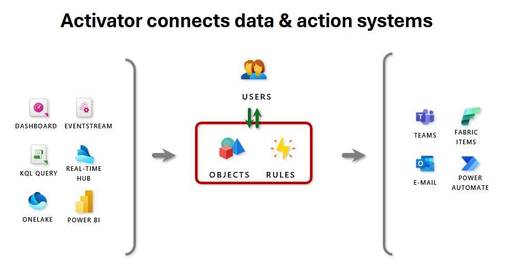

## Module 9 - Activator

### Introduction

In the landscape of real-time analytics, Activator plays a pivotal role in bridging insights and action. This module introduces Activator as Microsoft Fabric’s low-latency event rule engine, designed to listen to event streams, detect complex conditions, and trigger downstream actions within seconds.

One of Activator’s defining characteristics is that it is a no-code, low-latency event detection engine. Through an intuitive, GUI-based experience, users can define rule logic such as “value decreases below a threshold” or “state becomes offline” without writing a single line of code. These rules can then trigger pipelines, Teams messages, or Power Automate flows. This no-code paradigm democratizes access to real-time automation by allowing business users and analysts—not just developers to build and maintain production-grade detection logic directly on streaming data.

From detecting anomalies in IoT telemetry to reacting to operational changes in supply chains or public infrastructure, Activator transforms raw event data into automated, intelligent responses. It enables organizations to move from passive monitoring to proactive, event-driven decision-making - a shift critical in high-velocity data environments.

Throughout this module, you will explore how Activator can be integrated into enterprise-grade Real-Time Intelligence architectures, how it interoperates with Activator, Eventstreams, Pipelines, and Power Automate, and how to optimize it for performance, precision, and cost-efficiency.

By the end of this module, you will be equipped to:

- Architect stateful, rule-based detection logic on live data streams.

- Build responsive pipelines triggered by real-time events and patterns.

- Implement best practices to avoid alert fatigue, manage state transitions, and orchestrate Activator with the wider Fabric Real-Time Intelligence suite.

- Understand the pricing, monitoring, and schema evolution considerations essential for stable production use.

**Business Value:** Activator allows you to embed operational intelligence into your streaming pipelines, empowering frontline decisions at the speed of data.

### Architectural deep dive

Activator is the event detection and rules engine at the heart of Microsoft Fabric’s real-time intelligence stack. Architecturally, it acts as an intelligent observer - consuming high-velocity data streams, evaluating rule conditions in near real-time, and initiating automated downstream actions based on changes in event states.

It fits into a reactive, event-driven architecture where data flows continuously, and decisions are made based on stateful evaluations of event data in near real-time.

#### Core Architectural Elements

- **Event Sources (Eventstream)**
  Activator connects directly to Eventstreams, which ingest data from various producers (e.g., Azure Event Hubs, IoT devices, custom APIs). These streams serve as the source of events, and Activator can subscribe to one or more eventstreams to observe data changes.

- **Events and Objects**
  Events are individual records (e.g., a telemetry signal or file drop) received via Eventstream. These are grouped into objects based on a shared identifier (e.g., bikepoint_id, device_id, etc.). Rules are then evaluated per object, allowing fine-grained detection (e.g., per sensor or per asset).

- **Rules and Conditions**
  Each Activator includes one or more rules, which are evaluated continuously. These can be simple comparisons (value < threshold) or stateful expressions like `BECOMES`, `DECREASES`, `INCREASES`, `EXIT RANGE`, or absence of data (heartbeat). Activator ensures state tracking per object, which enables complex pattern detection over time.

- **Actions**
  When a rule condition is satisfied, Activator can trigger:

  - Data Pipelines or Notebooks in Fabric.

  - External actions via Power Automate
    (e.g. create ticket).

  - Send Teams Message

  - Send E-Mail

  - (Coming soon) Direct API integrations to custom systems using Webhooks or REST endpoints.

- **Alert Management and Rule Testing**
  Activator provides preview and impact estimates before rules are activated, showing how often a rule would have fired on historical data. This helps prevent alert spam and over-firing. Internally, state transitions are managed to suppress noise (e.g., a value must cross a threshold, not just remain under it).

- **Monitoring and Cost Control**
  You only incur cost when Activators are actively running. Activator instances are scoped to Fabric capacities and can be monitored through the workspace. Runtime logs and telemetry are available via Eventstreams and pipeline outputs.

#### Deployment Model

Activator instances are deployed per workspace and bound to specific data sources. Multiple Activators can monitor the same stream, enabling parallel rule evaluations for distinct business functions. Because Activator is capacity-bound, pay-as-you-go pricing only applies when rules are actively running—providing cost efficiency for intermittent detection scenarios.

#### Integration Points within Fabric Real-Time Intelligence

| Component      | Interaction with Activator                                                              |
| -------------- | --------------------------------------------------------------------------------------- |
| Eventstream    | Supplies federated data to Activator via low-latency stream ingestion.                  |
| Activator      | Can generate events (e.g., enriched entities or inferred labels) that trigger Activator |
| Pipeline       | Target of Activator’s rule triggers—automates downstream processing                     |
| Power BI       | Consumes the result of triggered pipelines or notebooks for real-time visualizations    |
| Power Automate | Allows event-driven ops via templated or custom actions                                 |

### Technical deep dive

Microsoft Fabric Activator operates as a high-performance, state-aware rules engine designed for low-latency evaluation of streaming events. At its core, Activator processes real-time events emitted via Eventstream, evaluates rule conditions per logical object, and initiates downstream actions in response to state transitions. This section outlines how Activator performs these operations under the hood, with attention to execution logic, state management, and internal orchestration.

#### Event Ingestion and Object Binding

Events ingested into Activator originate from Eventstream, which supports multiple upstream sources (e.g., Azure Event Hubs, IoT Hub, Blob Storage triggers). Each event contains:

- A timestamp
- A payload (structured or semi-structured data)
- One or more attributes used for object identification (e.g., `device_id`, `bikepoint_id`)

Object creation is implicit: Activator groups events using a designated object key. Rules are scoped to objects, meaning all evaluation logic is object-aware and independent across instances.

> **A rule monitoring `bikepoint_id` will create distinct logical evaluations for each unique station.**

#### Rule Evaluation Engine

Rules in Activator can be stateless or stateful:

- **Stateless rules** evaluate each event in isolation (e.g., `value < 50`)

- **Stateful rules** maintain memory across events per object (e.g., value `DECREASES`, `BECOMES`, `EXIT RANGE`)

Stateful evaluation relies on:

- **Delta detection:** Tracks changes between prior and current event values

- **Temporal sequencing:** Evaluates time-based conditions like absence of events (heartbeat detection)

- **State transitions:** Rules only fire on entry into a new state, preventing repeated firings in unchanged conditions

Each rule condition is compiled into an execution graph that is evaluated continuously, in-memory, and near-instantly. The system is optimized for **sub-second decisioning latency** after event arrival.

#### Event Deduplication and Alert Suppression

To prevent alert flooding:

- Activator maintains a state cache for each object-rule combination

- Firing conditions are edge-triggered (not level-triggered)

- "Suppression windows" (implicit via state model) reduce redundant actions

This design ensures that a rule like value BECOMES critical only fires when the condition first becomes true—not every time an event with the same value arrives.

#### Actions and Execution Pipeline

When a rule fires:

- Activator emits a trigger message with the current object state and rule metadata

- Supported targets:

  - Fabric Pipelines (for data movement, enrichment)
  - Fabric Notebooks (for ML scoring, diagnostics)
  - Power Automate Flows (for business process integration)
  - Teams Notifications (using template-based messaging)

- Payloads are parameterized automatically using event propeReal-Time Intelligencees (e.g., filename, device status)

Actions are **non-blocking**, and Activator does not wait for downstream execution to complete—enabling scalable asynchronous flows.

#### Performance, Throughput, and Latency

- **Ingestion rate:** Scales with Eventstream’s throughput (millions of events per hour supported)

- **Processing latency:** Typically under 15–30 seconds end-to-end

- **Throughput optimization:** Activator shards evaluation across objects; performance degrades only under high cardinality + high rule complexity scenarios

- **Cold start vs. hot path:** Rule activations and state tracking become more efficient over time due to caching

#### Resilience and Error Handling

- **Timeout behavior:** If no events arrive for an object after ~10 minutes, it is considered stale and removed from memory

- **Monitoring and diagnostics:** Trigger logs and preview tools assist in testing and runtime validation

- **Fault tolerance:** Activator persists minimal metadata; evaluation state is maintained in volatile memory and reconstructed from Eventstream if needed

### Implementations

Implementing Activator in Microsoft Fabric requires understanding not just how to configure rules, but how to design for precision, scalability, and operational clarity. While the UI experience emphasizes no-code configuration, real-world implementations often require careful architectural decisions to handle event volume, state granularity, and rule maintainability.

#### Typical Implementation Workflow

- **Ingest data using Eventstream**
  Connect structured or semi-structured sources like Azure Event Hub, IoT Hub, or Blob Storage. Eventstream standardizes input and enables schema projection.

- **Define objects and conditions in Activator**
  Choose a key to group events into objects (e.g., device_id, sensor_location). This becomes the unit of rule evaluation. Design rules using natural language operators like:

  - `BECOMES` (e.g., status becomes "offline")

  - `DECREASES` / `INCREASES` (e.g., temperature decreases)

  - `EXIT RANGE` (e.g., sensor value leaves [20, 80])

  - `Heartbeat conditions` (e.g., no data received for 10 minutes)

- **Bind to downstream actions**

Trigger:

- Data pipelines to transform or ingest data downstream
- Notebooks for scoring models or enrichment
- Power Automate flows for notifications, tickets, or system updates
- Microsoft Teams for aleReal-Time Intelligenceng or collaboration (via Flow Builder or future Web API)

- **Preview and test**
  Validate the expected behavior before activation. Activator allows rule preview and event replay, showing how often a rule would have fired on recent data.

- **Activate and monitor**
  Deploy rules and monitor trigger frequency. Logs are available through Eventstream or tied to triggered actions. Use this to tune rule logic and cost footprint.

#### Key Design Considerations

- **Stateful logic vs. stateless filtering**
  Stateless filters (e.g., `value < 5`) may be too noisy. Prefer transitional logic like `DECREASES` or `BECOMES` to reduce false positives and spam.

- **Object key cardinality**
  Each unique object key (e.g., `device ID`) incurs memory and compute tracking. High-cardinality implementations (>10,000 unique objects) should be carefully profiled to maintain performance.

- **Combining rules**
  Activator supports both AND and OR logic. Use them to build complex detection trees (e.g., temperature decreases AND status becomes “critical”).

- **Alert fatigue management**
  Design rules to fire on edge transitions only. Activator automatically suppresses repeat alerts unless a new state is entered, but good design further reduces noise.

#### Practical Use Cases

- **IoT & Asset Monitoring**
  Trigger pipelines when vibration or temperature decreases across thresholds, or when a device stops sending data (heartbeat failure).

- **File-based Workflows**
  In Blob Storage scenarios, use Eventstream to detect file drops (e.g., CSVs) and route metadata (file name, path) into pipelines automatically.

- **Public Transportation / Urban Infrastructure**
  As seen in the bikepoint example, Activator can be used to track real-time bike availability at docking stations and send alerts when inventory falls or rises unexpectedly.

- **Security & Compliance**
  Future support for sensitivity labels (e.g., from Activator) will allow context-aware triggers, such as aleReal-Time Intelligenceng on files labeled as “Confidential” being moved or accessed.

#### Reusability and Maintainability

- Activator supports multiple rules per object and multiple Activators per stream, enabling modular designs (e.g., separating operational and compliance triggers).

- Rules are managed independently, but shared context (object key, schema) enables a common detection fabric across business domains.

### Troubleshooting

While Activator abstracts away much of the complexity behind real-time event processing, implementations at scale may encounter data, configuration, or orchestration-related issues that require systematic troubleshooting. This section provides a deep dive into how to identify, analyze, and resolve common operational problems in Activator.

#### Common Issues and Symptoms

| Symptom                                  | Possible Cause                                                                          | Remediation                                                                                               |
| ---------------------------------------- | --------------------------------------------------------------------------------------- | --------------------------------------------------------------------------------------------------------- |
| Rules not firing                         | Eventstream not pushing data, incorrect object keys, rule conditions never met          | Validate stream connectivity, use rule preview, check object schema mapping                               |
| Alert spam or repeated triggers          | Use of stateless operators (e.g., less than) instead of stateful ones (e.g., decreases) | Redesign rules to use transitional operators like `DECREASES`, `BECOMES`, or enable debounce logic        |
| No actions triggered                     | Misconfigured pipeline/notebook/action target, or rule not satisfied                    | Check action bindings, ensure trigger payloads match pipeline expectations                                |
| Unexpected latency (over 30s)            | Cold start on Activator, high object cardinality, or Eventstream bottlenecks            | Warm up Activator with test events, review object cardinality, check Eventstream diagnostics              |
| “No data” errors after 10 min            | Eventstream source is idle or disconnected                                              | Monitor Eventstream source health; implement heartbeat detection rules to proactively catch these outages |
| Rules firing too frequently in test mode | Using synthetic or replayed test data with fast-changing states                         | Use controlled, deduplicated test data; apply filters to focus on realistic objects/events                |

#### Diagnosing Issues with Built-in Tools

- **Rule Preview** Before activating, use the preview feature to see how often a rule would have fired on historical events. This is critical for:

  - Identifying misconfigured filters
  - Detecting high-frequency triggers
  - Ensuring correct object grouping

- **Eventstream Monitoring** Use Eventstream’s monitoring panel to:

  - Confirm event flow from upstream sources
  - Check timestamps and payload structure
  - Identify dropouts or format mismatches

- **Triggered Actions Logs**
  Actions triggered by Activator (pipelines, flows) log execution metadata:

  - Timestamp, payload, rule that triggered
  - Execution success/failure (via pipeline run history or Power Automate logs)

- **Schema Mismatch Detection**
  Activator may silently fail to bind rules to data if:
  - The field name is misspelled
  - The value types (e.g., string vs. numeric) are mismatched Use Eventstream’s live sample view to confirm schema correctness before rule creation.

#### Working with Microsoft Support

When issues persist and require escalation and include the following when opening a support ticket:

- Workspace and Activator name
- Eventstream source details
- Rule ID(s) and their conditions
- Approximate timestamps and affected object keys
- Triggered action configuration and expected outcome

Where possible:

- Export sample event payloads (sanitized)
- Capture screenshots of rule preview and monitoring panels
- Note whether the issue is reproducible on other Activators or environments

#### Best Practices to Prevent Issues

- Always use rule preview before going live, especially on high-volume streams
- Prefer stateful operators to avoid repeated triggering
- Implement heartbeat rules to catch silent stream failures
- Periodically audit object key cardinality and streamline schemas
- Design rules with monitoring and fallback in mind (e.g., alert if rule hasn't fired in X time)

### Orchestration and optimization

Effective use of Activator in enterprise-grade real-time architectures requires intentional orchestration across Microsoft Fabric components and performance tuning for event volume, object cardinality, and rule complexity. This section explores how to orchestrate Activator with other services and how to optimize detection logic and runtime behavior to support low-latency, cost-efficient automation at scale.

#### Orchestration Patterns in Fabric Real-Time Intelligence

Activator plays a central role in event-driven pipelines by evaluating data at the point of arrival and triggering actions downstream. Typical orchestration patterns include:

| Pattern                                | Flow Description                                                                                                                 |
| -------------------------------------- | -------------------------------------------------------------------------------------------------------------------------------- |
| Ingestion → Detection → Transformation | Events flow from Eventstream into Activator, which triggers a Data Pipeline to enrich or move the data.                          |
| Ingestion → Detection → Notification   | Activator triggers Power Automate to send alerts or push status into Teams, Outlook, or ServiceNow.                              |
| Ingestion → Detection → Model Scoring  | Activator triggers a Notebook to score an ML model or perform advanced analytics based on real-time anomalies.                   |
| Feedback Loop with Activator (planned) | Activator-generated insights (e.g., sensitivity labels) are fed into Activator rules, enabling semantically enriched automation. |

> **Each orchestration should be modular—Activator should only handle detection logic and triggering, leaving transformation and response logic to Pipelines, Notebooks, or external systems.**

#### Optimization Guidelines

**Rule Logic Design**

- Use transitional operators (`DECREASES`, `BECOMES`, `EXIT RANGE`) to reduce rule churn.

- Avoid overly broad or nested rules that track too many propeReal-Time Intelligencees—split rules per logical condition or concern.

- Combine `AND`/`OR` conditions carefully; complex chains can slow evaluation on large object sets.

**Object Key Management**

- Minimize high-cardinality object keys unless necessary. Each unique object incurs memory and compute cost.

  Example: If you're tracking `device_id`, avoid using a compound key like `device_id` + `timestamp` unless temporal uniqueness is essential.

**Activation Scope**

- Use multiple Activators to separate functional domains (e.g., operations vs. compliance), keeping rule sets manageable.

- Use tagging or naming conventions to group Activators logically by stream, domain, or business function.

**Cold Start & Latency**

- Activator exhibits minor cold start delays (~15–30s). Mitigate by:
  - Running synthetic events on low-traffic streams to keep Activator warm.
  - Testing rule paths before go-live.

**Action Optimization**

- For pipelines: Use parameterized triggers with scoped datasets (e.g., pass in only the bikepoint_id and filter downstream).

- For Power Automate: Use prebuilt templates and message formatting best practices to reduce flow processing overhead.

#### Scheduling, Dependency, and Coordination

While Activator is fundamentally event-driven, its outputs often trigger components that require sequential or dependent execution. For example:

- A triggered pipeline may depend on recent output from a Activator process.

- A notebook scoring function may require cached feature lookups before scoring.

In such cases:

- Use pipeline orchestration features (e.g., dependency nodes, activity-level retries) to coordinate downstream processes.

- If conditional branching is needed, use Dataflows Gen2 or Pipelines as orchestrators downstream of Activator—not within Activator itself.

#### Cost Optimization

Activator is capacity-bound and charged only when running. To reduce cost:

- Deactivate unused or low-value rules during idle periods.

- Use rule preview to assess firing frequency and prune noisy logic.

- Favor centralized Activators when multiple rules share the same eventstream.

### Schemas and throughput

The performance and reliability of Activator are closely tied to how event schemas are handled and how throughput is managed across Eventstreams, rule evaluations, and object cardinality. This section addresses how Activator interprets and processes schemas, what limitations apply, and how to scale rule logic effectively across high-volume data streams.

#### Schema Handling in Activator

Activator inherits event schemas directly from Eventstream, which defines the shape of incoming data via structured ingestion sources (e.g., Azure Event Hubs, Blob Storage, IoT Hub).

Key characteristics:

- **Schema is inferred dynamically**
  Activator uses the live schema presented in Eventstream samples to generate rule conditions and object mappings. There is no static schema binding—changes are applied as events evolve.

- **Field names and data types are critical**

  - Rules are tightly coupled to exact field names (case-sensitive).

  - Type mismatches (e.g., using a string field in a numeric comparison) cause silent failures—rules will not evaluate properly, and no error is shown.

- **Best Practice:** Always verify schema field names and types in the Eventstream sample pane before creating rules in Activator.

- **Missing or optional fields**

  - If a field is missing in an event but referenced in a rule, the condition may evaluate as false or not at all.

  - Design rules to be resilient to paReal-Time Intelligenceal records where appropriate (e.g., via fallback conditions or default values downstream in the pipeline).

#### Structured vs. Semi-Structured Input

- Activator is best suited for structured or semi-structured data (e.g., JSON, CSV with consistent keys).

- For unstructured payloads (e.g., raw logs, text blobs), preprocessing must be handled in Eventstream or Activator before rule application.

#### Object Granularity and Evaluation Impact

Throughput is heavily influenced by:

- The number of distinct objects (i.e., unique keys like device_id, sensor_name)
- The frequency of events per object
- The complexity of rule logic per object

Each object incurs:

- State tracking in volatile memory (if stateful rules are used)
- Per-object rule execution on each new event

> **High-cardinality scenarios (e.g., >100K unique object keys/hour) must be load tested and monitored.**

#### Throughput and Latency Benchmarks

| Factor               | Observed Behavior                                                                         |
| -------------------- | ----------------------------------------------------------------------------------------- |
| Cold Start           | Time 15–30 seconds from activation to first rule evaluation                               |
| Evaluation Latency   | Typically <5s from event arrival to rule firing                                           |
| Event Ingestion Rate | Scales with Eventstream limits; Activator is optimized for high-volume ingestion          |
| Rule Evaluation Rate | Parallelized across objects; bottlenecks occur with deep nesting or excessive rule chains |

### Optimization Techniques

- **Limit schema width**
  Avoid pushing entire event payloads if only 2–3 fields are used in rules.

- **Normalize event shape upstream**
  Ensure consistent schemas to prevent schema drift or incompatible types from breaking rules.

- **Control object key cardinality**
  Design Activators with carefully scoped object keys (e.g., avoid time-based IDs or highly unique keys that offer no reuse).

- **Test with representative loads**
  Use live sample previews in Eventstream and dry-run Activator rules to model throughput impact before going live.

### Monitoring and pricing

As a real-time detection engine, Activator must be continuously monitored not only for technical health and accuracy but also for cost efficiency and operational predictability. This section outlines how to track Activator performance, evaluate rule behavior, and control costs in production environments.

#### Monitoring Activator in Production

Microsoft Fabric provides several native tools to observe Activator behavior and performance:

**Rule Preview and Impact Estimation**

Before activating any rule, use Preview Mode to simulate how often it would have fired against recent event data. This helps assess:

- Trigger frequency
- Data noise level
- Risk of alert flooding

Ideal for validating high-volume rules or new schema inputs.

**Live Monitoring via Eventstream**

Activator receives its data from Eventstream, which exposes:

- Source health and connection status
- Incoming event rates
- Schema snapshots

Use this to diagnose upstream data delays, gaps, or schema changes.

**Triggered Action Logs**

Every time a rule fires and triggers an action (pipeline, notebook, Power Automate flow), metadata is logged:

- Timestamp
- Triggered rule ID
- Action result (success/failure)

For pipelines and notebooks, use Fabric monitoring tools to inspect run status, duration, and errors. For Power Automate, use the Flow Run History for each trigger.

**Heartbeat and Inactivity Detection**

- Activator supports rules that detect absence of data (e.g., if no event is received for a defined time period).

- These are critical for monitoring stream health and data source availability.

**Alert Effectiveness Audits**

- Review how many alerts resulted in downstream impact (e.g., notebook executed, incident resolved).
- Helps tune false positive rates and eliminate redundant rules.

#### Pricing Model

Activator follows a capacity-based pricing model within Microsoft Fabric:

| Pricing Principle          | Description                                                                                                          |
| -------------------------- | -------------------------------------------------------------------------------------------------------------------- |
| Per capacity, not per rule | You pay for Activator runtime only while activators are actively running in your Fabric capacity.                    |
| Usage-based billing        | Cost is driven by duration of activation and number of running Activators - not volume of events or number of rules. |
| Deactivation halts billing | If an Activator is paused or deactivated, it stops incurring cost.                                                   |

> **Best Practice: Deactivate inactive or experimental rules when not in use to avoid unnecessary runtime charges.**

#### Cost Optimization Strategies

- **Use Rule Preview to estimate volume**
  Don’t activate rules blind. Preview them first to avoid overly aggressive triggers.

- **Group related rules logically**
  Reduce the number of separate Activators by using multiple rules within a single instance (when applicable). This lowers activation cost and simplifies monitoring.

- **Control object cardinality**
  Large numbers of distinct objects (e.g., millions of device IDs) can increase processing overhead—even if the rule volume is stable.

- **Batch actions downstream**
  Where appropriate, trigger pipelines or flows that can handle multiple events in one execution to reduce downstream workload costs.

### Hands-on lab

---
