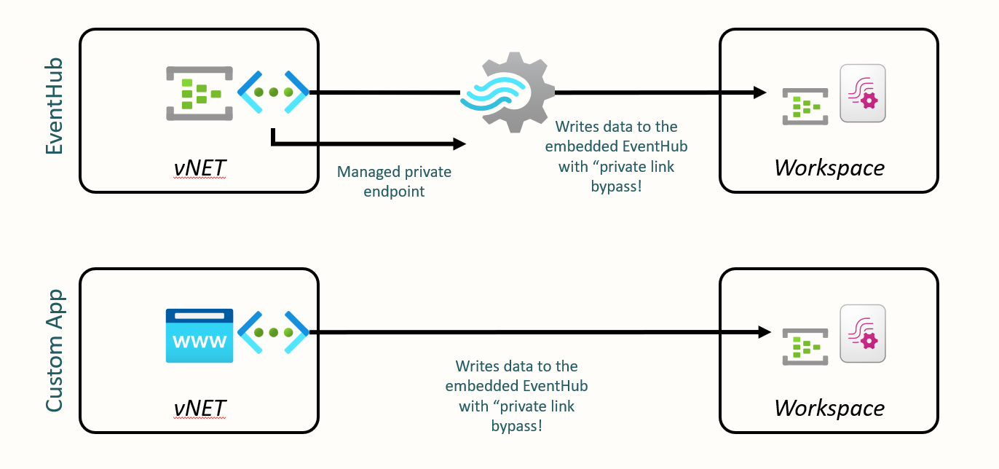

## Module 12 - Networking

### Introduction

Networking in Fabric Real-Time Intelligence plays a critical role in ensuring low-latency, secure, and scalable communication between services, devices, and data streams. From configuring Eventstream pipelines to managing network security policies and leveraging hybrid connectivity options, understanding the networking layer is fundamental for architects and developers building real-time analytics solutions. This article explores the core networking components of Fabric Real-Time Intelligence, how they support real-time workloads, and best practices for optimizing performance and reliability in production environments.

### Architectural deep dive

At the core of Fabric Real-Time Intelligence is a modular architecture designed to handle high-throughput, low-latency data flows across distributed environments. The system is built around Eventstreams, which act as the central pipelines for ingesting and routing data from various sources such as IoT devices, Azure Event Hubs, Kafka brokers, and REST APIs. These Eventstreams are backed by a scalable streaming engine that supports real-time event processing and ensures messages are delivered reliably and in sequence. This architecture allows for continuous data capture and transformation, which is essential for time-sensitive analytics and operational decision-making.

The networking layer within Fabric Real-Time Intelligence facilitates secure and efficient data movement between source systems, Eventstreams, and downstream consumers such as Power BI, Azure Data Lake, and machine learning endpoints. This is accomplished through a combination of private endpoints, managed virtual networks, and data gateways for hybrid scenarios. Network isolation and traffic control are enforced through Azure networking features like Network Security Groups (NSGs), ensuring that data stays protected while minimizing latency. This design provides flexibility in connecting both cloud-native and on-premises systems without compromising security or performance.

Another critical architectural component is the integration of streaming analytics and event processing logic directly within the pipeline. This is achieved using no-code and low-code authoring tools within the Fabric interface, allowing users to apply filtering, transformation, enrichment, and aggregation functions in real time. The networking infrastructure supports these compute layers by ensuring they have reliable access to incoming data and downstream destinations with minimal delay. Together, these architectural elements form a cohesive and extensible platform capable of supporting enterprise-grade real-time intelligence workflows.

All of this said, the handling and maintennence of network setup is handled through the usual Fabric setup and configuration on the tenant level. This be around Private endpoint configration and connection and the use of service principals for these kind of connections.

### Technical deep dive

When implementing connections through private endpoints, the Eventstream item does a lot of things behind the scenes. Here are the highlight of these things.

#### Connecting to an EventHub in a vNET

When using the Eventstream to connect to a private endpoint in a vNET the underlyging engine will provision an Azure Streaming Analytics job to pull the data from the EventHub using the Managed Private Endpoint connector.

This Azure Streaming Analytics job will then write the data to the embedded EventHub inside the Eventstream using a method named "private link bypass". From there the data is in the Eventstream and can be processed as normally.

#### Connecting to an App (or other connections) in a vNET

When connecting to an custom app (or other custom connections) from a vNET the private link connection will write the data directly to the embedded EventHub in the Eventstream and the processeing of data can continue.

To put it in an illustrative matter. it looks like this:

MS for now is calling this a "private link bypass" using contracts in the request to enable the trusted handshake between the "outside" ASA and the internal Eventhub in the Eventstream in the workspace not open to the public (in a vNET).

For destionation inside a vNET in Fabric, the Eventstream is also using the "private link bypass" for Lakehouse, Eventhouse in (push to EH). But here is a problem for EH pulling data from the Eventstream.

### Implementations

All of the above is automatically implemented when using vNETs, Private endpoints and workspaces which are shut down for private access. So it is not feasable to create labs and how-to's to this section.
