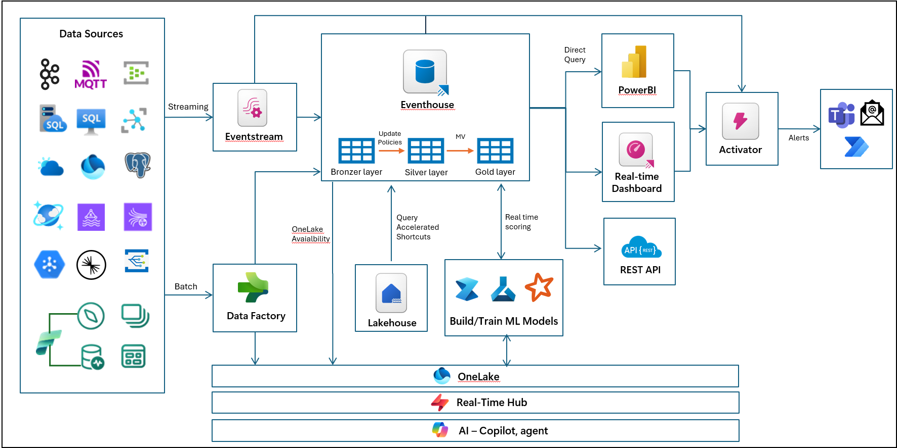
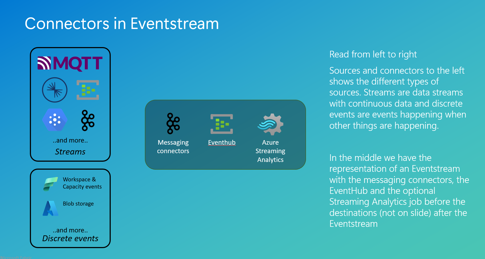
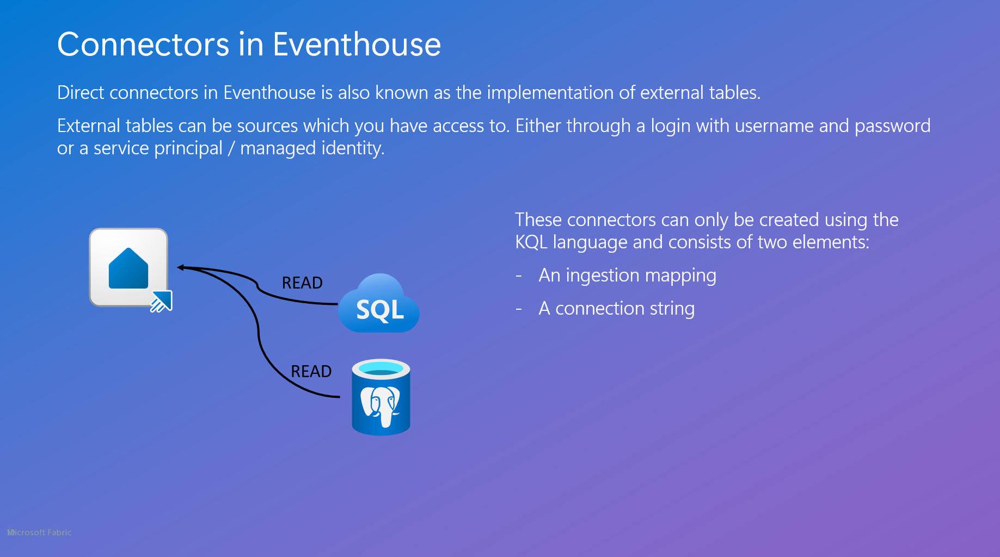
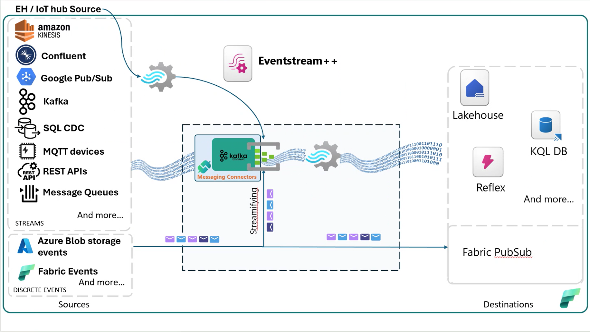
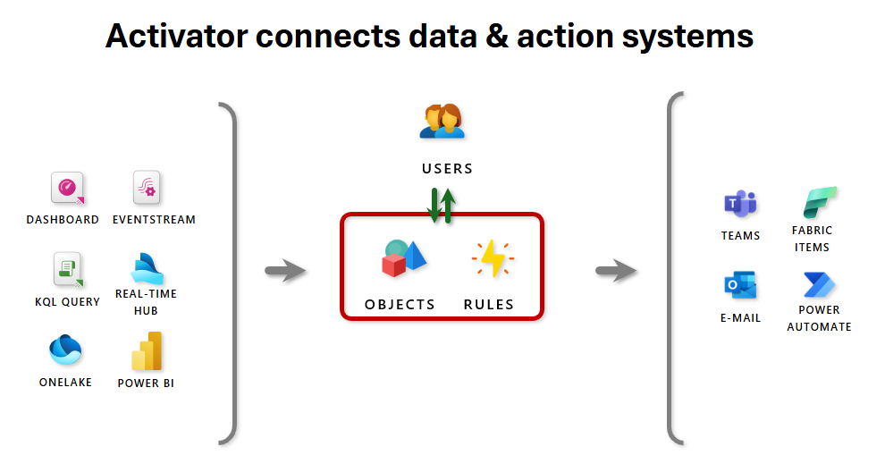
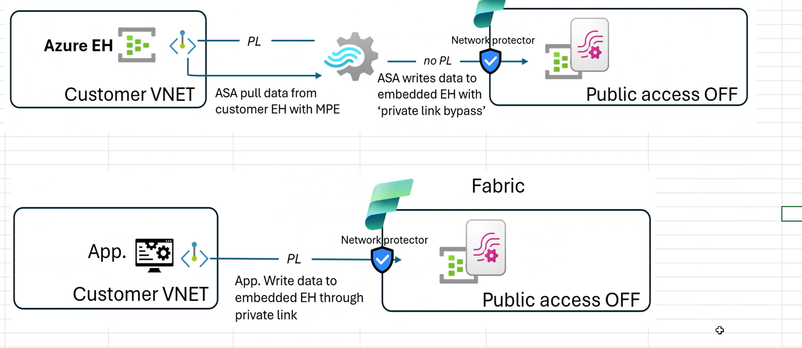

# Introduction

The Microsoft Fabric Real-Time Intelligence (RTI) platform represents a pivotal shift in how enterprises handle
streaming data, automation, and action-oriented analytics. As adoption grows, so too does the need for real-world
expertise that goes beyond the surface-level feature set.

## Why This Course Was Created

Across the Microsoft data ecosystem, we are seeing a recurring pattern: Partners and customers are building
real-time solutions using Fabric—but too often with architectural blind spots, implementation mistakes, or
fundamental misunderstandings of how services like Activator, Eventstream, and Reflex are meant to interoperate at scale.

For example:

- Partners report difficulty staffing RTI engagements due to a lack of L400–500-skilled professionals.
- Suboptimal implementations are leading to production disruptions,
- Customers are building real-time automation flows without fully understanding how detection
  rules interact with stream federation, delays, and failure states.
- Fundamental concepts such as pattern detection, state change management, and
  throughput handling are either misapplied or ignored.

These are not theoretical issues—they are impacting live deployments and increasing the burden on
support and engineering teams. We must address this gap in expertise now to avoid scale-limiting friction
across the RTI customer base.

## What This Course Provides

This course was built to:

- Equip senior engineers, architects, and partners with advanced technical insight into Fabric RTI’s architecture,
  performance characteristics, and behavioral nuances.
- Demystify complex real-time patterns, including dynamic schema handling,
  alert suppression strategies, federated stream orchestration, and event-driven pipeline execution.
- Enable best-practice implementations by showcasing what should happen in production—and what often
  goes wrong when you miss key details.
- Accelerate onboarding of RTI experts to ensure Microsoft’s ecosystem can meet the growing customer
  demand for high-fidelity real-time solutions.

The content is driven directly by interviews with Microsoft’s product engineering leaders, distilled into
actionable knowledge and guided labs.

## Modalities

- Total workshop duration is 2-3 days.
- Each module is accompanied with technical explanation of the Fabric Real-Time
  Intelligence component being used in the tutorial.
- Without the accompanied explanation, the tutorial can be completed in 1-2 days.

## Authors

- [Brian Bønk](https://www.linkedin.com/in/brianbonk/), Data Platform MVP
- [Frank Geisler](https://www.linkedin.com/in/frank-geisler/), Data Platform MVP
- [Matt Gordon](https://www.linkedin.com/in/sqlatspeed/), Data Platform MVP

## Contributing

- If you'd like to contribute to this lab, report a bug or issue, please feel free to submit a Pull-Request
  to the ==[GitHub repo](<link to repo>)== for us to review or ==[submit Issues](<link to repo>)== you encounter.

## Prerequisites

To get starated with this training and to understand the baseline of the Real-Time Intelligence suite of
services from Microsoft Fabric, it is expected of the audience to have the following certifications:

- [DP-600 Microsoft Certified: Fabric Analytics Engineer Associate](https://learn.microsoft.com/en-us/credentials/certifications/fabric-analytics-engineer-associate/?practice-assessment-type=certification)
- [DP-700 Microsoft Certified: Fabric Data Engineer Associate](https://learn.microsoft.com/en-us/credentials/certifications/fabric-data-engineer-associate/?practice-assessment-type=certification)
- [Microsoft Applied Skills: Implement a Real-Time Intelligence solution with Microsoft Fabric](https://learn.microsoft.com/en-us/credentials/applied-skills/implement-a-real-time-intelligence-solution-with-microsoft-fabric/)

This training will not help you understand the basics of the suite, and it will start of from the above mentioned knowledge level.

## Overview of the content

The content is built from 13 modules + 1 appendix, spanning ingestion of data, manipulation of data when
needed using the KQL language, visualize and analyze data using KQL, Real-Time Dashboards and Power BI, CI/CD and
architectural approaches, Security and Networking.

1. [Introduction to RTI](#module-1---introduction-to-rti) (Frank)
2. [Real-Time Hub](#module-2---real-time-hub) (Matt)
3. [Connectors](#module-3---connectors) (Brian)
4. [Ingestion](#module-4---ingestion) (Brian)
5. [Data modelling](#module-5---data-modelling) (Frank)
6. [Analytics](#module-6---analytics) (Brian)
7. [AI + Copilot](#module-7---ai--copilot) (Matt)
8. [Dashboards](#module-8---dashboards) (Matt)
9. [Rules (Activator)](#module-9---rules-activator) (Frank)
10. [Actions](#module-10---actions) (Frank)
11. [Security](#module-11---security) (Matt)
12. [Networking](#module-12---networking) (Brian)
13. [CI/CD and ALM](#module-13---cicd-and-alm) (Frank)
14. [Appendix](#appendix) (all)


Each module has the same overall structure:

| Structure                         | Content                                                                                                                                                                                                                                                            |
| --------------------------------- | ------------------------------------------------------------------------------------------------------------------------------------------------------------------------------------------------------------------------------------------------------------------ |
| 1. Introduction to the module     | Gives the fly-in to the module, the content and the business value of the module and area of RTI.                                                                                                                                                                  |
| 2. Architectural deep dive        | Introduces the module and the connection to the rest of the RTI suite in Microsoft Fabric. Also contains elements on how the architecture could work in conjunction with other parts of the RTI service.                                                           |
| 3. Technical deep dive            | Dive into the whereabouts of the service. Seen from the backend, with a deep technical walktthrough of how things are working behind the scenes and what makes the specific part of the service connect with the rest.                                             |
| 4. Implementations                | How should the specific part of the service be implemented and what to look out for when working with it. Also a deep walktrough of the details in functionality and outcome of the service.                                                                       |
| 5. Troubleshooting                | How to read error messages and error codes. How to debug issues. How to best help Microsoft support in case of need.                                                                                                                                               |
| 6. Orchestration and optimization | How does the service best fit with an entire architecture around orchestration, how to execute the processes. How to optimize the loads, speeds and querytimes.                                                                                                    |
| 7. Schemas and throughout         | How to handle schemas in the service and what to know when working with structured, semi-structured and unstructured data. A walkthrough of the limitations, configuration options and whereabouts of throughput                                                   |
| 8. Monitoring and pricing         | How to monitor the service and find the bottlenecks and other needed information of the performance. A deep learning element on how to calculate and estimate cost of a service and an entire implementation. How to monitor cost and optimize for cost reduction. |
| 9. Hands-on lab                   | A hands on lab with guides, to try out the specific service and to learn some of the L400 features.                                                                                                                                                                |

<div class="info" data-title="Note">

> **In some modules, you will not find all of the sections above. This is by intent, and shows that this specific section does not apply to this module, or the module does not contain any information about the section.**

</div>

## Module 1 - Introduction to RTI

### Introduction

Real-Time Intelligence (RTI) in Microsoft Fabric is a fully managed, end-to-end platform for ingesting,
processing, analyzing, and acting on streaming data — all in near real time.

It enables organizations to:

- **Capture live data** from sources like IoT devices, logs, files, APIs, and more using Eventstream.
- **Enrich and transform** that data in motion with KQL, Eventstreams, or low-code tools.
- **Detect patterns, anomalies, and threshold conditions** using intelligent Reflex rules and Activator.
- **Trigger automated actions** across systems (e.g., Power Automate, pipelines, APIs) the moment a business-critical event occurs.

RTI is deeply integrated with the broader Fabric platform — allowing seamless connectivity with OneLake, Notebooks, Pipelines,
Power BI, and security infrastructure. This gives enterprises a unified foundation for real-time operational
analytics, anomaly detection, alerting, and automated decisioning.

In short: RTI empowers you to go from data-in-motion to action-in-motion.

### Architectural deep dive

Real-Time Intelligence (RTI) is not a siloed service—it is a tightly integrated layer within the broader
Microsoft Fabric unified data platform, designed to support continuous intelligence pipelines across
structured and unstructured data streams.



At the architectural level, RTI is composed of several interlocking components:

#### 1. Data Sources (Streaming & Batch)

The architecture supports a wide range of streaming and batch data sources:

- Streaming: Kafka, MQTT, Azure Event Hubs, IoT Hub, Azure Data Explorer, PostgreSQL, Cosmos DB, and others.
- Batch: Ingested and orchestrated via Data Factory, which feeds both Lakehouse and Eventhouse layers.

#### 2. Eventstream – The Streaming Ingestion Gateway

Eventstream acts as the unified real-time ingestion layer:

- Connects to live data sources with low latency
- Filters, parses, and enriches data in motion
- Routes data simultaneously to destinations such as Eventhouse, Real-time Dashboards, and Activator

#### 3. Eventhouse – Layered Storage & Processing

With Eventhouse you can build:

- Bronze, Silver, and Gold layers for progressive data refinement
- Update policies to process data as they are ingested into the KQL-Databases
- Materialized views (MV) for near-real-time queryability
- Integration with OneLake and Query Accelerated Shortcuts for high-performance access

#### 4. Machine Learning Integration

The platform supports training and real-time scoring of ML models:

- Models consume streaming or batch data
- Real-time inference is embedded directly into the processing pipeline via Eventhouse

#### 5. Real-Time Visualization and Analytics

- Power BI and Real-Time Dashboards provide instant visibility into data flowing through
  Eventstream and Eventhouse
- Data is queried directly via DirectQuery, eliminating the need for duplication

#### 6. Activator – Action Engine and Automation Layer

Activator is the execution engine for real-time actions:

- Listens for triggers from Reflex detection rules or Eventstream patterns
- Executes downstream actions: Power Automate flows, REST API calls, email, Teams alerts, and more
- Supports composable rules, stateful evaluation, and alert suppression strategies

#### 7. Foundational Platform Integration

All RTI components are built on core Fabric foundations:

- OneLake for unified data storage across batch and streaming workloads
- Real-Time Hub as a logical fabric-wide orchestration layer
- AI and Copilot Agents for intelligent assistance and automation enrichment

#### Architectural Highlights

- **Integrated Lakehouse and Streaming:** Combines traditional Lakehouse architecture with real-time stream
  processing
- **Natively Fabric:** All services are fully managed and deeply connected across the Fabric ecosystem
- **Streaming-to-Action:** Built for low-latency, high-value automated responses
- **End-to-End Observability:** Real-time dashboards and ML scoring close the loop from raw data to business decision

RTI workloads are capacity-based, ensuring predictable performance and cost control across tenant- or
workspace-scoped environments. It supports multi-tenant, cross-workspace, and multi-sink streaming
architectures, making it a good fit for enterprise-wide observability, monitoring, and automation solutions.

### Technical deep dive

Real-Time Intelligence in Microsoft Fabric is more than a data flow — it’s a system of reactive engines working together to process, detect, and act on data in milliseconds. This section introduces the internal workings behind the core components to help you understand why things behave the way they do. This is only a short summary.
These topics are covered in the different Modules more in depth

#### Eventstream Internals

**Core Focus:** Buffering, parallelization, schema evolution, and latency management

- Ingested data from streaming sources is processed via partitioned pipelines, often aligned to source partitions (e.g., Kafka topics).

- Eventstream introduces a controlled buffer delay (typically ~10 seconds) to enable multi-sink routing and enrichment.

- Supports schema inference and evolution, allowing downstream systems to adapt to changes in the payload shape.

- Event delivery is parallelized but respects ordering guarantees per partition.

**Implication:** Changes in source schemas, burst traffic, or improperly filtered data can delay or disrupt downstream pipelines.

#### Eventhouse Mechanics

**Core Focus:** Update policies, ingestion windows, materialized views

- Data ingested by Eventstream to the Bronze layer can be written to Silver or Gold layers via update policies.
- Ingestion into Eventhouse supports near real-time materialized views (MV) to precompute aggregates.
- Ingestion windows define how often new records are committed and visible — typically every few seconds.

**Implication:** Knowing how Eventhouse batches and evaluates data is essential for synchronizing analytics and trigger points with actual data availability.

#### Activator

**Core Focus:** Trigger resolution, delay models, retries, and action targeting

- Activator receives event context from Reflex including all rule-evaluated fields and metadata.
- Internally, Activator applies:

  - Suppression logic (e.g., “no more than one alert per 60s”)
  - Concurrency controls (to avoid over-firing actions)
  - Execution retries for transient failures (e.g., webhook timeouts)

- Supports multiple action targets, including notebooks, pipelines, Power Automate, and webhooks.

**Implication:** Misconfigured rules or actions can overload endpoints or cause noisy alerting without proper debounce logic.

#### State Handling in Reflex

**Core Focus:** Stateless vs. stateful evaluation, cooldowns, suppression

- Stateless rules match raw values (e.g., value > 100) — evaluated on every event.
- Stateful rules track transitions (e.g., value DECREASES, EXIT RANGE, or absence over time).
- Reflex maintains in-memory state per tracked entity, e.g., per device_id or bikepoint_id.
- Cooldown timers and alert thresholds reduce false positives and spamming.

**Implication:** Understanding how state is maintained and when it resets is crucial to correct and efficient pattern detection.

#### Action Routing

**Core Focus:** Execution paths, targeting logic, and custom extensions

- Activator can execute multiple action types depending on business needs:
  - Built-in Power Automate integration
  - REST POST to web services or Teams
  - Trigger Fabric Pipelines or Notebooks
- Action routing can dynamically include payload data, headers, and even computed values.
- Soon: Direct Web API integration to define fully custom actions.

**Implication:** Building enterprise-grade reactions means understanding what each action path supports in terms of latency, retries, and payload structure.

#### Performance Tuning Knobs

**Core Focus:** Throughput, suppression, and buffer configuration

- Eventstream allows tuning:
  - Buffer sizes
  - Output frequency
  - Filtering complexity
- Reflex rules can include alert frequency controls and aggregation windows
- Activator supports deduplication, throttling windows, and max concurrency settings

**Implication:** Understanding these levers helps reduce noise, optimize cost, and improve SLAs.

#### Capacity Impact

Core Focus: RTI’s consumption of Fabric Capacity Units (FCUs)

- Each component consumes compute based on:
- Data volume and frequency
- Rule complexity
- Action volume and concurrency

Eventstream and Activator scale with event velocity, while Eventhouse depends on query concurrency and storage tiering.

**Implication:** RTI capacity must be planned with sustained and peak loads in mind — especially for high-volume streaming applications.

### Implementations

Microsoft Fabric Real-Time Intelligence (RTI) is engineered for enterprise-grade data streaming, event detection, and low-latency action pipelines. But design elegance on paper doesn’t guarantee operational success. Implementations in the real world surface challenges that are not immediately visible from documentation or demos.

This course places special emphasis on implementations—not just how the services work, but how they behave under scale, complex orchestration, and production constraints.

#### What "Implementation" Means in RTI

- Designing event ingestion pipelines that handle bursty, high-volume, and diverse data reliably
- Authoring rules and detections that avoid false positives and alert spamming
- Managing state, schema evolution, and windowing in streaming logic
- Triggering actions (notebooks, pipelines, alerts) in a controlled, idempotent, and performant manner
- Embedding RTI into broader data estate orchestration (Synapse, Power BI, Microsoft Purview, etc.)

#### Why It Matters

In current partner engagements, we’ve observed that incorrect or naïve implementations are a leading cause of:

- Production outages due to misfiring rules or underprovisioned capacities
- Delayed detection due to improper windowing or federation configuration
- Unnecessary costs from unfiltered ingestion or redundant triggers

Getting implementation right is not a bonus—it’s foundational to making RTI reliable, scalable, and cost-effective.

#### What to Expect in This Course

You’ll learn not only how to configure services, but also:

- When to use them—and when not to
- How to structure stateful logic for durable alerting
- How to monitor behavior in-flight and post-execution
- Where common pitfalls lie, and how to avoid or mitigate them

We’ll provide implementation blueprints and walkthroughs drawn from real customer architectures, internal Microsoft learnings, and validated best practices from the product engineering team.

### Troubleshooting

#### Real-Time Systems Fail Differently

In real-time architectures, failures don’t always come with clear error messages. Instead, they manifest as **missing events**, **delayed detections**, **duplicate triggers**, or **silent breakdowns in orchestration**.

Microsoft Fabric Real-Time Intelligence (RTI) is a powerful suite—but also a distributed, low-latency system where:

- Data flows continuously across services (Eventstream → Eventhouse → Activator/Visualisation)
- Latency thresholds are tight
- Observability requires intentional design

Because of this, troubleshooting in RTI is not an isolated phase—it’s an architectural concern that must be addressed from the outset.

#### Why Troubleshooting is Foundational

This course integrates troubleshooting as a core skillset throughout every module. For senior architects and data engineers, success with RTI doesn’t just mean getting pipelines running - it means keeping them stable, traceable, and observable in production.

You’ll explore:

- How to diagnose lag across ingestion, federation, and evaluation layers
- How to trace issues across services, from Eventstream failures to delayed triggers in downstream systems
- How to handle schema mismatches, data gaps, and unexpected bursts
- How to read and act on system diagnostics, including metrics, logs, and rule previews

#### The Cost of Poor Troubleshooting Readiness

In real-world deployments, we’ve seen:

- Pipelines silently stall because stream partitions were dropped upstream
- Rules misfire due to misunderstood time windows or null handling
- BI dashboards display stale data because of overlooked ingestion lag
- Support escalations take days due to lack of trace-level observability

This course gives you the tools and mindset to design for debuggability from day one—avoiding the cost of reactive firefighting.

#### What You'll Learn

By the end of the course, you’ll be able to:

- Design RTI architectures that are traceable end-to-end
- Build monitoring into every component—from Eventstreams to KQL DBs to actions
- Use built-in and external tools (e.g., Log Analytics, Monitor, Diagnostic Logs) to detect and resolve failures
- Provide clear signals and telemetry when engaging with Microsoft support or operations teams

The best RTI systems are not just fast—they’re also introspectable, resilient, and transparent when things go wrong.

### Orchestration and optimization

#### Beyond Configuration: Architecting for Flow and Efficiency

In Real-Time Intelligence, services like Eventstream, KQL DB, Real-Time Hub and Activatorare powerful individually - but they only deliver business value when orchestrated into coherent, low-latency dataflows.

This course emphasizes not just how to configure components, but how to architect and optimize them holistically - so that data moves with purpose, triggers fire with precision, and costs stay predictable at scale.

#### The RTI Orchestration Model

Microsoft Fabric RTI enables event-driven workflows, but orchestration must be explicitly designed to ensure:

- Data arrives at the right processing layer (e.g., KQL DB vs. pipeline vs. alert rule)
- Actions execute only when preconditions are satisfied
- State transitions are respected, especially in temporal logic
- Downstream systems (Power BI, Synapse, Teams) are triggered with the right payload, at the right time

You’ll learn how to use tools like:

- Eventstream filters and partitions to direct traffic efficiently
- KQL queries with temporal windows and joins to correlate real-time data
- Rule federation and grouping to reduce trigger noise
- Power Automate and Notebooks to create precise, governed actions

#### Optimization is Not Optional

Real-time systems operate under tight latency budgets and throughput ceilings. Poor optimization can result in:

- Delayed detections (e.g., alerts fire after the event has passed)
- Unnecessary compute costs (e.g., evaluating every message in every rule)
- Overloaded KQL DBs due to unbatched inserts or joins across high-velocity streams
- Stream starvation or backpressure, causing missed detections

Optimization in RTI isn’t a one-time tuning—it’s a continuous design mindset. You’ll explore:

- How to model throughput across ingestion and federation
- How to structure queries and pipelines for sub-second latency
- How to monitor execution metrics and system counters
- How to right-size capacity and workload placement across Fabric items

#### What You'll Learn

Throughout the course, you will develop a deep understanding of how to:

- Design end-to-end orchestrated pipelines across RTI components
- Minimize latency, contention, and false positives through query and rule optimization
- Structure workloads for observability, testability, and reliability
- Estimate and control resource consumption and cost

In RTI, performance is not a luxury - it’s a design requirement. And orchestration is where performance becomes architecture.

### Schemas and throughput

#### The Overlooked Foundations of RTI Architecture

In Real-Time Intelligence (RTI), much of the architectural complexity lies not in configuration, but in understanding how data structure (schemas) and data velocity (throughput) impact the system’s behavior from ingestion to action.

Poor assumptions about these two dimensions are a leading cause of production issues in real-world RTI deployments. This course tackles both topics as core architectural considerations—not as side effects of upstream decisions.

#### Why Schemas Matter in Real Time

RTI services - Eventstream, KQL DB, Activator, Real-Time Hub - depend on explicit schema understanding to parse, correlate, and act on data. But in modern streaming systems, schemas are rarely fixed:

- JSON payloads evolve
- Fields become nullable or disappear
- New attributes are added midstream

If your architecture assumes schema stability, you’re building a fragile system.

You’ll learn:

- How schema drift can break pipelines silently
- How semi-structured payloads (e.g. nested JSON) impact parsing and filtering
- How to manage schema alignment across ingestion, detection, and action layers
- When to use schema-on-read (e.g., KQL parse_json) vs. schema-on-write (e.g., structured Eventstream)

Schema is not just a developer concern—it’s a first-order operational dependency.

#### Throughput: The Invisible Limit

Fabric RTI is built for speed, but every component - Eventstream, KQL DB, Pipelines, Notebooks - has practical throughput boundaries. Many implementations fail to model:

- Ingest rate per partition
- Rule evaluation cost under event spikes
- Memory pressure in downstream aggregations

The result? Delays, throttling, and even silent data loss.

This course teaches you how to:

- Benchmark and estimate throughput end-to-end
- Identify bottlenecks in ingestion, federation, and action layers
- Use tools (e.g., Eventstream diagnostics, Monitor metrics, KQL DMVs) to trace pressure points
- Optimize rule complexity and reduce fan-out in streaming pipelines

Real-time success isn't about speed alone—it’s about sustained, observable, and predictable throughput.

#### What You'll Learn

Throughout this course, you’ll develop the skills to:

- Architect for schema evolution while maintaining system stability
- Design for throughput-aware processing across Fabric RTI components
- Choose formats (CSV, JSON, Avro) based on latency and fidelity trade-offs
- Prevent schema mismatches and stream overloads through early validation and instrumentation

Schema defines what data is. Throughput defines how much and how fast. Together, they define whether it works.

### Monitoring and pricing

#### Real-Time Systems Demand Real-Time Insight

In Real-Time Intelligence, what you can’t observe, you can’t control—and what you can’t control, you can’t trust in production.

Microsoft Fabric RTI enables sophisticated low-latency pipelines, but with that power comes the need for rigorous **monitoring** and **cost governance**. This course treats both as non-negotiable pillars of a production-grade design.

#### Monitoring: Observability is Architecture

Monitoring in RTI is not just about uptime - it’s about:

- Latency detection across ingestion, evaluation, and action layers
- Event gaps (e.g., heartbeat failures, missing partitions)
- Trigger audits (what fired, when, with what payload)
- Data quality diagnostics (nulls, schema errors, outliers)

Yet many implementations defer observability until after deployment, resulting in:

- Blind spots during alert storms or missing events
- Difficulty debugging false positives or failed triggers
- Lack of evidence when engaging with Microsoft Support

You’ll learn how to:

- Leverage built-in diagnostics in Eventstream, Activator, and Real-Time Hub
- Use Azure Monitor, Log Analytics, and diagnostic logs for telemetry aggregation
- Build live dashboards in Power BI for RTI health monitoring
- Trace a single event across the full RTI pipeline using correlation IDs and logging hooks

Monitoring is not a dashboard—it’s a design mindset that enables production trust.

#### Pricing: Real-Time Costs Are Continuous

RTI workloads are event-driven, continuous, and potentially high-volume. Without cost awareness, teams risk:

- Unexpected consumption spikes (e.g., unfiltered streams, over-triggered actions)
- Wasteful rule evaluation on irrelevant partitions
- Over-provisioning of capacity in pipelines and KQL DBs

This course trains you to design with cost efficiency in mind from the start:

- Estimate per-event cost across ingestion, federation, and action
- Understand how capacity SKUs, RTI item types, and rule frequency affect pricing
- Use cost telemetry and Fabric billing APIs to monitor spend in near-real-time
- Apply cost optimization patterns (e.g., preview mode testing, selective rule targeting, action throttling)

RTI cost is not just a budget item - it’s a feedback loop for architectural efficiency.

#### What You’ll Learn

By the end of the course, you will be able to:

- Build fully observable RTI pipelines with end-to-end diagnostics
- Detect anomalies and degradations before they affect downstream systems
- Predict and monitor event-driven cost behavior at scale
- Make design trade-offs that balance latency, fidelity, and financial impact

In production-grade RTI systems, what gets monitored gets trusted—and what gets priced gets optimized.

## Module 2 - Real-Time Hub

### Introduction

### Architectural deep dive

### Technical deep dive

### Implementations

### Troubleshooting

### Orchestration and optimization

### Schemas and throughput

### Monitoring and pricing

### Hands-on lab

## Module 3 - Connectors

### Introduction

The Real-Time Intelligence suite in Microsoft Fabric has a lot of connectors. These connectors are in place to enable you to read data from a various number of sources.

The sources are mainly configured using the Eventstream service in a workspace. There is also a set of functionalities directly in the Eventhouse.

In this module, we will dive into the whereabouts of each methods and show you how to work with the different connectors. We will also discuss the technical details for each method (not all connectors) and show you what to take into account when working with the services.

### Architectural deep dive

The way the services in Eventstream is build, is based on a general approach to the standard services in Azure from:

- Azure EventHub: This service is the message broker for each message coming to the Eventstream and makes sure to accept the message and send it onwards to the Streaming Analytics service (if neeeded) or directly to the configured destination in the Eventstream.
- Azure EventGrid: This service is the role of listening to events happening (Storage Account Event, Workspace Events etc.) and send the messages and event details onwards to the EventHub for futher processing.
- Azure Streaming Analytics: This service can be utilized in the Eventstream, if you are implementing any transformations to the data flowing through the service. If you are not transforming the data, this service will not be used. Even though it is always provisioned, it might not actually be used.

These three services are the backbone of the Eventstream service and are provisioned every time you create an Eventstream. A detailed rundown of the Eventstream service will also be made later in Module 4 - Ingestion.

### Technical deep dive

From a high level perspective, two types of connectors exist in Real-Time Intelligence. Connectors from Eventstream and connectors for Eventhouse.

Connectors for Eventstream are the ones found in the “source” section of Eventstream.
These connectors are always expanding and contains sources for Microsoft out-of-the-box sources and sources from 3rd party providers, like Google pub/sub, Confluent Kafka etc.



Connectors for Eventhouse are built on top of the Azure Data Explorer database engine and can only be configured using the KQL script language.
These connectors are not as extensive as the ones found for Eventstream.



### Schemas and throughput

Schemas will be configured for direct ingestion to the Eventhouse only. For data which is pushed to the Eventhouse, the schema will not be defined in other way than the destionation table in the Eventhouse.
Schema validation is a part of the Ingestion module and will be handled there.

When defining Eventhouse connectors, you must also define a schema to support that specific ingestion.
This is done in an _ingestion mapping_ in the Eventhouse itself. These exists on two levels: Database mapping and database, table mapping. The last mapping is fixed to a specific table in the database, where as the first one is only tied to a specific database.

An ingestion mapping consists of the columns and the corresponding data type - for instance:

```kql

.create table DestinationTable ingestion csv mapping "MappingOne"
'['
'   { "column" : "rownumber", "DataType":"int", "Properties":{"Ordinal":"0"}},'
'   { "column" : "rowguid", "DataType":"string", "Properties":{"Ordinal":"1"}}'
']'

.create database DestinationDatabase ingestion csv mapping "MappingTwo"
'['
'   { "column" : "rownumber", "DataType":"int", "Properties":{"Ordinal":"0"}},'
'   { "column" : "rowguid", "DataType":"string", "Properties":{"Ordinal":"1"}}'
']'

```

Notice the difference in the **table** and **database** in the code above.

<div class="info" data-title="Note">

> When working with JSON format the ingetsion mapping has a special structure and syntax. Please follow [this link](https://learn.microsoft.com/en-us/kusto/management/json-mapping?view=azure-data-explorer) to read more.

</div>

#### Schemas best practices

When working with connectors and ingestion, it is good practice to work with _typed_ columns when applicable. So try to avoid the dynamic datatype. If working with dynamic data type and some JSON fields are often used for searching and aggregration, then do an explicit convertion before storing and save it as string, long or ind for faster performance.

When working with datetime columns, these should always be stored as the datetime data type. Long and int can also store datetime, but the storeage and performance will not be as effective as the datetime format.

If a column can be converted from decimal to real, then do that. It will help the engine in the aggregation.

Any identity columns in the source data should be converted to a string. Strings are much faster than int and other number formats, as the index on data is build to work with strings ootb.

Use as narrow tables as possible for ingestion and in the same time try to denormalize data to limit joins.

### Monitoring and pricing

Monitoring of connectors is not available, please see the Module for Ingestion to get the introduction to the ingetsion errors and monitoring.

Pricing for connectors are free, they are only pointers to data and sources, and does not generate cost in themselfes.

### Hands-on lab

#### Ingest data from SQL server to Eventhouse

#### Read data from JSON file to Eventhouse

## Module 4 - Ingestion

### Introduction

### Architectural deep dive

### Technical deep dive

Eventstream - meeting with Xu Jiang April 14



- Low = 4 partitions
- Medium = 16 partitions
- High = 32 partitions

Throughput has 3 parts: the inlet (the event hub) the processing, the ASA job and lastly the destination speed.
Custom endpoint has the hightest throughpout as a destination. See the documentation for details (Eventstream -> Configure settings)
Notice the throughput when using pull and push to Eventhouse

When choosing "Eventstream before ingestion" the Eventhouse does a streaming mode and the max throughput is only theoretical.

For Event Hub and IoT Hub source:

- An ASA job is created to pull the data and send it to the Eventstream
- This also enables vNET, as the Streaming connector is not vNET enabled
- MS is working os using the Messaging Connectors to read data from EH and IoT Hub

### Implementations

### Troubleshooting

### Orchestration and optimization

### Schemas and throughput

### Monitoring and pricing

### Hands-on lab

## Module 5 - Data modelling

### Introduction

### Architectural deep dive

### Technical deep dive

### Implementations

### Troubleshooting

### Orchestration and optimization

### Schemas and throughput

### Monitoring and pricing

### Hands-on lab

## Module 6 - Analytics

### Introduction

### Architectural deep dive

### Technical deep dive

### Implementations

### Troubleshooting

### Orchestration and optimization

### Schemas and throughput

### Monitoring and pricing

### Hands-on lab

## Module 7 - AI + Copilot

### Introduction

### Architectural deep dive

### Technical deep dive

### Implementations

### Troubleshooting

### Orchestration and optimization

### Schemas and throughput

### Monitoring and pricing

### Hands-on lab

## Module 8 - Dashboards

### Introduction

### Architectural deep dive

### Technical deep dive

### Implementations

### Troubleshooting

### Orchestration and optimization

### Schemas and throughput

### Monitoring and pricing

### Hands-on lab

## Module 9 - Rules (Activator)

### Introduction

In the landscape of real-time analytics, Activator plays a pivotal role in bridging insights and action. This module introduces Activator as Microsoft Fabric’s low-latency event rule engine, designed to listen to event streams, detect complex conditions, and trigger downstream actions within seconds.

One of Activator’s defining characteristics is that it is a no-code, low-latency event detection engine. Through an intuitive, GUI-based experience, users can define rule logic such as “value decreases below a threshold” or “state becomes offline” without writing a single line of code. These rules can then trigger pipelines, Teams messages, or Power Automate flows. This no-code paradigm democratizes access to real-time automation by allowing business users and analysts—not just developers to build and maintain production-grade detection logic directly on streaming data.

From detecting anomalies in IoT telemetry to reacting to operational changes in supply chains or public infrastructure, Activator transforms raw event data into automated, intelligent responses. It enables organizations to move from passive monitoring to proactive, event-driven decision-making - a shift critical in high-velocity data environments.

Throughout this module, you will explore how Activator can be integrated into enterprise-grade RTI architectures, how it interoperates with Reflex, Eventstreams, Pipelines, and Power Automate, and how to optimize it for performance, precision, and cost-efficiency.

By the end of this module, you will be equipped to:

- Architect stateful, rule-based detection logic on live data streams.

- Build responsive pipelines triggered by real-time events and patterns.

- Implement best practices to avoid alert fatigue, manage state transitions, and orchestrate Activator with the wider Fabric RTI suite.

- Understand the pricing, monitoring, and schema evolution considerations essential for stable production use.

**Business Value:** Activator allows you to embed operational intelligence into your streaming pipelines, empowering frontline decisions at the speed of data.

### Architectural deep dive

Activator is the event detection and rules engine at the heart of Microsoft Fabric’s real-time intelligence stack. Architecturally, it acts as an intelligent observer - consuming high-velocity data streams, evaluating rule conditions in near real-time, and initiating automated downstream actions based on changes in event states.

It fits into a reactive, event-driven architecture where data flows continuously, and decisions are made based on stateful evaluations of event data in near real-time.

#### Core Architectural Elements



- **Event Sources (Eventstream)**
  Activator connects directly to Eventstreams, which ingest data from various producers (e.g., Azure Event Hubs, IoT devices, custom APIs). These streams serve as the source of events, and Activator can subscribe to one or more eventstreams to observe data changes.

- **Events and Objects**
  Events are individual records (e.g., a telemetry signal or file drop) received via Eventstream. These are grouped into objects based on a shared identifier (e.g., bikepoint_id, device_id, etc.). Rules are then evaluated per object, allowing fine-grained detection (e.g., per sensor or per asset).

- **Rules and Conditions**
  Each Activator includes one or more rules, which are evaluated continuously. These can be simple comparisons (value < threshold) or stateful expressions like `BECOMES`, `DECREASES`, `INCREASES`, `EXIT RANGE`, or absence of data (heartbeat). Activator ensures state tracking per object, which enables complex pattern detection over time.

- **Actions**
  When a rule condition is satisfied, Activator can trigger:

  - Data Pipelines or Notebooks in Fabric.

  - External actions via Power Automate (e.g., send email, Teams message, create ticket).

  - (Coming soon) Direct API integrations to custom systems using Webhooks or REST endpoints.

- **Alert Management and Rule Testing**
  Activator provides preview and impact estimates before rules are activated, showing how often a rule would have fired on historical data. This helps prevent alert spam and over-firing. Internally, state transitions are managed to suppress noise (e.g., a value must cross a threshold, not just remain under it).

- **Monitoring and Cost Control**
  You only incur cost when Activators are actively running. Activator instances are scoped to Fabric capacities and can be monitored through the workspace. Runtime logs and telemetry are available via Eventstreams and pipeline outputs.

#### Deployment Model

Activator instances are deployed per workspace and bound to specific data sources. Multiple Activators can monitor the same stream, enabling parallel rule evaluations for distinct business functions. Because Activator is capacity-bound, pay-as-you-go pricing only applies when rules are actively running—providing cost efficiency for intermittent detection scenarios.

#### Integration Points within Fabric RTI

| Component      | Interaction with Activator                                                              |
| -------------- | --------------------------------------------------------------------------------------- |
| Eventstream    | Supplies federated data to Activator via low-latency stream ingestion.                  |
| Reflex         | Can generate events (e.g., enriched entities or inferred labels) that trigger Activator |
| Pipeline       | Target of Activator’s rule triggers—automates downstream processing                     |
| Power BI       | Consumes the result of triggered pipelines or notebooks for real-time visualizations    |
| Power Automate | Allows event-driven ops via templated or custom actions                                 |

### Technical deep dive

Microsoft Fabric Activator operates as a high-performance, state-aware rules engine designed for low-latency evaluation of streaming events. At its core, Activator processes real-time events emitted via Eventstream, evaluates rule conditions per logical object, and initiates downstream actions in response to state transitions. This section outlines how Activator performs these operations under the hood, with attention to execution logic, state management, and internal orchestration.

#### Event Ingestion and Object Binding

Events ingested into Activator originate from Eventstream, which supports multiple upstream sources (e.g., Azure Event Hubs, IoT Hub, Blob Storage triggers). Each event contains:

- A timestamp
- A payload (structured or semi-structured data)
- One or more attributes used for object identification (e.g., `device_id`, `bikepoint_id`)

Object creation is implicit: Activator groups events using a designated object key. Rules are scoped to objects, meaning all evaluation logic is object-aware and independent across instances.

<div class="info" data-title="Example">

> **A rule monitoring `bikepoint_id` will create distinct logical evaluations for each unique station.**

</div>

#### Rule Evaluation Engine

Rules in Activator can be stateless or stateful:

- **Stateless rules** evaluate each event in isolation (e.g., `value < 50`)

- **Stateful rules** maintain memory across events per object (e.g., value `DECREASES`, `BECOMES`, `EXIT RANGE`)

Stateful evaluation relies on:

- **Delta detection:** Tracks changes between prior and current event values

- **Temporal sequencing:** Evaluates time-based conditions like absence of events (heartbeat detection)

- **State transitions:** Rules only fire on entry into a new state, preventing repeated firings in unchanged conditions

Each rule condition is compiled into an execution graph that is evaluated continuously, in-memory, and near-instantly. The system is optimized for **sub-second decisioning latency** after event arrival.

#### Event Deduplication and Alert Suppression

To prevent alert flooding:

- Activator maintains a state cache for each object-rule combination

- Firing conditions are edge-triggered (not level-triggered)

- "Suppression windows" (implicit via state model) reduce redundant actions

This design ensures that a rule like value BECOMES critical only fires when the condition first becomes true—not every time an event with the same value arrives.

#### Actions and Execution Pipeline

When a rule fires:

- Activator emits a trigger message with the current object state and rule metadata

- Supported targets:

  - Fabric Pipelines (for data movement, enrichment)
  - Fabric Notebooks (for ML scoring, diagnostics)
  - Power Automate Flows (for business process integration)
  - Teams Notifications (using template-based messaging)

- Payloads are parameterized automatically using event properties (e.g., filename, device status)

Actions are **non-blocking**, and Activator does not wait for downstream execution to complete—enabling scalable asynchronous flows.

#### Performance, Throughput, and Latency

- **Ingestion rate:** Scales with Eventstream’s throughput (millions of events per hour supported)

- **Processing latency:** Typically under 15–30 seconds end-to-end

- **Throughput optimization:** Activator shards evaluation across objects; performance degrades only under high cardinality + high rule complexity scenarios

- **Cold start vs. hot path:** Rule activations and state tracking become more efficient over time due to caching

#### Resilience and Error Handling

- **Timeout behavior:** If no events arrive for an object after ~10 minutes, it is considered stale and removed from memory

- **Monitoring and diagnostics:** Trigger logs and preview tools assist in testing and runtime validation

- **Fault tolerance:** Activator persists minimal metadata; evaluation state is maintained in volatile memory and reconstructed from Eventstream if needed

### Implementations

Implementing Activator in Microsoft Fabric requires understanding not just how to configure rules, but how to design for precision, scalability, and operational clarity. While the UI experience emphasizes no-code configuration, real-world implementations often require careful architectural decisions to handle event volume, state granularity, and rule maintainability.

#### Typical Implementation Workflow

- **Ingest data using Eventstream**
  Connect structured or semi-structured sources like Azure Event Hub, IoT Hub, or Blob Storage. Eventstream standardizes input and enables schema projection.

- **Define objects and conditions in Activator**
  Choose a key to group events into objects (e.g., device_id, sensor_location). This becomes the unit of rule evaluation. Design rules using natural language operators like:

  - `BECOMES` (e.g., status becomes "offline")

  - `DECREASES` / `INCREASES` (e.g., temperature decreases)

  - `EXIT RANGE` (e.g., sensor value leaves [20, 80])

  - `Heartbeat conditions` (e.g., no data received for 10 minutes)

- **Bind to downstream actions**

Trigger:

- Data pipelines to transform or ingest data downstream
- Notebooks for scoring models or enrichment
- Power Automate flows for notifications, tickets, or system updates
- Microsoft Teams for alerting or collaboration (via Flow Builder or future Web API)

- **Preview and test**
  Validate the expected behavior before activation. Activator allows rule preview and event replay, showing how often a rule would have fired on recent data.

- **Activate and monitor**
  Deploy rules and monitor trigger frequency. Logs are available through Eventstream or tied to triggered actions. Use this to tune rule logic and cost footprint.

#### Key Design Considerations

- **Stateful logic vs. stateless filtering**
  Stateless filters (e.g., `value < 5`) may be too noisy. Prefer transitional logic like `DECREASES` or `BECOMES` to reduce false positives and spam.

- **Object key cardinality**
  Each unique object key (e.g., `device ID`) incurs memory and compute tracking. High-cardinality implementations (>10,000 unique objects) should be carefully profiled to maintain performance.

- **Combining rules**
  Activator supports both AND and OR logic. Use them to build complex detection trees (e.g., temperature decreases AND status becomes “critical”).

- **Alert fatigue management**
  Design rules to fire on edge transitions only. Activator automatically suppresses repeat alerts unless a new state is entered, but good design further reduces noise.

#### Practical Use Cases

- **IoT & Asset Monitoring**
  Trigger pipelines when vibration or temperature decreases across thresholds, or when a device stops sending data (heartbeat failure).

- **File-based Workflows**
  In Blob Storage scenarios, use Eventstream to detect file drops (e.g., CSVs) and route metadata (file name, path) into pipelines automatically.

- **Public Transportation / Urban Infrastructure**
  As seen in the bikepoint example, Activator can be used to track real-time bike availability at docking stations and send alerts when inventory falls or rises unexpectedly.

- **Security & Compliance**
  Future support for sensitivity labels (e.g., from Reflex) will allow context-aware triggers, such as alerting on files labeled as “Confidential” being moved or accessed.

#### Reusability and Maintainability

- Activator supports multiple rules per object and multiple Activators per stream, enabling modular designs (e.g., separating operational and compliance triggers).

- Rules are managed independently, but shared context (object key, schema) enables a common detection fabric across business domains.

### Troubleshooting

While Activator abstracts away much of the complexity behind real-time event processing, implementations at scale may encounter data, configuration, or orchestration-related issues that require systematic troubleshooting. This section provides a deep dive into how to identify, analyze, and resolve common operational problems in Activator.

#### Common Issues and Symptoms

| Symptom                                  | Possible Cause                                                                          | Remediation                                                                                               |
| ---------------------------------------- | --------------------------------------------------------------------------------------- | --------------------------------------------------------------------------------------------------------- |
| Rules not firing                         | Eventstream not pushing data, incorrect object keys, rule conditions never met          | Validate stream connectivity, use rule preview, check object schema mapping                               |
| Alert spam or repeated triggers          | Use of stateless operators (e.g., less than) instead of stateful ones (e.g., decreases) | Redesign rules to use transitional operators like `DECREASES`, `BECOMES`, or enable debounce logic        |
| No actions triggered                     | Misconfigured pipeline/notebook/action target, or rule not satisfied                    | Check action bindings, ensure trigger payloads match pipeline expectations                                |
| Unexpected latency (over 30s)            | Cold start on Activator, high object cardinality, or Eventstream bottlenecks            | Warm up Activator with test events, review object cardinality, check Eventstream diagnostics              |
| “No data” errors after 10 min            | Eventstream source is idle or disconnected                                              | Monitor Eventstream source health; implement heartbeat detection rules to proactively catch these outages |
| Rules firing too frequently in test mode | Using synthetic or replayed test data with fast-changing states                         | Use controlled, deduplicated test data; apply filters to focus on realistic objects/events                |

#### Diagnosing Issues with Built-in Tools

- **Rule Preview** Before activating, use the preview feature to see how often a rule would have fired on historical events. This is critical for:

  - Identifying misconfigured filters
  - Detecting high-frequency triggers
  - Ensuring correct object grouping

- **Eventstream Monitoring** Use Eventstream’s monitoring panel to:

  - Confirm event flow from upstream sources
  - Check timestamps and payload structure
  - Identify dropouts or format mismatches

- **Triggered Actions Logs**
  Actions triggered by Activator (pipelines, flows) log execution metadata:

  - Timestamp, payload, rule that triggered
  - Execution success/failure (via pipeline run history or Power Automate logs)

- **Schema Mismatch Detection**
  Activator may silently fail to bind rules to data if:
  - The field name is misspelled
  - The value types (e.g., string vs. numeric) are mismatched Use Eventstream’s live sample view to confirm schema correctness before rule creation.

#### Working with Microsoft Support

When issues persist and require escalation and include the following when opening a support ticket:

- Workspace and Activator name
- Eventstream source details
- Rule ID(s) and their conditions
- Approximate timestamps and affected object keys
- Triggered action configuration and expected outcome

Where possible:

- Export sample event payloads (sanitized)
- Capture screenshots of rule preview and monitoring panels
- Note whether the issue is reproducible on other Activators or environments

#### Best Practices to Prevent Issues

- Always use rule preview before going live, especially on high-volume streams
- Prefer stateful operators to avoid repeated triggering
- Implement heartbeat rules to catch silent stream failures
- Periodically audit object key cardinality and streamline schemas
- Design rules with monitoring and fallback in mind (e.g., alert if rule hasn't fired in X time)

### Orchestration and optimization

Effective use of Activator in enterprise-grade real-time architectures requires intentional orchestration across Microsoft Fabric components and performance tuning for event volume, object cardinality, and rule complexity. This section explores how to orchestrate Activator with other services and how to optimize detection logic and runtime behavior to support low-latency, cost-efficient automation at scale.

#### Orchestration Patterns in Fabric RTI

Activator plays a central role in event-driven pipelines by evaluating data at the point of arrival and triggering actions downstream. Typical orchestration patterns include:

| Pattern                                | Flow Description                                                                                                              |
| -------------------------------------- | ----------------------------------------------------------------------------------------------------------------------------- |
| Ingestion → Detection → Transformation | Events flow from Eventstream into Activator, which triggers a Data Pipeline to enrich or move the data.                       |
| Ingestion → Detection → Notification   | Activator triggers Power Automate to send alerts or push status into Teams, Outlook, or ServiceNow.                           |
| Ingestion → Detection → Model Scoring  | Activator triggers a Notebook to score an ML model or perform advanced analytics based on real-time anomalies.                |
| Feedback Loop with Reflex (planned)    | Reflex-generated insights (e.g., sensitivity labels) are fed into Activator rules, enabling semantically enriched automation. |

<div class="info" data-title="Note">

> **Each orchestration should be modular—Activator should only handle detection logic and triggering, leaving transformation and response logic to Pipelines, Notebooks, or external systems.**

</div>

#### Optimization Guidelines

**Rule Logic Design**

- Use transitional operators (`DECREASES`, `BECOMES`, `EXIT RANGE`) to reduce rule churn.

- Avoid overly broad or nested rules that track too many properties—split rules per logical condition or concern.

- Combine `AND`/`OR` conditions carefully; complex chains can slow evaluation on large object sets.

**Object Key Management**

- Minimize high-cardinality object keys unless necessary. Each unique object incurs memory and compute cost.

  Example: If you're tracking `device_id`, avoid using a compound key like `device_id` + `timestamp` unless temporal uniqueness is essential.

**Activation Scope**

- Use multiple Activators to separate functional domains (e.g., operations vs. compliance), keeping rule sets manageable.

- Use tagging or naming conventions to group Activators logically by stream, domain, or business function.

**Cold Start & Latency**

- Activator exhibits minor cold start delays (~15–30s). Mitigate by:
  - Running synthetic events on low-traffic streams to keep Activator warm.
  - Testing rule paths before go-live.

**Action Optimization**

- For pipelines: Use parameterized triggers with scoped datasets (e.g., pass in only the bikepoint_id and filter downstream).

- For Power Automate: Use prebuilt templates and message formatting best practices to reduce flow processing overhead.

#### Scheduling, Dependency, and Coordination

While Activator is fundamentally event-driven, its outputs often trigger components that require sequential or dependent execution. For example:

- A triggered pipeline may depend on recent output from a Reflex process.

- A notebook scoring function may require cached feature lookups before scoring.

In such cases:

- Use pipeline orchestration features (e.g., dependency nodes, activity-level retries) to coordinate downstream processes.

- If conditional branching is needed, use Dataflows Gen2 or Pipelines as orchestrators downstream of Activator—not within Activator itself.

#### Cost Optimization

Activator is capacity-bound and charged only when running. To reduce cost:

- Deactivate unused or low-value rules during idle periods.

- Use rule preview to assess firing frequency and prune noisy logic.

- Favor centralized Activators when multiple rules share the same eventstream.

### Schemas and throughput

The performance and reliability of Activator are closely tied to how event schemas are handled and how throughput is managed across Eventstreams, rule evaluations, and object cardinality. This section addresses how Activator interprets and processes schemas, what limitations apply, and how to scale rule logic effectively across high-volume data streams.

#### Schema Handling in Activator

Activator inherits event schemas directly from Eventstream, which defines the shape of incoming data via structured ingestion sources (e.g., Azure Event Hubs, Blob Storage, IoT Hub).

Key characteristics:

- **Schema is inferred dynamically**
  Activator uses the live schema presented in Eventstream samples to generate rule conditions and object mappings. There is no static schema binding—changes are applied as events evolve.

- **Field names and data types are critical**

  - Rules are tightly coupled to exact field names (case-sensitive).

  - Type mismatches (e.g., using a string field in a numeric comparison) cause silent failures—rules will not evaluate properly, and no error is shown.

- **Best Practice:** Always verify schema field names and types in the Eventstream sample pane before creating rules in Activator.

- **Missing or optional fields**

  - If a field is missing in an event but referenced in a rule, the condition may evaluate as false or not at all.

  - Design rules to be resilient to partial records where appropriate (e.g., via fallback conditions or default values downstream in the pipeline).

#### Structured vs. Semi-Structured Input

- Activator is best suited for structured or semi-structured data (e.g., JSON, CSV with consistent keys).

- For unstructured payloads (e.g., raw logs, text blobs), preprocessing must be handled in Eventstream or Reflex before rule application.

#### Object Granularity and Evaluation Impact

Throughput is heavily influenced by:

- The number of distinct objects (i.e., unique keys like device_id, sensor_name)
- The frequency of events per object
- The complexity of rule logic per object

Each object incurs:

- State tracking in volatile memory (if stateful rules are used)
- Per-object rule execution on each new event

<div class="warning" data-title="Warning">

> **High-cardinality scenarios (e.g., >100K unique object keys/hour) must be load tested and monitored.**

</div>

#### Throughput and Latency Benchmarks

| Factor               | Observed Behavior                                                                         |
| -------------------- | ----------------------------------------------------------------------------------------- |
| Cold Start           | Time 15–30 seconds from activation to first rule evaluation                               |
| Evaluation Latency   | Typically <5s from event arrival to rule firing                                           |
| Event Ingestion Rate | Scales with Eventstream limits; Activator is optimized for high-volume ingestion          |
| Rule Evaluation Rate | Parallelized across objects; bottlenecks occur with deep nesting or excessive rule chains |

### Optimization Techniques

- **Limit schema width**
  Avoid pushing entire event payloads if only 2–3 fields are used in rules.

- **Normalize event shape upstream**
  Ensure consistent schemas to prevent schema drift or incompatible types from breaking rules.

- **Control object key cardinality**
  Design Activators with carefully scoped object keys (e.g., avoid time-based IDs or highly unique keys that offer no reuse).

- **Test with representative loads**
  Use live sample previews in Eventstream and dry-run Activator rules to model throughput impact before going live.

### Monitoring and pricing

As a real-time detection engine, Activator must be continuously monitored not only for technical health and accuracy but also for cost efficiency and operational predictability. This section outlines how to track Activator performance, evaluate rule behavior, and control costs in production environments.

#### Monitoring Activator in Production

Microsoft Fabric provides several native tools to observe Activator behavior and performance:

**Rule Preview and Impact Estimation**

Before activating any rule, use Preview Mode to simulate how often it would have fired against recent event data. This helps assess:

- Trigger frequency
- Data noise level
- Risk of alert flooding

Ideal for validating high-volume rules or new schema inputs.

**Live Monitoring via Eventstream**

Activator receives its data from Eventstream, which exposes:

- Source health and connection status
- Incoming event rates
- Schema snapshots

Use this to diagnose upstream data delays, gaps, or schema changes.

**Triggered Action Logs**

Every time a rule fires and triggers an action (pipeline, notebook, Power Automate flow), metadata is logged:

- Timestamp
- Triggered rule ID
- Action result (success/failure)

For pipelines and notebooks, use Fabric monitoring tools to inspect run status, duration, and errors. For Power Automate, use the Flow Run History for each trigger.

**Heartbeat and Inactivity Detection**

- Activator supports rules that detect absence of data (e.g., if no event is received for a defined time period).

- These are critical for monitoring stream health and data source availability.

**Alert Effectiveness Audits**

- Review how many alerts resulted in downstream impact (e.g., notebook executed, incident resolved).
- Helps tune false positive rates and eliminate redundant rules.

#### Pricing Model

Activator follows a capacity-based pricing model within Microsoft Fabric:

| Pricing Principle          | Description                                                                                                          |
| -------------------------- | -------------------------------------------------------------------------------------------------------------------- |
| Per capacity, not per rule | You pay for Activator runtime only while activators are actively running in your Fabric capacity.                    |
| Usage-based billing        | Cost is driven by duration of activation and number of running Activators - not volume of events or number of rules. |
| Deactivation halts billing | If an Activator is paused or deactivated, it stops incurring cost.                                                   |

<div class="info" data-title="Note">

> **Best Practice: Deactivate inactive or experimental rules when not in use to avoid unnecessary runtime charges.**

</div>

#### Cost Optimization Strategies

- **Use Rule Preview to estimate volume**
  Don’t activate rules blind. Preview them first to avoid overly aggressive triggers.

- **Group related rules logically**
  Reduce the number of separate Activators by using multiple rules within a single instance (when applicable). This lowers activation cost and simplifies monitoring.

- **Control object cardinality**
  Large numbers of distinct objects (e.g., millions of device IDs) can increase processing overhead—even if the rule volume is stable.

- **Batch actions downstream**
  Where appropriate, trigger pipelines or flows that can handle multiple events in one execution to reduce downstream workload costs.

### Hands-on lab

## Module 10 - Actions

### Introduction

### Architectural deep dive

### Technical deep dive

### Implementations

### Troubleshooting

### Orchestration and optimization

### Schemas and throughput

### Monitoring and pricing

### Hands-on lab

## Module 11 - Security

### Introduction

### Architectural deep dive

### Technical deep dive

### Implementations

### Troubleshooting

### Orchestration and optimization

### Schemas and throughput

### Monitoring and pricing

### Hands-on lab

## Module 12 - Networking

### Introduction

### Architectural deep dive

### Technical deep dive

Eventstream - meeting Xu Jiang April 14



PL = Private Link.

When a workspace is closed to public accesss the Eventstream will use the ASA job to pull data from the Azure Event Hub from the vNET using the network protector library.

MS for now is calling this a "private link bypass" using contracts in the request to enable the trusted handshake between the "outside" ASA and the internal Eventhub in the Eventstream in the workspace not open to the public (in a vNET).

For destionation inside a vNET in Fabric, the Eventstream is also using the "private link bypass" for Lakehouse, Eventhouse in (push to EH). But here is a problem for EH pulling data from the Eventstream.


This image was a part of the networking discussion. Around the work on getting data from on-prem data sets.

### Implementations

### Troubleshooting

### Orchestration and optimization

### Schemas and throughput

### Monitoring and pricing

### Hands-on lab

## Module 13 - CI/CD and ALM

### Introduction

### Architectural deep dive

### Technical deep dive

### Implementations

### Troubleshooting

### Orchestration and optimization

### Schemas and throughput

### Monitoring and pricing

### Hands-on lab

## Appendix

### Important Links

To support your learning journey and enable hands-on exploration, we’ve compiled key links to official documentation, product updates, public demos, and diagnostic tooling. These resources will help you go deeper into specific RTI components, stay current with new features, and access the same tools used by Microsoft engineering and support teams. Bookmark this list - you’ll return to it often as you move through advanced modules and real-world implementations.

- Introduction to RTI

  - [Microsoft Fabric RTI Demo Application](https://github.com/microsoft/Microsoft_Fabric_RTI_API_Sample/blob/main/README.md)

- Real-Time Hub
- Connectors
- Ingestion
- Data modelling

  - [Query acceleration for OneLake shortcuts - overview (preview)](https://learn.microsoft.com/en-us/fabric/real-time-intelligence/query-acceleration-overview=)
  - [Tutorial: Use an Eventhouse as a vector database](https://learn.microsoft.com/en-us/fabric/real-time-intelligence/vector-database-eventhouse)
  - [Vector databases](https://learn.microsoft.com/en-us/fabric/real-time-intelligence/vector-database)
  - [Create a database shortcut](https://learn.microsoft.com/en-us/fabric/real-time-intelligence/database-shortcut?tabs=workspace)
  - [Add and manage an event source in an eventstream](https://learn.microsoft.com/en-us/fabric/real-time-intelligence/event-streams/add-manage-eventstream-sources?pivots=standard-capabilities)
  - [series_cosine_similarity()](https://learn.microsoft.com/en-us/kusto/query/series-cosine-similarity-function?view=microsoft-fabric)
  - [Query acceleration policy (preview)](https://learn.microsoft.com/en-us/kusto/management/query-acceleration-policy?view=microsoft-fabric)
  - [Continuous data export overview](https://learn.microsoft.com/en-us/kusto/management/data-export/continuous-data-export?view=microsoft-fabric)
  - [Eventhouse OneLake Availability](https://learn.microsoft.com/en-us/fabric/real-time-intelligence/event-house-onelake-availability)
  - [.export to storage](https://learn.microsoft.com/en-us/kusto/management/data-export/export-data-to-storage?view=microsoft-fabric)
  - [Eventhouse and KQL Database consumption](https://learn.microsoft.com/en-us/fabric/real-time-intelligence/real-time-intelligence-consumption)
  - [Fabric KQL Database Cost Estimator](https://dataexplorer.azure.com/KustoFabricCostEstimator.html)

- Analytics

  - [azure-kusto-analytics-lib Repository](https://github.com/Azure/azure-kusto-analytics-lib/blob/master/index.md)
  - [Python plugin](https://learn.microsoft.com/en-us/kusto/query/python-plugin?view=microsoft-fabric)
  - [Functions library](https://learn.microsoft.com/en-us/kusto/functions-library/functions-library?view=microsoft-fabric)
  - [Debug Kusto Query Language inline Python using Visual Studio Code](https://learn.microsoft.com/en-us/kusto/debug-inline-python?view=microsoft-fabric)
  - [Anomaly diagnosis for root cause analysis](https://learn.microsoft.com/en-us/kusto/query/anomaly-diagnosis?view=microsoft-fabric)
  - [The new SCAN Operator: Process Mining in Azure Data Explorer](https://techcommunity.microsoft.com/blog/azuredataexplorer/the-new-scan-operator-process-mining-in-azure-data-explorer/2378795)
  - [Advanced Time Series Anomaly Detector in Fabric](https://blog.fabric.microsoft.com/en-us/blog/advanced-time-series-anomaly-detector-in-fabric?ft=Real-time-intelligence:category)
  - [Anomaly detection and forecasting](https://learn.microsoft.com/en-us/kusto/query/anomaly-detection?view=microsoft-fabric)

- AI + Copilot
- Dashboards
- Rules (Activator)

  - [Detection settings in Activator](https://learn.microsoft.com/en-us/fabric/real-time-intelligence/data-activator/activator-detection-conditions?wt.mc_id=searchapi_inproduct_fabrichelppane)
  - [Youtube Videos on Activator](https://www.youtube.com/results?search_query=data+activator)

- Actions
- Security
- Networking
- CI/CD and ALM
  - [Git integration and deployment pipelines (Preview)](https://learn.microsoft.com/en-us/fabric/real-time-intelligence/git-deployment-pipelines)
  - [Microsoft Fabric REST API documentation](https://learn.microsoft.com/en-us/rest/api/fabric/articles/)
  - [Deploy an eventhouse using Fabric APIs](https://learn.microsoft.com/en-us/fabric/real-time-intelligence/eventhouse-deploy-with-fabric-api?tabs=fabric-definition)

---

# Standard elements (delete before final deployment)

## Note section

<div class="info" data-title="Note">

> **The title can be resized on the dashboard canvas directly, rather than writing code.**

</div>

## Images


## code sections

```KQL
This is a code section
// this is a KQL comment within a code section
```

##

`this is code`

```kql
this
| is a KQL Codeblock
```
