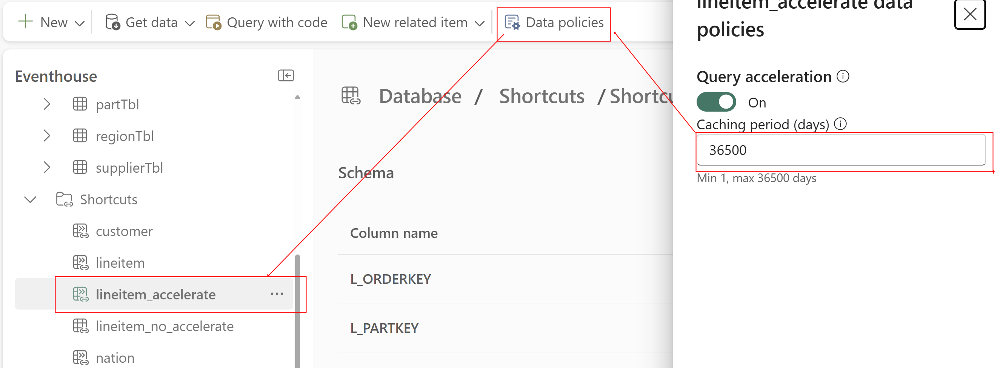

# Introduction

The Microsoft Fabric Real-Time Intelligence (RTI) platform represents a pivotal shift in how enterprises handle
streaming data, automation, and action-oriented analytics. As adoption grows, so too does the need for real-world
expertise that goes beyond the surface-level feature set.

## Why This Course Was Created

Across the Microsoft data ecosystem, we are seeing a recurring pattern: Partners and customers are building
real-time solutions using Fabric—but too often with architectural blind spots, implementation mistakes, or
fundamental misunderstandings of how services like Activator, Eventstream, and Reflex are meant to interoperate at scale.

For example:

- Partners report difficulty staffing RTI engagements due to a lack of L400–500-skilled professionals.
- Suboptimal implementations are leading to production disruptions,
- Customers are building real-time automation flows without fully understanding how detection
  rules interact with stream federation, delays, and failure states.
- Fundamental concepts such as pattern detection, state change management, and
  throughput handling are either misapplied or ignored.

These are not theoretical issues—they are impacting live deployments and increasing the burden on
support and engineering teams. We must address this gap in expertise now to avoid scale-limiting friction
across the RTI customer base.

## What This Course Provides

This course was built to:

- Equip senior engineers, architects, and partners with advanced technical insight into Fabric RTI’s architecture,
  performance characteristics, and behavioral nuances.
- Demystify complex real-time patterns, including dynamic schema handling,
  alert suppression strategies, federated stream orchestration, and event-driven pipeline execution.
- Enable best-practice implementations by showcasing what should happen in production—and what often
  goes wrong when you miss key details.
- Accelerate onboarding of RTI experts to ensure Microsoft’s ecosystem can meet the growing customer
  demand for high-fidelity real-time solutions.

The content is driven directly by interviews with Microsoft’s product engineering leaders, distilled into
actionable knowledge and guided labs.

## Modalities

- Total workshop duration is 2-3 days.
- Each module is accompanied with technical explanation of the Fabric Real-Time
  Intelligence component being used in the tutorial.
- Without the accompanied explanation, the tutorial can be completed in 1-2 days.

## Authors

- [Brian Bønk](https://www.linkedin.com/in/brianbonk/), Data Platform MVP
- [Frank Geisler](https://www.linkedin.com/in/frank-geisler/), Data Platform MVP
- [Matt Gordon](https://www.linkedin.com/in/sqlatspeed/), Data Platform MVP

## Contributing

- If you'd like to contribute to this lab, report a bug or issue, please feel free to submit a Pull-Request
  to the ==[GitHub repo](<link to repo>)== for us to review or ==[submit Issues](<link to repo>)== you encounter.

## Prerequisites

To get starated with this training and to understand the baseline of the Real-Time Intelligence suite of
services from Microsoft Fabric, it is expected of the audience to have the following certifications:

- [DP-600 Microsoft Certified: Fabric Analytics Engineer Associate](https://learn.microsoft.com/en-us/credentials/certifications/fabric-analytics-engineer-associate/?practice-assessment-type=certification)
- [DP-700 Microsoft Certified: Fabric Data Engineer Associate](https://learn.microsoft.com/en-us/credentials/certifications/fabric-data-engineer-associate/?practice-assessment-type=certification)
- [Microsoft Applied Skills: Implement a Real-Time Intelligence solution with Microsoft Fabric](https://learn.microsoft.com/en-us/credentials/applied-skills/implement-a-real-time-intelligence-solution-with-microsoft-fabric/)

This training will not help you understand the basics of the suite, and it will start of from the above mentioned knowledge level.

## Overview of the content

The content is built from 13 modules + 1 appendix, spanning ingestion of data, manipulation of data when
needed using the KQL language, visualize and analyze data using KQL, Real-Time Dashboards and Power BI, CI/CD and
architectural approaches, Security and Networking.

1. [Introduction to RTI](./01%20-%20Introduction.md) (Frank)
2. [Real-Time Hub](./02%20-%20Real-Time%20Hub.md) (Matt)
3. [Connectors](./03%20-%20Connectors.md) (Brian)
4. [Ingestion](./04%20-%20Ingestion.md) (Brian)
5. [Data modelling](./05%20-%20Data%20modelling.md) (Frank)
6. [Analytics](./06%20-%20Analytics.md) (Brian)
7. [AI + Copilot](./07%20-%20AI%20+%20Copliot.md) (Matt)
8. [Dashboards](./08%20-%20Dashboards.md) (Matt)
9. [Rules (Activator)](#module-9---rules-activator) (Frank)
10. [Security](./10%20-%20Security.md) (Matt)
11. [Networking](./11%20-%20Networking.md) (Brian)
12. [CI/CD and ALM](./12%20-%20CICD%20and%20ALM.md) (Frank)
13. [Appendix](./13%20-%20Appendix.md) (all)


Each module has the same overall structure:

| Structure                         | Content                                                                                                                                                                                                                                                            |
| --------------------------------- | ------------------------------------------------------------------------------------------------------------------------------------------------------------------------------------------------------------------------------------------------------------------ |
| 1. Introduction to the module     | Gives the fly-in to the module, the content and the business value of the module and area of RTI.                                                                                                                                                                  |
| 2. Architectural deep dive        | Introduces the module and the connection to the rest of the RTI suite in Microsoft Fabric. Also contains elements on how the architecture could work in conjunction with other parts of the RTI service.                                                           |
| 3. Technical deep dive            | Dive into the whereabouts of the service. Seen from the backend, with a deep technical walktthrough of how things are working behind the scenes and what makes the specific part of the service connect with the rest.                                             |
| 4. Implementations                | How should the specific part of the service be implemented and what to look out for when working with it. Also a deep walktrough of the details in functionality and outcome of the service.                                                                       |
| 5. Troubleshooting                | How to read error messages and error codes. How to debug issues. How to best help Microsoft support in case of need.                                                                                                                                               |
| 6. Orchestration and optimization | How does the service best fit with an entire architecture around orchestration, how to execute the processes. How to optimize the loads, speeds and querytimes.                                                                                                    |
| 7. Schemas and throughout         | How to handle schemas in the service and what to know when working with structured, semi-structured and unstructured data. A walkthrough of the limitations, configuration options and whereabouts of throughput                                                   |
| 8. Monitoring and pricing         | How to monitor the service and find the bottlenecks and other needed information of the performance. A deep learning element on how to calculate and estimate cost of a service and an entire implementation. How to monitor cost and optimize for cost reduction. |
| 9. Hands-on lab                   | A hands on lab with guides, to try out the specific service and to learn some of the L400 features.                                                                                                                                                                |

<div class="info" data-title="Note">

> **In some modules, you will not find all of the sections above. This is by intent, and shows that this specific section does not apply to this module, or the module does not contain any information about the section.**

</div>

---
## Module 1 - Introduction to RTI

### Introduction

Real-Time Intelligence (RTI) in Microsoft Fabric is a fully managed, end-to-end platform for ingesting,
processing, analyzing, and acting on streaming data — all in near real time.

It enables organizations to:

- **Capture live data** from sources like IoT devices, logs, files, APIs, and more using Eventstream.
- **Enrich and transform** that data in motion with KQL, Eventstreams, or low-code tools.
- **Detect patterns, anomalies, and threshold conditions** using intelligent Reflex rules and Activator.
- **Trigger automated actions** across systems (e.g., Power Automate, pipelines, APIs) the moment a business-critical event occurs.

RTI is deeply integrated with the broader Fabric platform — allowing seamless connectivity with OneLake, Notebooks, Pipelines,
Power BI, and security infrastructure. This gives enterprises a unified foundation for real-time operational
analytics, anomaly detection, alerting, and automated decisioning.

In short: RTI empowers you to go from data-in-motion to action-in-motion.

### Architectural deep dive

Real-Time Intelligence (RTI) is not a siloed service—it is a tightly integrated layer within the broader
Microsoft Fabric unified data platform, designed to support continuous intelligence pipelines across
structured and unstructured data streams.


At the architectural level, RTI is composed of several interlocking components:

#### 1. Data Sources (Streaming & Batch)

The architecture supports a wide range of streaming and batch data sources:

- Streaming: Kafka, MQTT, Azure Event Hubs, IoT Hub, Azure Data Explorer, PostgreSQL, Cosmos DB, and others.
- Batch: Ingested and orchestrated via Data Factory, which feeds both Lakehouse and Eventhouse layers.

#### 2. Eventstream – The Streaming Ingestion Gateway

Eventstream acts as the unified real-time ingestion layer:

- Connects to live data sources with low latency
- Filters, parses, and enriches data in motion
- Routes data simultaneously to destinations such as Eventhouse, Real-time Dashboards, and Activator

#### 3. Eventhouse – Layered Storage & Processing

With Eventhouse you can build:

- Bronze, Silver, and Gold layers for progressive data refinement
- Update policies to process data as they are ingested into the KQL-Databases
- Materialized views (MV) for near-real-time queryability
- Integration with OneLake and Query Accelerated Shortcuts for high-performance access

#### 4. Machine Learning Integration

The platform supports training and real-time scoring of ML models:

- Models consume streaming or batch data
- Real-time inference is embedded directly into the processing pipeline via Eventhouse

#### 5. Real-Time Visualization and Analytics

- Power BI and Real-Time Dashboards provide instant visibility into data flowing through
  Eventstream and Eventhouse
- Data is queried directly via DirectQuery, eliminating the need for duplication

#### 6. Activator – Action Engine and Automation Layer

Activator is the execution engine for real-time actions:

- Listens for triggers from Reflex detection rules or Eventstream patterns
- Executes downstream actions: Power Automate flows, REST API calls, email, Teams alerts, and more
- Supports composable rules, stateful evaluation, and alert suppression strategies

#### 7. Foundational Platform Integration

All RTI components are built on core Fabric foundations:

- OneLake for unified data storage across batch and streaming workloads
- Real-Time Hub as a logical fabric-wide orchestration layer
- AI and Copilot Agents for intelligent assistance and automation enrichment

#### Architectural Highlights

- **Integrated Lakehouse and Streaming:** Combines traditional Lakehouse architecture with real-time stream
  processing
- **Natively Fabric:** All services are fully managed and deeply connected across the Fabric ecosystem
- **Streaming-to-Action:** Built for low-latency, high-value automated responses
- **End-to-End Observability:** Real-time dashboards and ML scoring close the loop from raw data to business decision

RTI workloads are capacity-based, ensuring predictable performance and cost control across tenant- or
workspace-scoped environments. It supports multi-tenant, cross-workspace, and multi-sink streaming
architectures, making it a good fit for enterprise-wide observability, monitoring, and automation solutions.

### Technical deep dive

Real-Time Intelligence in Microsoft Fabric is more than a data flow — it’s a system of reactive engines working together to process, detect, and act on data in milliseconds. This section introduces the internal workings behind the core components to help you understand why things behave the way they do. This is only a short summary.
These topics are covered in the different Modules more in depth

#### Eventstream Internals

**Core Focus:** Buffering, parallelization, schema evolution, and latency management

- Ingested data from streaming sources is processed via partitioned pipelines, often aligned to source partitions (e.g., Kafka topics).

- Eventstream introduces a controlled buffer delay (typically ~10 seconds) to enable multi-sink routing and enrichment.

- Supports schema inference and evolution, allowing downstream systems to adapt to changes in the payload shape.

- Event delivery is parallelized but respects ordering guarantees per partition.

**Implication:** Changes in source schemas, burst traffic, or improperly filtered data can delay or disrupt downstream pipelines.

#### Eventhouse Mechanics

**Core Focus:** Update policies, ingestion windows, materialized views

- Data ingested by Eventstream to the Bronze layer can be written to Silver or Gold layers via update policies.
- Ingestion into Eventhouse supports near real-time materialized views (MV) to precompute aggregates.
- Ingestion windows define how often new records are committed and visible — typically every few seconds.

**Implication:** Knowing how Eventhouse batches and evaluates data is essential for synchronizing analytics and trigger points with actual data availability.

#### Activator

**Core Focus:** Trigger resolution, delay models, retries, and action targeting

- Activator receives event context from Reflex including all rule-evaluated fields and metadata.
- Internally, Activator applies:

  - Suppression logic (e.g., “no more than one alert per 60s”)
  - Concurrency controls (to avoid over-firing actions)
  - Execution retries for transient failures (e.g., webhook timeouts)

- Supports multiple action targets, including notebooks, pipelines, Power Automate, and webhooks.

**Implication:** Misconfigured rules or actions can overload endpoints or cause noisy alerting without proper debounce logic.

#### State Handling in Reflex

**Core Focus:** Stateless vs. stateful evaluation, cooldowns, suppression

- Stateless rules match raw values (e.g., value > 100) — evaluated on every event.
- Stateful rules track transitions (e.g., value DECREASES, EXIT RANGE, or absence over time).
- Reflex maintains in-memory state per tracked entity, e.g., per device_id or bikepoint_id.
- Cooldown timers and alert thresholds reduce false positives and spamming.

**Implication:** Understanding how state is maintained and when it resets is crucial to correct and efficient pattern detection.

#### Action Routing

**Core Focus:** Execution paths, targeting logic, and custom extensions

- Activator can execute multiple action types depending on business needs:
  - Built-in Power Automate integration
  - REST POST to web services or Teams
  - Trigger Fabric Pipelines or Notebooks
- Action routing can dynamically include payload data, headers, and even computed values.
- Soon: Direct Web API integration to define fully custom actions.

**Implication:** Building enterprise-grade reactions means understanding what each action path supports in terms of latency, retries, and payload structure.

#### Performance Tuning Knobs

**Core Focus:** Throughput, suppression, and buffer configuration

- Eventstream allows tuning:
  - Buffer sizes
  - Output frequency
  - Filtering complexity
- Reflex rules can include alert frequency controls and aggregation windows
- Activator supports deduplication, throttling windows, and max concurrency settings

**Implication:** Understanding these levers helps reduce noise, optimize cost, and improve SLAs.

#### Capacity Impact

Core Focus: RTI’s consumption of Fabric Capacity Units (FCUs)

- Each component consumes compute based on:
- Data volume and frequency
- Rule complexity
- Action volume and concurrency

Eventstream and Activator scale with event velocity, while Eventhouse depends on query concurrency and storage tiering.

**Implication:** RTI capacity must be planned with sustained and peak loads in mind — especially for high-volume streaming applications.

### Implementations

Microsoft Fabric Real-Time Intelligence (RTI) is engineered for enterprise-grade data streaming, event detection, and low-latency action pipelines. But design elegance on paper doesn’t guarantee operational success. Implementations in the real world surface challenges that are not immediately visible from documentation or demos.

This course places special emphasis on implementations—not just how the services work, but how they behave under scale, complex orchestration, and production constraints.

#### What "Implementation" Means in RTI

- Designing event ingestion pipelines that handle bursty, high-volume, and diverse data reliably
- Authoring rules and detections that avoid false positives and alert spamming
- Managing state, schema evolution, and windowing in streaming logic
- Triggering actions (notebooks, pipelines, alerts) in a controlled, idempotent, and performant manner
- Embedding RTI into broader data estate orchestration (Synapse, Power BI, Microsoft Purview, etc.)

#### Why It Matters

In current partner engagements, we’ve observed that incorrect or naïve implementations are a leading cause of:

- Production outages due to misfiring rules or underprovisioned capacities
- Delayed detection due to improper windowing or federation configuration
- Unnecessary costs from unfiltered ingestion or redundant triggers

Getting implementation right is not a bonus—it’s foundational to making RTI reliable, scalable, and cost-effective.

#### What to Expect in This Course

You’ll learn not only how to configure services, but also:

- When to use them—and when not to
- How to structure stateful logic for durable alerting
- How to monitor behavior in-flight and post-execution
- Where common pitfalls lie, and how to avoid or mitigate them

We’ll provide implementation blueprints and walkthroughs drawn from real customer architectures, internal Microsoft learnings, and validated best practices from the product engineering team.

### Troubleshooting

#### Real-Time Systems Fail Differently

In real-time architectures, failures don’t always come with clear error messages. Instead, they manifest as **missing events**, **delayed detections**, **duplicate triggers**, or **silent breakdowns in orchestration**.

Microsoft Fabric Real-Time Intelligence (RTI) is a powerful suite—but also a distributed, low-latency system where:

- Data flows continuously across services (Eventstream → Eventhouse → Activator/Visualisation)
- Latency thresholds are tight
- Observability requires intentional design

Because of this, troubleshooting in RTI is not an isolated phase—it’s an architectural concern that must be addressed from the outset.

#### Why Troubleshooting is Foundational

This course integrates troubleshooting as a core skillset throughout every module. For senior architects and data engineers, success with RTI doesn’t just mean getting pipelines running - it means keeping them stable, traceable, and observable in production.

You’ll explore:

- How to diagnose lag across ingestion, federation, and evaluation layers
- How to trace issues across services, from Eventstream failures to delayed triggers in downstream systems
- How to handle schema mismatches, data gaps, and unexpected bursts
- How to read and act on system diagnostics, including metrics, logs, and rule previews

#### The Cost of Poor Troubleshooting Readiness

In real-world deployments, we’ve seen:

- Pipelines silently stall because stream partitions were dropped upstream
- Rules misfire due to misunderstood time windows or null handling
- BI dashboards display stale data because of overlooked ingestion lag
- Support escalations take days due to lack of trace-level observability

This course gives you the tools and mindset to design for debuggability from day one—avoiding the cost of reactive firefighting.

#### What You'll Learn

By the end of the course, you’ll be able to:

- Design RTI architectures that are traceable end-to-end
- Build monitoring into every component—from Eventstreams to KQL DBs to actions
- Use built-in and external tools (e.g., Log Analytics, Monitor, Diagnostic Logs) to detect and resolve failures
- Provide clear signals and telemetry when engaging with Microsoft support or operations teams

The best RTI systems are not just fast—they’re also introspectable, resilient, and transparent when things go wrong.

### Orchestration and optimization

#### Beyond Configuration: Architecting for Flow and Efficiency

In Real-Time Intelligence, services like Eventstream, KQL DB, Real-Time Hub and Activatorare powerful individually - but they only deliver business value when orchestrated into coherent, low-latency dataflows.

This course emphasizes not just how to configure components, but how to architect and optimize them holistically - so that data moves with purpose, triggers fire with precision, and costs stay predictable at scale.

#### The RTI Orchestration Model

Microsoft Fabric RTI enables event-driven workflows, but orchestration must be explicitly designed to ensure:

- Data arrives at the right processing layer (e.g., KQL DB vs. pipeline vs. alert rule)
- Actions execute only when preconditions are satisfied
- State transitions are respected, especially in temporal logic
- Downstream systems (Power BI, Synapse, Teams) are triggered with the right payload, at the right time

You’ll learn how to use tools like:

- Eventstream filters and partitions to direct traffic efficiently
- KQL queries with temporal windows and joins to correlate real-time data
- Rule federation and grouping to reduce trigger noise
- Power Automate and Notebooks to create precise, governed actions

#### Optimization is Not Optional

Real-time systems operate under tight latency budgets and throughput ceilings. Poor optimization can result in:

- Delayed detections (e.g., alerts fire after the event has passed)
- Unnecessary compute costs (e.g., evaluating every message in every rule)
- Overloaded KQL DBs due to unbatched inserts or joins across high-velocity streams
- Stream starvation or backpressure, causing missed detections

Optimization in RTI isn’t a one-time tuning—it’s a continuous design mindset. You’ll explore:

- How to model throughput across ingestion and federation
- How to structure queries and pipelines for sub-second latency
- How to monitor execution metrics and system counters
- How to right-size capacity and workload placement across Fabric items

#### What You'll Learn

Throughout the course, you will develop a deep understanding of how to:

- Design end-to-end orchestrated pipelines across RTI components
- Minimize latency, contention, and false positives through query and rule optimization
- Structure workloads for observability, testability, and reliability
- Estimate and control resource consumption and cost

In RTI, performance is not a luxury - it’s a design requirement. And orchestration is where performance becomes architecture.

### Schemas and throughput

#### The Overlooked Foundations of RTI Architecture

In Real-Time Intelligence (RTI), much of the architectural complexity lies not in configuration, but in understanding how data structure (schemas) and data velocity (throughput) impact the system’s behavior from ingestion to action.

Poor assumptions about these two dimensions are a leading cause of production issues in real-world RTI deployments. This course tackles both topics as core architectural considerations—not as side effects of upstream decisions.

#### Why Schemas Matter in Real Time

RTI services - Eventstream, Eventhouse, Activator, Real-Time Hub - depend on explicit schema understanding to parse, correlate, and act on data. But in modern streaming systems, schemas are rarely fixed:

- JSON payloads evolve
- Fields become nullable or disappear
- New attributes are added midstream

If your architecture assumes schema stability, you’re building a fragile system.

You’ll learn:

- How schema drift can break pipelines silently
- How semi-structured payloads (e.g. nested JSON) impact parsing and filtering
- How to manage schema alignment across ingestion, detection, and action layers
- When to use schema-on-read (e.g., KQL parse_json) vs. schema-on-write (e.g., structured Eventstream)

Schema is not just a developer concern—it’s a first-order operational dependency.

#### Throughput: The Invisible Limit

Fabric RTI is built for speed, but every component - Eventstream, KQL DB, Pipelines, Notebooks - has practical throughput boundaries. Many implementations fail to model:

- Ingest rate per partition
- Rule evaluation cost under event spikes
- Memory pressure in downstream aggregations

The result? Delays, throttling, and even silent data loss.

This course teaches you how to:

- Benchmark and estimate throughput end-to-end
- Identify bottlenecks in ingestion, federation, and action layers
- Use tools (e.g., Eventstream diagnostics, Monitor metrics, KQL DMVs) to trace pressure points
- Optimize rule complexity and reduce fan-out in streaming pipelines

Real-time success isn't about speed alone—it’s about sustained, observable, and predictable throughput.

#### What You'll Learn

Throughout this course, you’ll develop the skills to:

- Architect for schema evolution while maintaining system stability
- Design for throughput-aware processing across Fabric RTI components
- Choose formats (CSV, JSON, Avro) based on latency and fidelity trade-offs
- Prevent schema mismatches and stream overloads through early validation and instrumentation

Schema defines what data is. Throughput defines how much and how fast. Together, they define whether it works.

### Monitoring and pricing

#### Real-Time Systems Demand Real-Time Insight

In Real-Time Intelligence, what you can’t observe, you can’t control—and what you can’t control, you can’t trust in production.

Microsoft Fabric RTI enables sophisticated low-latency pipelines, but with that power comes the need for rigorous **monitoring** and **cost governance**. This course treats both as non-negotiable pillars of a production-grade design.

#### Monitoring: Observability is Architecture

Monitoring in RTI is not just about uptime - it’s about:

- Latency detection across ingestion, evaluation, and action layers
- Event gaps (e.g., heartbeat failures, missing partitions)
- Trigger audits (what fired, when, with what payload)
- Data quality diagnostics (nulls, schema errors, outliers)

Yet many implementations defer observability until after deployment, resulting in:

- Blind spots during alert storms or missing events
- Difficulty debugging false positives or failed triggers
- Lack of evidence when engaging with Microsoft Support

You’ll learn how to:

- Leverage built-in diagnostics in Eventstream, Activator, and Real-Time Hub
- Use Azure Monitor, Log Analytics, and diagnostic logs for telemetry aggregation
- Build live dashboards in Power BI for RTI health monitoring
- Trace a single event across the full RTI pipeline using correlation IDs and logging hooks

Monitoring is not a dashboard—it’s a design mindset that enables production trust.

#### Pricing: Real-Time Costs Are Continuous

RTI workloads are event-driven, continuous, and potentially high-volume. Without cost awareness, teams risk:

- Unexpected consumption spikes (e.g., unfiltered streams, over-triggered actions)
- Wasteful rule evaluation on irrelevant partitions
- Over-provisioning of capacity in pipelines and KQL DBs

This course trains you to design with cost efficiency in mind from the start:

- Estimate per-event cost across ingestion, federation, and action
- Understand how capacity SKUs, RTI item types, and rule frequency affect pricing
- Use cost telemetry and Fabric billing APIs to monitor spend in near-real-time
- Apply cost optimization patterns (e.g., preview mode testing, selective rule targeting, action throttling)

RTI cost is not just a budget item - it’s a feedback loop for architectural efficiency.

#### What You’ll Learn

By the end of the course, you will be able to:

- Build fully observable RTI pipelines with end-to-end diagnostics
- Detect anomalies and degradations before they affect downstream systems
- Predict and monitor event-driven cost behavior at scale
- Make design trade-offs that balance latency, fidelity, and financial impact

In production-grade RTI systems, what gets monitored gets trusted—and what gets priced gets optimized.

---
## Module 2 - Real-Time Hub

### Introduction

### Architectural deep dive

### Technical deep dive

### Implementations

### Troubleshooting

### Orchestration and optimization

### Schemas and throughput

### Monitoring and pricing

### Hands-on lab

---
## Module 3 - Connectors

### Introduction

The Real-Time Intelligence suite in Microsoft Fabric has a lot of connectors. These connectors are in place to enable you to read data from a various number of sources.

The sources are mainly configured using the Eventstream service in a workspace. There is also a set of functionalities directly in the Eventhouse.

In this module, we will dive into the whereabouts of each methods and show you how to work with the different connectors. We will also discuss the technical details for each method (not all connectors) and show you what to take into account when working with the services.

### Architectural deep dive

The way the services in Eventstream is build, is based on a general approach to the standard services in Azure from:

- Azure EventHub: This service is the message broker for each message coming to the Eventstream and makes sure to accept the message and send it onwards to the Streaming Analytics service (if neeeded) or directly to the configured destination in the Eventstream.
- Azure EventGrid: This service is the role of listening to events happening (Storage Account Event, Workspace Events etc.) and send the messages and event details onwards to the EventHub for futher processing.
- Azure Streaming Analytics: This service can be utilized in the Eventstream, if you are implementing any transformations to the data flowing through the service. If you are not transforming the data, this service will not be used. Even though it is always provisioned, it might not actually be used.

These three services are the backbone of the Eventstream service and are provisioned every time you create an Eventstream. A detailed rundown of the Eventstream service will also be made later in Module 4 - Ingestion.

### Technical deep dive

From a high level perspective, two types of connectors exist in Real-Time Intelligence. Connectors from Eventstream and connectors for Eventhouse.

Connectors for Eventstream are the ones found in the “source” section of Eventstream.
These connectors are always expanding and contains sources for Microsoft out-of-the-box sources and sources from 3rd party providers, like Google pub/sub, Confluent Kafka etc.


Connectors for Eventhouse are built on top of the Azure Data Explorer database engine and can only be configured using the KQL script language.
These connectors are not as extensive as the ones found for Eventstream.


### Schemas and throughput

Schemas will be configured for direct ingestion to the Eventhouse only. For data which is pushed to the Eventhouse, the schema will not be defined in other way than the destionation table in the Eventhouse.
Schema validation is a part of the Ingestion module and will be handled there.

When defining Eventhouse connectors, you must also define a schema to support that specific ingestion.
This is done in an _ingestion mapping_ in the Eventhouse itself. These exists on two levels: Database mapping and database, table mapping. The last mapping is fixed to a specific table in the database, where as the first one is only tied to a specific database.

An ingestion mapping consists of the columns and the corresponding data type - for instance:

```kql

.create table DestinationTable ingestion csv mapping "MappingOne"
'['
'   { "column" : "rownumber", "DataType":"int", "Properties":{"Ordinal":"0"}},'
'   { "column" : "rowguid", "DataType":"string", "Properties":{"Ordinal":"1"}}'
']'

.create database DestinationDatabase ingestion csv mapping "MappingTwo"
'['
'   { "column" : "rownumber", "DataType":"int", "Properties":{"Ordinal":"0"}},'
'   { "column" : "rowguid", "DataType":"string", "Properties":{"Ordinal":"1"}}'
']'

```

Notice the difference in the **table** and **database** in the code above.

<div class="info" data-title="Note">

> When working with JSON format the ingetsion mapping has a special structure and syntax. Please follow [this link](https://learn.microsoft.com/en-us/kusto/management/json-mapping?view=azure-data-explorer) to read more.

</div>

#### Schemas best practices

When working with connectors and ingestion, it is good practice to work with _typed_ columns when applicable. So try to avoid the dynamic datatype. If working with dynamic data type and some JSON fields are often used for searching and aggregration, then do an explicit convertion before storing and save it as string, long or ind for faster performance.

When working with datetime columns, these should always be stored as the datetime data type. Long and int can also store datetime, but the storeage and performance will not be as effective as the datetime format.

If a column can be converted from decimal to real, then do that. It will help the engine in the aggregation.

Any identity columns in the source data should be converted to a string. Strings are much faster than int and other number formats, as the index on data is build to work with strings ootb.

Use as narrow tables as possible for ingestion and in the same time try to denormalize data to limit joins.

### Monitoring and pricing

Monitoring of connectors is not available, please see the Module for Ingestion to get the introduction to the ingetsion errors and monitoring.

Pricing for connectors are free, they are only pointers to data and sources, and does not generate cost in themselfes.

### Hands-on lab

#### Ingest data from SQL server to Eventhouse

#### Read data from JSON file to Eventhouse

---
## Module 4 - Ingestion

### Introduction

When ingesting data to the Real-Time Intelligence solution, you have several options.

- Using an Eventstream to get data
- Direct ingest to the Eventhouse
- Shortcuts from outside the Eventhouse

This module dives into the details of each method and will give you insights to the technical implementation and give you and understanding on how and when to choose what method.

The lab will challenge you in the ingestion methods, and help you understand the throughput and details of each method through hands on experience.

### Architectural deep dive

With the three highlevel approaches to ingestion, we have a possible architecture (with selections) which looks like this:


#### Eventstream ingestion

When ingesting data to the Eventhouse using the Eventstream service, the connectors (as discusses in Module 2) will have to be set up and read/accept the data from the sources.

The only way to manipulate data at ingestion time is through the Eventstream. The other two methods is a 1:1 copy from source to destination.

The Eventstream has two methods of handing over data to the destination. Either through a **pull** method or through a **push** method.

The pull method is also the fastest method, as it is the destination table which pulls the data from the Eventstream. The underlying Eventhub is used for this method, where the data is stored in temporary storage and the Eventhouse service polls the endpoint and received the data from the Eventhub.

The push method is the only method available when doing any transformations to the incoming data. The transformations are, under the covers, handled by an Azure Streaming Analytics job and that job then pushes the data to the destionation.

When manipulating data in the Eventstream service, we have the tranformations part of the Eventstream processor.

#### Shortcuts

To enhance the performance of queries over external data, Microsoft Fabric offers a feature known as query acceleration for OneLake shortcuts. This feature allows users to define a policy specifying the number of days to cache data from external delta tables, thereby improving query performance and reducing latency. It applies to data from various sources, including Azure Data Lake Store Gen1, Amazon S3, Google Cloud Services, and Azure Blob Storage.

#### Direct ingestion

When speaking of direct ingestion, we have a source, for which it is possible to connect directly from the Eventhouse and read the data. These sources are, but not limited to, SQL Server, EventHub, and [Brian to find more sources]

### Technical deep dive

#### Eventstream

The eventstream has settings for throughput and retention. Retention is a way of configuring the days in which the messages will be stored in case of an issue in the destination.
The throughput can be configured from Low, through Medium to High.

- Low gives you 4 partitions on the Eventhub
- Medium gives you 16 partitions in the Eventhub
- High gives you 32 partitions in the Eventhub

The throughput does not in itself boost the overall throughput of ingestion in the Eventstream area. Every throughput has 3 limitations:

1. The inlet (in this case the Event hub)
2. The Azure Analytics Job
3. The speed of the destination

So when configuring the throughput of the Eventstream, also remember to think of the other two areas of the total throughput configuration for a better and overall technical implementation.

#### Shortcuts


The accelerated shortcuts works by reading the data from the source to a storage inside the Eventhouse (in the KQL database level) as shards and gives the enduser and application the speed of the KQL database.
This apporach demands the engine to read data from the source as a direct ingestion to the KQL database. This process will also consume CUs from the Fabric capacity and will, behind the scenes, autoscale the cluster to have a fast ingestion for the initial load.
Updates to the data in the shortcut, from the source, is automatically handled by the engine and the processing of data resumes for reading the new data.

When the shortcut is created, you can alter the caching period of the data. By default data is kept in memory for 36500 days. These days are automatic calculated based on the internal storage metadata and the modifiedDate column for each row in the shortcut.

This can be changed by editing the Data policies on each shortcut.



Or by altering the shortcut’s data policy in KQL script:

```kql
.alter external table lineitem_accelerate policy query_acceleration '{"IsEnabled": true, "Hot": "1.00:00:00"}'

```

With the _Hot_ variable to define the timespan needed for chaching.

When you create a shortcut with acceleration enabled, the underlying Kusto engine begins to load the data from the source to memory. Depending on the size of the data, this can take a while.

To get a status of this process, you can execute the following command:

```kql
.show external table lineitems600m_accelerate operations query_acceleration statistics
```

#### Direct ingestion

When ingesting data using the direct ingestion mode, you are configuring the database to read the data from the source directly, basicly using a KQL query.

At normal situtations any KQL query will only run for 10 mins - whereas the ingestion queries are running on a different node in the cluster and will not have this limit of the 10 minute exetution time.

Other than that, the direct ingestion is pretty straight forward.

### Hands-on lab

#### Have people build a direct ingestion

#### Have people come up with a solution for ingesting large volume data and find the correct settings for all 3 areas of throughput

---
## Module 5 - Data modelling

### Introduction

In the landscape of real-time analytics, the fidelity and flexibility of your data model can be the decisive factor between a scalable solution and a bottlenecked architecture. This module focuses on the advanced practices of data modeling within the Microsoft Fabric Real-Time Intelligence platform, enabling precise, performant, and production-grade implementations.

Real-time systems differ fundamentally from traditional Business Intelligence Systems. They must ingest, transform and serve analytical insights with sub-minute latency—often against massive, high-cardinality, high-granular datasets. This requires a new class of modeling techniques tailored to streaming - first architectures.

This module delivers expert-level guidance on structuring data for streaming and hybrid workloads in Fabric’s KQL-based ecosystem, especially Eventhouse and KQL Database. It bridges theory and implementation through deep dives into update policies, materialized views and external tables, alongside schema strategies for performant Power BI Reports. These concepts are foundational to driving low-latency queries, minimizing compute cost and supporting downstream consumers like dashboards and alerting systems.

#### Business Value

This module is designed for architects, data engineers, and advanced BI professionals who are:

- Designing real-time intelligence systems in production,
- Troubleshooting high-latency or high-cost query workloads,
- Building Power BI semantic models directly over streaming or near real-time KQL data sources,
- Working with complex schema evolution, externalized data references, and time-sensitive joins.

By mastering these advanced techniques, participants will avoid common pitfalls — like improper caching policies, poorly scoped materializations, or inefficient joins - that we’ve seen derail real-world RTI implementations.

### Architectural deep dive

Data modeling in Microsoft Fabric’s Real-Time Intelligence (RTI) must be aligned with the architecture of Eventhouse, KQL Database, and the broader Fabric ecosystem. This section provides a blueprint for how real-time models are constructed in a high-concurrency, high-throughput architecture.

#### Fabric RTI Architectural Context

At the core of the RTI stack lies Eventhouse, a KQL-based data service optimized for high-frequency, time-series data. Eventhouse ingestion scales elastically, and data is indexed on ingest, partitioned, and stored in compressed extents for optimal query performance.

Data models in this environment are not just schemas — they are performance-critical assets. Modeling decisions directly affect:

- Costs (in terms of compute and latency),
- Query plan efficiency (especially under load),
- Retention policy tuning, and
- Downstream semantic model fidelity that can be used by Power BI.

#### The medallion Architecture

The Medallion Architecture is a layered data architecture designed to streamline the flow of data from raw ingestion to refined, business-ready insights. It is classically divided into three zones:

- **Bronze Layer:** Raw, immutable, ingested data in its original form. Useful for full-fidelity reprocessing and audit scenarios.
- **Silver Layer:** Cleaned, filtered, and optionally joined data. This layer applies business rules, deduplication, and enrichment logic.
- **Gold Layer:** Aggregated, curated datasets intended for direct consumption by business intelligence tools, ML models, or APIs.

Each layer improves data quality and readiness, and decouples concerns of ingestion, transformation, and analytics.

##### How the Medallion Architecture Maps to a KQL Database

In Microsoft Fabric Real-Time Intelligence, KQL Databases (backed by Eventhouse) naturally support this tiered architecture, though the layering is implemented through logical constructs and processing pipelines, rather than through physical storage separation. Here's how it aligns:

| Medallion Layer | Fabric RTI / KQL DB Implementation                                                                                                                                          |
| --------------- | --------------------------------------------------------------------------------------------------------------------------------------------------------------------------- |
| Bronze          | Raw data ingested via Eventstream, Direct Ingestion, or External Tables. Raw event tables (with update policies off) typically reside here.                                 |
| Silver          | Implemented using Update Policies or Materialized Views that apply cleaning, deduplication, joins, and derived fields. Acts as the refined source for analytical workloads. |
| Gold            | Optimized aggregation or business-specific shaping, via additional Materialized Views, Functions, or export to Power BI using semantic models designed for performance.     |

##### Architectural Elements in RTI that Enable the Medallion Model

- **Update Policies:** Automatically transform Bronze to Silver during ingestion. Supports branching raw streams into multiple shaped outputs.

- **Materialized Views:** Serve as performant Silver-to-Gold bridges; offline-processed, indexable aggregations that minimize query time and cost​​.

- **External Tables:** Can act as an extended Bronze layer, enabling real-time access to cold or remote data (e.g., from OneLake or SQL) without full ingestion​.

- **Power BI Integration:** Gold-layer data is often consumed in Power BI models, where star-schema design and dual storage mode are used to optimize slicing/filtering performance​.

**Key Considerations**

- KQL databases do not enforce strict layer boundaries—the medallion model is applied through query logic, schema design, and ingestion policies.
- Retention policies can be configured per layer - e.g., Bronze (short), Silver (medium), Gold (long) - to optimize cost.
- Query performance and COGS benefits are significant in Silver/Gold due to pre-aggregation and filtering in materialized views.
- KQL’s hidden extent management and delta + materialized combination model ensures that even recent, non-materialized records are reflected in queries, enabling near-real-time freshness without sacrificing performance.

#### Key Architectural Components for Modeling

##### 1. Datatypes

Datatypes in Microsoft Fabric RTI are foundational to data modeling. They define not only how data is stored and queried in KQL-based services like Eventhouse, but also how efficiently that data is joined, filtered, compressed, and consumed downstream (e.g., in Power BI). From an architectural perspective, datatypes:

- Determine compression strategy and extent shaping, impacting storage efficiency and query scan times.
- Affect join behavior and broadcast strategies in large distributed queries.
- Shape the semantic layer compatibility, especially for time-based models and dynamic data.
- Influence update policy and materialized view design, since transformations must respect and preserve type semantics.

In Real-Time Intelligence solutions, incorrect or inconsistent type usage - particularly with `datetime`, `timespan`, or `dynamic` can lead to performance degradation, broken filters in Power BI, and failed ingestion operations.

##### 2. Update Policies

Update policies are executed during ingestion time. They transform or enrich data as it lands and project it into derived tables. From an architectural perspective, this enables:

- Schema simplification at query time
- Filtering
- Normalization (e.g., from wide raw logs to fact/dimension schemas),
- Transformations, extracting columns
- Forking a source to several target tables

Update policies are executed synchronously at ingest, so they affect ingestion latency and capacity. Therefore, they must be lean, deterministic, and designed with ingestion slot constraints in mind.

##### 3. Materialized Views

Materialized views provide pre-aggregated views of a source table. They are defined over a single source table, with single summarize statement. They have a well defined schema and can be queried, just like any other table or function in the database. They exist as physically stored datasets and are automatically updated in the background. In architecture, they serve as:

- Query acceleration layers for common query patterns (e.g., arg_max per session, count by 15-minute bins),
- Mechanisms to reduce cost per query by offloading work from interactive query time,
- Foundations for Power BI models where freshness of the semantic model is bound to the materialization frequency.

They can be used for

- Downsampling

```kql
T
| summarize count() by bin(Timestamp, 1d))
```

```kql
T
| summarize dcount(User), avg(Duration) by bin(Timestamp, 1h))
```

- Last entity by update time

```kql
T
| summarize arg_max(Timestmap, *) by Id
```

- De-Duplication

```kql
T
| summarize take_any(*) by Dimension1, Dimension2…DimensionN
```

The internal materialized view architecture includes delta tracking and cursor-based processing, allowing the system to maintain freshness without reprocessing the full dataset. Query-time joins against MVs are optimized through filter pushdown and rewrite rules.

Although materialized views are a handy tool to reduce query time and pre-calculate you should not have too many of them because multi-tenancy is required. Always think about if it would be possible to replace a materialized view by a real table and an update policy.

##### 4. External Tables

External tables expose datasets that reside in external storage (ADLS, Blob, SQL) or OneLake, allowing you to query operational data without ingesting it. From an architectural perspective, this:

- Enables schema-on-read for low-frequency or archival datasets,
- Supports cross-system joins (e.g., enrichment from dimension data in SQL),
- Reduces storage cost by eliminating unnecessary ingestion.

Partition pruning and pre-filtering play a critical role in maintaining performance. Effective modeling requires aligning the external table’s path structure with likely filter predicates.

##### 5. Partitioning Policies

Partitioning policies define how extents (immutable data shards) are organized post-ingestion to optimize query performance. From an architectural perspective, this:

- Enables partition pruning by datetime or high-cardinality string keys (e.g., TenantId, AccountId),
- Reduces data movement across nodes in distributed queries and joins,
- Improves compression and caching efficiency for time-series and multi-tenant scenarios.

Policies can be configured to assign partitioned extents using `ByPartition` (co-location on same node) or `Uniform` (balanced distribution). Effective modeling requires aligning the partition key with common filter patterns and join conditions.

##### 6. Modeling for Power BI

Power BI semantic models built atop KQL-Databases must accommodate latency, freshness, and cardinality. Key architectural considerations include:

- Using star schemas over flat tables to improve slicer/filter efficiency,
- Ensuring dimension tables are set to Dual mode when feasible to reduce joins on Direct Query paths
- Ensuring fact tables are set to DirectQuery mode
- Modeling datetime fields for efficient filtering (e.g., via time rounding or calendar relationships),
- Using KQL functions or materialized views as semantic objects for reuse and clarity.

Semantic models should be architected with DirectQuery for the fact tables and dual mode for the dimension tables to balance performance with real-time accuracy.

##### 7. OneLake Availibility

OneLake plays a pivotal role in unifying data access across Microsoft Fabric, enabling seamless integration of streaming data with analytical and operational workloads. In the context of Real-Time Intelligence (RTI), OneLake serves not only as a persistent, queryable data layer but also as a critical component in reducing latency, cost, and complexity when managing event-driven architectures at scale.

This section dissects the architectural model that enables OneLake availability from Eventhouse, ensuring that data ingested in real time is efficiently exposed to downstream consumers in both raw and optimized formats.

**Architectural Flow**

At a high level, the architecture consists of the following stages:

1. Ingestion into Eventhouse (KQL DB)

   - Real-time data streams (via Eventstream or other pipelines) are ingested into Eventhouse in rowstore format for lowest latency.
   - This format is immediately queryable, enabling near-instant analytics post-ingestion.

2. Background Conversion to Columnstore

   - Behind the scenes, Eventhouse asynchronously converts rowstore data into columnar Parquet format for long-term analytics performance and compression efficiency.
   - These columnstore segments are co-located and made available through OneLake using shared storage pointers—avoiding data duplication.

3. Exposure in OneLake

   - The same Parquet-formatted data is made accessible through OneLake via logical shortcuts, either at the database level or for individual tables.

   - These OneLake representations appear as external tables for downstream compute engines (e.g., Spark, SQL, Power BI).

**Key Architectural Characteristics**

| Feature                          | Description                                                                                                                                                                                        |
| -------------------------------- | -------------------------------------------------------------------------------------------------------------------------------------------------------------------------------------------------- |
| Hot and Cold Tiering             | Data initially resides in hot SSD-backed storage (rowstore), then is tiered to colder columnstore Parquet segments optimized for cost and performance.                                             |
| Parquet Exposure                 | The columnstore segments are exposed in Open Parquet format for compatibility with external engines.                                                                                               |
| One Copy Design                  | No redundant storage—data is referenced, not duplicated. This enables zero additional storage cost for making Eventhouse data available in OneLake.                                                |
| Latency Tuning                   | Trickling ingestion patterns (low event rates) can introduce delays (up to 3 hours) before data appears in OneLake. Heavier ingestion rates optimize latency by triggering faster materialization. |
| Adaptive File Optimization       | Eventhouse determines optimal file size for Parquet segments to balance performance and cost. No additional tuning is required by users.                                                           |
| Schema and Retention Constraints | Once OneLake exposure is enabled, schema changes and data deletion are restricted. Users cannot alter table schemas or delete data unless they disable OneLake availability.                       |

**Architectural Best Practices**

- **Design for Append-Only Workloads:** Due to schema immutability, datasets exposed to OneLake should be modeled as append-only where possible.
- **Avoid Excessive Trickling:** Avoid scenarios with a very low ingestion rate over extended time (e.g., few events per second), as this will delay columnstore availability in OneLake.
- **Use Logical Shortcuts Strategically:** Expose only the datasets that require cross-engine visibility; over-exposing datasets can lead to cost and operational overhead.
- **Understand the Cold Path Behavior:** For long-term analysis or integrations with external engines (e.g., Spark ML or Lakehouse), design queries to leverage OneLake data via SQL or Lakehouse endpoints.

### Technical deep dive

#### 1. Datatypes

Datatypes in Microsoft Real-Time Intelligence (Eventhouse/KQL Database) are more than schema constraints - they directly affect storage efficiency, query performance, and downstream integration, particularly with Power BI and external consumers.

**Core Datatypes and Storage Behavior**

Fabric RTI relies on a columnar storage engine, where each column is encoded and compressed independently. The choice of datatype influences both compression ratio and query execution plan:

- `datetime`: Always stored in UTC with nanosecond precision. Used extensively for filtering, binning, and temporal joins. Internally indexed for efficient range queries.

- `timespan`: Represents durations; supports arithmetic and comparisons. Appears as decimal in Power BI (in days), requiring careful modeling to preserve interpretability.

- `dynamic`: Stores JSON-like semi-structured data. Powerful for flexibility but expensive for parsing and filtering—avoid frequent projection or filtering on deep-nested fields.

- `string`: High-cardinality strings can inflate dictionary sizes and affect memory utilization. From its history, Kusto is aimed at working with strings, so if you have e.g. a number that is not calculated with store it as string. Use `hash()` where possible in joins or aggregations. The `hash()` function is recommended in scenarios where:

  - The actual string values are not needed in output,
  - You’re performing joins or group-bys where cardinality is high,
  - You need to reduce memory consumption and simplify value comparison.

- `int`, `long`, `real`, `decimal`: Fixed-precision numerics. Prefer `long` or `real` over `decimal` unless exact scale/precision is needed; decimal has a higher query-time cost.

**Modeling Implications**

- Avoid overuse of dynamic fields in hot paths; consider pre-flattening or projecting frequently used fields into dedicated columns via update policies.

- Be explicit with datetime handling when integrating with Power BI—timezone shifts (e.g., datetime_utc_to_local()) can degrade performance unless applied post-filtering.

- Normalize categorical fields used in slicers/joins into dimension tables (especially in Power BI) to avoid scanning large fact tables for distinct values.

- Enforce strong typing in ingestion paths—ambiguous schemas (e.g., mixing strings and numerics) can lead to costly type coercion at query time.

**Interop with Power BI**

When data is surfaced to Power BI:

- datetime → datetime (assumed UTC),
- timespan → decimal (duration in days),
- dynamic → string (Power Query may parse if JSON),
- bool, int, long, real → match directly.

Type conversions and representations may affect filter behavior and visuals e.g., duration in decimal form requires DAX formatting to be user-friendly.

##### 2. Update Policies

Update policies in KQL-Databases are server-side data transformation rules that automatically populate one or more target tables during ingestion of data into a source table. They are defined declaratively and executed in real time, enabling near-synchronous materialization of derived views, enriched datasets, or pre-aggregated snapshots—without requiring post-processing jobs.

**How Update Policies Work**

An update policy links a source table (where data is ingested) to one or more target tables (where processed results are written). The transformation logic is defined as a KQL function that runs at ingestion time. Architecturally, this means:

- The ingestion pipeline triggers the update policy as a side-effect of writing data to the source table.
- The output of the query is materialized into the target table in a transactionally consistent manner.
- Multiple target tables can be populated from the same source with different transformation logic.

**Common Use Cases**

- **Data filtering:** Routing only relevant records (e.g., where ErrorCode != 0) into a troubleshooting table.

- **Schema transformation:** Projecting or renaming columns to standardize downstream data structure.

- **Data enrichment:** Performing lookup joins against dimension tables to enhance the ingested records with descriptive metadata.

- **Data forking:** Distributing data from a raw ingestion table into multiple shaped, consumer-friendly tables based on business context (e.g., telemetry vs. alerts vs. billing).

**Technical Considerations**

- **Performance:** Since update policies execute at ingestion time, they directly impact ingestion throughput. Complex policies (e.g., joins, regex parsing) may throttle ingestion if not tuned.

- **Query behavior:** Policies must be ingestion-safe. That means they cannot use operators like `join kind=inner` on large tables without `hint.strategy=broadcast`, or call user-defined functions with unbounded logic.

- **Transformation Function:** Must take no parameters and be deterministic. Think of it as a logical view over newly ingested data.

- **Error handling:** If the update policy query fails, ingestion into the source table succeeds, but the target table is not updated. Failures are logged and can be monitored using .show ingestion failures.

- **Debugging:** Use `.get ingestion failures` or temporarily disable the policy and run the transformation logic manually to troubleshoot.

**Modeling Best Practices**

- Keep update policies idempotent and stateless — they should only process new ingested records, using ingestion-time context if needed.

- Precompute expensive transformations early via update policies if they are reused in queries, to offload query-time compute.

- Use the `.ingest inline` command or simulated ingestion to test policy logic before enabling in production.

- Avoid chaining update policies; Fabric does not support recursive execution between target tables with their own update policies.

**Example for an update policy**

In this example we enrich Logs using an update policy.

Step 1: Create the source table

```kql
.create table RawLogs (
    Timestamp: datetime,
    DeviceId: string,
    Message: string
)
```

Step 2: Create the Target Table

```kql
.create table EnrichedLogs (
    Timestamp: datetime,
    DeviceId: string,
    DeviceType: string,
    Region: string,
    Message: string
)
```

Step 3: Create a Dimension Table for enrichment

```kql
.create table Devices (
    DeviceId: string,
    DeviceType: string,
    Region: string
)
```

Step 4: Define a Transformation Function

```kql
.create function with (folder = "UpdatePolicies") EnrichRawLogs() {
    RawLogs
    | lookup kind=leftouter Devices on DeviceId
    | project Timestamp, DeviceId, DeviceType, Region, Message
}
```

Step 5: Attach the Update Policy to table `RawLogs`

```kql
.alter table RawLogs policy update
@'[{"IsEnabled": true, "Source": "RawLogs", "Query": "EnrichRawLogs()", "Destination": "EnrichedLogs"}]'
```

##### 3. Materialized Views

Materialized Views (MVs) in Microsoft Fabric RTI are a performance-critical modeling construct that allow pre-aggregation and deduplication of high-volume data streams in a cost-effective and scalable manner. Unlike traditional views or on-the-fly aggregations, materialized views are physically materialized and maintained incrementally using a delta-and-cursor-based architecture.

This section explores the internal mechanics, refresh behavior, query execution path, and advanced considerations for using Materialized Views effectively in Eventhouse and KQL Database.

**Internal Architecture**

Materialized Views are backed by a hidden physical table that stores precomputed results. The system maintains two key components:

- **View Table:** The hidden storage table containing the materialized extents.

- **Delta (Source Tail):** Newly ingested records not yet materialized.


The cursor tracks how far materialization has progressed in the source table. During materialization:

- New data is read based on the cursor position.
- Overlapping data is soft-deleted.
- A single commit replaces the materialized extents.
- The cursor is advanced accordingly.

This allows the view to stay fresh without reprocessing the entire source table, which is critical for high-ingest scenarios​.

**Query Execution Logic**

When querying a materialized view, the system combines the hidden view table and the delta tail to produce the most up-to-date result.

Query Planner Behavior:

- Aggregates the delta (non-materialized records).
- Joins it with the materialized part.
- Applies rewrite rules and filter pushdown to optimize execution​.


This mechanism ensures consistency and freshness, even in between materialization cycles.

You can also use the `materialized_view("ViewName", max_age)` function to explicitly reference only the materialized part, skipping delta aggregation. The function has an optional `max_age` argument. If the view was not materialized in the last `max_age` the entire view will be queried. This improves performance at the cost of data freshness and is useful for:

- Serving pre-aggregated metrics to Power BI dashboards.

- Running high-concurrency read queries under SLA constraints.


**Constraints and Characteristics**

- Defined over a single source table with a single summarize statement.
- Cannot contain joins, unions, or multiple stages of computation.
- Schema is auto-inferred and updated unless schema auto-update is disabled.
- MV over another MV is supported only if the first view uses `take_any()` (i.e., for deduplication).

**Materialization Behavior and Capacity Limits**

Materialization is an asynchronous background job, triggered when capacity allows. Triggers are based on:

- Eventhouse capacity policy (per-cluster limit on concurrent materializations).
- Extent age and size of delta region.

To inspect the materialization status

```kql
.show materialized-view <ViewName> details
```

**Performance Tuning Tips**

- Use `bin()` and `arg_max()`/`take_any()` to support time-based aggregations and deduplication.
- Filter early and reduce cardinality before materialization to lower cost.
- Avoid defining more MVs than the system can refresh concurrently.

Consider partitioning policies on the source table if your view has predictable slice patterns (e.g., by customer, tenant, or time).

**Use Cases**

- **Sessionization:** `arg_max()` per session ID for last known state.
- **Downsampling:** `summarize count() by bin(Timestamp, 1m)` for real-time visualizations.
- **De-duplication:** `take_any()` for noisy or overlapping event streams.
- **Power BI acceleration:** Precompute aggregates to reduce DirectQuery load and improve responsiveness.

##### 4. External Tables

External tables in Microsoft Fabric Real-Time Intelligence (RTI) are user-defined schema entities that reference data stored outside the native Kusto (Eventhouse/KQL DB) database.

They provide a critical architectural capability for real-time access, cross-system integration, and cost optimization without requiring ingestion into the database engine.

An external table behaves similarly to a regular KQL table in that it exposes a well-defined schema, supports partitions, and is addressable via standard KQL queries. However, the backing data is remote—stored either in cloud storage systems or SQL databases.

**External Table Types**

There are two primary external table types:

- **Storage External Tables:** Reference files stored in Azure Blob Storage,
  Azure Data Lake Storage Gen2, or Microsoft OneLake. Supported formats
  include Parquet, Delta, CSV, JSON, and Cosmos DB's Stream format.
- **SQL External Tables:** Reference relational database tables directly
  from systems such as Azure SQL Database, Cosmos DB, PostgreSQL, and MySQL.

Each type demands specific configuration:

- **Storage tables** require storage connection strings, path formats,
  and format specifications.
- **SQL tables** require SQL connection strings and native query mappings.

**How External Table Queries Work**

When querying an external table, the Fabric engine does not ingest the
data into Eventhouse. Instead, it issues an on-demand retrieval and
parsing operation:

- For **Storage External** Tables, file metadata is accessed first to plan
  efficient reads (especially for partitioned datasets).
- For **SQL External Tables**, queries are pushed down and executed
  against the external SQL database whenever possible (pushdown optimization).

Partition pruning, format-specific readers (Parquet, Delta), and
optimized network retrieval are core backend mechanisms that ensure
minimal latency and resource consumption.

Example:

```kql
external_table("MyExternalStorageTable")
| where Timestamp > ago(1d)
| summarize count() by bin(Timestamp, 1h)
```

Behind the scenes, this pulls only the minimum required file segments
or database rows.

**Partitioning**

Partitions are fundamental for scaling external table performance:

- **Storage tables** often partition by date or tenant ID in the folder
  path structure.
- **SQL external** tables rely on database indexes for partitioning,
  with optional KQL-side partition hints.

Effective partitioning is crucial to avoid full scans and optimize query
latency and cost. Partition keys must match query patterns for efficient pruning.

**Authentication**

Fabric supports multiple authentication models depending on the external system:

- Managed Identity for Azure resources.
- EntraID Principals for cross-service authentication.
- SQL Authentication for SQL databases.

Secure credential storage is enforced, and external table definitions
reference credential entities abstracted from the user.

**Query and Export**

External tables can be used for both query and export workflows:

- **Query:** Ad-hoc or scheduled queries reading from external
  sources in place.
- **Export:** Data in Eventhouse can be continuously or on-demand
  exported to external storage using Continuous Export.

<div class="important" data-title="Important">

> **Continuous Export into external tables must account for schema drift and file format constraints (only Parquet, Delta, CSV, and JSON supported).**

</div>

**Performance Considerations**

- **Cost Model:** No storage cost in Eventhouse; costs shift toward network, read transactions, and potentially compute from source systems​.
- **Performance Tip:** Frequent heavy queries over external tables might be more expensive and slower than ingesting the data. Evaluate query frequency and data freshness needs.
- **Query Acceleration:** Use Query Acceleration Policies where applicable (currently in preview) to speed up queries over OneLake shortcuts​.

**Common Pitfalls**

- High-latency storage or SQL servers severely affect query times.
- Poor partitioning leads to full scans and excessive resource usage.
- Schema mismatches between definition and actual data can cause query errors.
- Authentication failures if tokens expire or credentials are rotated incorrectly.

**Hidden Complexity**

While external tables seem straightforward conceptually, under the hood they involve:

- Distributed read scheduling
- Partition pruning engines
- Intelligent format readers
- Secure and auditable access tracking
- Error retries and partial query failure handling

Fabric hides these complexities from the user but understanding them helps optimize architecture designs.

##### 4. Partitioning Policies

Partitioning policies in Microsoft Fabric RTI (Real-Time Intelligence) allow database administrators and solution architects to control the physical layout of data inside tables.

In a system designed for massive ingestion and low-latency querying, partitioning is critical for:

- Minimizing query scan footprint (I/O optimization)
- Accelerating aggregation and filtering
- Optimizing storage lifecycle management (retention policies)
- Reducing cost (compute and storage)

Partitioning is **declarative:** it is defined in advance as part of the table’s metadata, and the engine automatically applies it during ingestion and query processing.

**How Partitioning Policies Work**

Partitioning policies logically segment the ingested data into extents based on one or more columns.

An extent is the core internal storage unit in Kusto (Fabric Eventhouse) — it can be thought of as a "mini-table" with up to hundreds of megabytes of data.

When a partitioning policy is configured:

- During ingestion, data is bucketed based on the partition key(s).
- During querying, only the relevant buckets (extents) are accessed, avoiding full table scans.
- During retention, partition policies help the system efficiently delete or archive data.

**Types of Partitioning**

Partitioning in KQL databases is **column-based** and usually falls into two common scenarios:

1. **Time-based Partitioning**

   - Most critical for telemetry, log analytics, IoT, event data.
   - Partition on a datetime column like Timestamp or EventTime.
   - Typically combined with `bin()` functions in queries for efficient time slicing.

   Example:

   ```kql
   .alter-merge table Events policy partitioning
   { "PartitionKeys": [ { "ColumnName": "Timestamp", "Kind": "UniformRange" } ] }
   ```

2. **Key-based Partitioning**

   Partitioning based on business keys, such as `CustomerID`, `DeviceID`, `Region`, or `TenantID`.
   Common for multitenant solutions to improve query isolation and minimize noisy neighbor effects.

   Example:

   ```kql
   .alter-merge table Metrics policy partitioning
   { "PartitionKeys": [ { "ColumnName": "TenantId", "Kind": "Hash" } ] }
   ```

**Partition Key Kinds**
Partition keys can have different partitioning strategies (Kind)​:

- **UniformRange** — Used for datetime or numeric columns. Buckets are ranges (e.g., one-day intervals).
- **Hash** — Used for categorical/text keys (e.g., `CustomerId`). Buckets are based on hash values.
- **None** — No partitioning.

Choosing the wrong kind (e.g., hashing timestamps) can severely degrade performance.

**How Partitioning Affects Queries**

During query compilation:

- The query engine applies partition pruning: only relevant extents are scanned based on filter predicates.
- Example: A query filtered on `Timestamp > ago(1d)` automatically limits the scan to recent partitions.

Without a filter on the partition key(s), full table scan occurs - leading to worse performance than expected.

<div class="warning" data-title="Critical Tip">

> **Always filter on partition keys wherever possible for performance-sensitive queries.**

</div>

**Best Practices for Defining Partitioning Policies**

- **Time-based data:** Always partition on a datetime column (e.g., event timestamp).
- **High cardinality dimensions:** Partition on fields like `DeviceId` or `CustomerId` if you query by them.
- **Low cardinality caution:** Avoid partitioning on fields with very few unique values (e.g., Status = Active/Inactive) — it provides no benefit.
- **Multiple keys:** You can define multiple partition keys, but be mindful of complexity and diminishing returns.
- **Retention and Cost:** Align partitioning keys with your retention policies for efficient aging-out of data.

**Common Mistakes**

- Partitioning on non-filtered columns: Leads to no pruning benefit.
- Over-partitioning: Too many partitions (e.g., by `UserId`) can create operational overhead and metadata bloat.
- Wrong partition key type: Hash when uniform range would be better (especially for time series).

**Hidden Complexity**
Internally, the Fabric Eventhouse engine:

- Tracks partitions via extent metadata.
- Automatically merges small extents and splits large ones during background optimization cycles (Compaction, Repartitioning).
- Dynamically updates partition pruning hints during query plan optimization.

Users **do not** manually manage partitions once policy is set - it's a fully managed, auto-optimized system.

##### 5. Modeling for Power BI

When building real-time analytics solutions in Fabric RTI, modeling data properly for Power BI is essential to achieve:

- Fast and scalable reports
- Correct aggregations and slicing
- Efficient storage and memory usage
- Seamless end-user experiences

While raw data might be optimized for ingestion and storage in Eventhouse (KQL DB), it must be remodeled to match Power BI’s semantic and performance requirements​.

**Fabric to Power BI Connection Modes**

When connecting Power BI to Eventhouse (KQL DB) you typically use:

| Mode        | Description                                                 | When to Use                                                                        |
| ----------- | ----------------------------------------------------------- | ---------------------------------------------------------------------------------- |
| DirectQuery | Queries the Eventhouse database live at query time.         | Real-time freshness is critical. Data size too large to fit in memory.             |
| Import      | Imports a static snapshot of the data into Power BI memory. | When query latency from Eventhouse is high, or high-performance dashboards needed. |
| Dual        | Supports both import and DirectQuery dynamically.           | Best of both worlds; for filtering and small lookups.                              |
| DirectLake  | For lakehouse scenarios, not typical for KQL sources.       | Only when sourcing via OneLake or Delta tables.                                    |

**Best Practice:**

- Use **DirectQuery** or **Dual** for live real-time datasets.
- Use **Import** for heavy aggregations on large datasets that can tolerate some latency​.

**Importance of Star Schema**

A star schema remains best practice for Power BI models even when sourcing from KQL​:

- **Fact Tables:** Large tables capturing events (telemetry, transactions, logs).
- **Dimension Tables:** Smaller tables for descriptive attributes (users, devices, categories).

**Benefits:**

- Improved performance (Power BI query engine optimizations)
- Cleaner DAX and simpler relationships
- Enables Dual storage mode for dimensions, allowing fast slicing without live Eventhouse queries.

**Storage Mode Strategy**

Real-world guidance for fabric RTI to Power BI modeling:

| Table Type                       | Recommended Storage Mode | Reason                                   |
| -------------------------------- | ------------------------ | ---------------------------------------- |
| Fact Table (Events, Logs)        | DirectQuery              | Real-time freshness; too big for import. |
| Small Dimensions (Lookup Tables) | Dual                     | Faster slicer/filtering; caches locally. |
| Large Dimensions                 | DirectQuery              | If size > 1M rows and freshness needed.  |

<div class="info" data-title="Key Tuning Tip">

> **Set dimensions that do not change often (e.g., country, device type) to Dual mode to avoid query latency during filtering​.**

</div>

**Key Tuning Tip:**

**Handling DateTime Columns**

Datetime modeling is non-trivial with KQL sources​​​:

- Always treat DateTime columns as UTC.
- Create a Calendar Table to filter by dates.
- Use datetime_utc_to_local() only carefully (performance penalty if used extensively​).
- Use relative time slicers in Power BI for "Last N hours/minutes" analysis​.

Example of generating a DateTime table (M Query):

```M
let
    StartDate = DateTime.From(Date.AddDays(DateTime.LocalNow(), -30)),TimeSeries = List.DateTimes(StartDate, 43200, #duration(0,0,1,0)),
    #"Converted to Table" = Table.FromList(TimeSeries, Splitter.SplitByNothing(), {"Timestamp"})
in
    #"Converted to Table"
```

**Query Pushdown and Native Query**

When using the Azure Data Explorer (Kusto) connector:

- Native Query folding is supported: KQL runs server-side.
- Avoid heavy Power Query (M) transformations post-load — push filtering and aggregation into KQL as much as possible.

Best practice:
Model complex transformations as Kusto Functions inside Fabric and reference them from Power BI.

**Monitoring Power BI Query Performance**

In large RTI solutions:

- Use Performance Analyzer in Power BI Desktop.
- Watch for slow DirectQuery requests.
- Profile KQL query execution in Eventhouse side (.show queries).

Typical signs of bad modeling:

- High row retrieval counts
- Slow slicer/filter performance
- Repeated queries without result reuse

**Common Modeling Pitfalls**

- No star schema: Flat wide tables slow down slicers.
- DirectQuery everything: Even for small dimension tables — causes unnecessary latency.
- Local time conversions in visuals: Slows queries massively.
- Missing relationships: Forces Power BI to do expensive cartesian joins.
- Overuse of calculated columns: Instead, compute fields at the source using KQL.

**Hidden Complexity**

Behind the scenes:

- Power BI maintains a query cache even for DirectQuery datasets.
- Dual-mode tables automatically switch modes depending on query patterns.
- Advanced users can parameterize KQL queries via M dynamic parameters for multi-tenant or on-demand filtering.

### Implementations

Implementing effective data modeling practices in Fabric RTI is critical to ensuring performance, scalability, and maintainability of real-time analytics solutions.
This section details how to implement key modeling elements, provides deep walkthroughs of functionality, and highlights critical design choices to be aware of.

#### Update Policied Implementation

Update policies automate transformation of ingested data by triggering materializations into other tables during ingestion​.

**Implementation Steps:**

1. Define a source table (raw ingestion).
2. Create a target table (transformed storage).
3. Attach an update policy to the target table with a transformation query.
4. Ensure the policy runs at ingestion or at batching intervals.

Example:

```kql
.alter table CleanEvents policy update
@'{
  "IsEnabled": true,
  "Source": "RawEvents",
  "Query": "RawEvents | extend CleanTime = tostring(datetime_column) | project CleanTime, OtherFields",
  "IsTransactional": true
}'
```

**Key Implementation Considerations:**

- The update query must be idempotent.
- Avoid complex joins in the update query (performance impact).
- Update policies increase ingestion costs, design carefully.

#### Materialized Views Implementation

Materialized views are offline, incremental aggregations over a source table​​.

**Implementation Steps:**

1. Design a summarize-based KQL query suitable for materialization.
2. Define a materialized view over a single source table.
3. Configure materialization schedule (automatic behind the scenes).

```kql
.create materialized-view DailyEventCounts on table Events
{
  Events
  | summarize Count = count() by bin(EventTime, 1d)
}
```

**Key Implementation Considerations:**

- Only one summarize per materialized view.
- Supports low-latency queries at the cost of some materialization overhead.
- Monitor for late-arriving data and lookback settings for re-materialization.

#### Export Policies Implementation

(If included — continuous export is optional)
Export policies allow continuous streaming of ingested data to external systems​.

**Implementation Steps:**

1. Define the external storage location and format (Parquet, Delta, CSV, JSON).
2. Create an export policy scoped to the source table.
3. Configure cursor management for delta-based exports.

```kql
.alter table Events policy continuous-export
@'{
  "IsEnabled": true,
  "ExportFormat": "parquet",
  "ExportPathPattern": "https://<storageaccount>.dfs.core.windows.net/container/exports/",
  "IntervalBetweenExports": "5m"
}'
```

**Key Implementation Considerations:**

- Align schema compatibility between source and export destination.
- Export costs are separate from query costs.
- Be mindful of storage transactions when exporting at high frequency.

#### Joins in Fabric RTI

Efficient joins are critical in KQL modeling, especially in real-time environments.

**Implementation Steps:**

1. Use hash joins for large table-to-large table joins.
2. Use broadcast joins when one side is very small.
3. Pre-aggregate or pre-filter as much as possible before the join.
4. If modeling for Power BI, minimize the number of joins by using star schemas.

```kql
EventData
| join kind=inner hint.strategy=hash (
    DeviceRegistry
) on DeviceId
```

**Key Implementation Considerations:**

- Excessive cross joins can lead to query throttling.
- Always align join keys by type (avoid implicit conversions).
- Push down filters to both sides of the join when possible.

#### Modeling for Power BI Implementation

Modeling for Power BI must align with both semantic and performance needs​.

**Implementation Steps:**

1. Expose datasets through Querysets or direct table access.
2. Use star schema modeling wherever possible.
3. Set storage modes:
   - Fact tables: DirectQuery
   - Dimension tables: Dual (if small) or DirectQuery (if large).
4. Handle DateTime columns carefully:
   - Always work in UTC inside Eventhouse.
   - Create Calendar/Time tables in Power BI.
5. Monitor query folding and optimize KQL for folding efficiency.

**Key Implementation Considerations:**

- Limit calculated columns inside Power BI; prefer precomputed fields in KQL.
- Be careful with slicers and filters on high-granularity DateTime columns.
- Tune visuals to minimize DirectQuery hits.

#### External Tables Implementation

External tables enable querying remote storage or SQL sources without ingestion​.

**Implementation Steps:**

1. Define an external table with connection parameters and schema mapping.
2. Reference external storage (e.g., ADLS, OneLake) or SQL sources.
3. Implement partition pruning strategies for high-performance external queries.

Example (Storage External Table):

```kql
.create external table ExtEvents
(
    EventId: string,
    Timestamp: datetime
)
kind=storage
with (location="https://<storageaccount>.dfs.core.windows.net/container/events/", format="parquet")
```

**Key Implementation Considerations:**

- Partition the data appropriately on storage side for query efficiency.
- Be mindful of authentication (Managed Identity or Service Principal).
- Storage transaction costs can be significant on large-scale external queries.

### Troubleshooting

Troubleshooting in the Data Modeling domain for Fabric RTI focuses on diagnosing issues across:

- Update policies
- Materialized views
- External tables
- Power BI modeling
- Partitioning and join performance

In high-scale, real-time architectures, small misconfigurations can cause large performance and cost penalties.
This section describes how to identify, diagnose, and resolve common issues with clear, production-grade practices.

#### Troubleshooting Update Policies

| Symptom                             | Possible Causes                                                | Resolution                                                                          |
| ----------------------------------- | -------------------------------------------------------------- | ----------------------------------------------------------------------------------- |
| Update policy failures at ingestion | Syntax errors, missing columns, schema mismatch.               | Validate update query manually outside policy. Ensure all referenced columns exist. |
| Unexpected data duplication         | Update policy is not idempotent.                               | Redesign update query to be idempotent (e.g., using `arg_max()` patterns).          |
| High ingestion cost or slowness     | Update queries are too heavy (joins, complex transformations). | Simplify update logic; offload enrichment to post-ingestion ETL if necessary.       |
| Partial updates or skipped batches  | Source ingestion is faster than policy execution.              | Scale out ingestion cluster if necessary or redesign update flow to batch mode.     |

**Diagnostics Tools:**

- Inspect ingestion failures in Kusto ingestion failures blade.
- Use `.show ingestion failures` command.

#### Troubleshooting Materialized Views

| Symptom                                          | Possible Causes                                     | Resolution                                                                  |
| ------------------------------------------------ | --------------------------------------------------- | --------------------------------------------------------------------------- |
| Query over materialized view missing recent data | Delay in materialization; late-arriving data.       | Check materialization lag. Adjust lookback window if necessary.             |
| Query performance unexpectedly slow              | Delta part too large compared to materialized part. | Force more frequent materialization or optimize source ingestion.           |
| Materialized view refresh failures               | Schema drift or incompatible summarize queries.     | Check view definition for schema assumptions; avoid schema drift at source. |

**Diagnostics Tools:**

- `.show materialized-views` command.
- Inspect `LastProcessedTimestamp` and materialization error fields.

#### Troubleshooting External Tables

| Symptom                         | Possible Causes                                                          | Resolution                                                                  |
| ------------------------------- | ------------------------------------------------------------------------ | --------------------------------------------------------------------------- |
| Query failure on external table | Authentication error, invalid path, corrupted file.                      | Verify connection strings, storage permissions, and file format compliance. |
| Slow query performance          | No partition pruning, inefficient file format (e.g., CSV).               | Partition external data; prefer Parquet/Delta over text formats.            |
| Partial data returned           | Misaligned schema between external source and external table definition. | Explicitly map all columns and validate format before query.                |

**Diagnostics Tools:**

- Monitor KQL query diagnostics (.show queries with failures).
- Storage account diagnostics (Azure Monitor).

#### Troubleshooting Power BI Modeling

| Symptom                               | Possible Causes                                                           | Resolution                                                                            |
| ------------------------------------- | ------------------------------------------------------------------------- | ------------------------------------------------------------------------------------- |
| Slow report performance (DirectQuery) | No star schema, inefficient slicers, high-granularity DateTime filtering. | Implement star schema; use Dual mode for small dimensions; reduce slicer cardinality. |
| Incorrect aggregations or joins       | Missing relationships; incorrectly modeled schema.                        | Validate relationships in Power BI Model View.                                        |
| Frequent "Query timeout" errors       | Inefficient KQL queries; too many rows fetched.                           | Push summarizations into KQL layer; reduce initial data load.                         |
| DAX measures extremely slow           | Computations over raw fields without aggregation.                         | Precompute measures inside KQL if possible (e.g., summarize before Power BI load).    |

**Diagnostics Tools:**

- Power BI Performance Analyzer.
- Fabric Diagnostic Queries (`.show queries` with `client_request_id` filtering).

#### Troubleshooting Partitioning and Joins

| Symptom                                           | Possible Causes                                                 | Resolution                                                          |
| ------------------------------------------------- | --------------------------------------------------------------- | ------------------------------------------------------------------- |
| Full table scans despite filters                  | Partition key mismatch in query.                                | Ensure where clause filters on partition keys exactly.              |
| Slow joins causing throttling                     | Hash join not used when needed, or broadcast join not feasible. | Apply `hint.strategy=hash manually`; pre-filter both sides of join. |
| Extent management issues (too many small extents) | Improper partitioning during ingestion.                         | Review and adjust ingestion batching and partitioning policies.     |

**Diagnostics Tools:**

- `.show table extents` to inspect extent distribution.
- `.show ingestion failures` and ingestion batching configuration review.

#### General Diagnostic Commands in Fabric RTI

Useful Kusto commands for general modeling troubleshooting:

```kql
.show ingestion failures
.show materialized-views
.show queries
.show operations
.show extents
```

Useful monitoring areas:

- Eventhouse Metrics (CPU, Query Load, Storage Transactions)
- Storage Account Metrics (for external tables)
- Power BI Service Dataset Refresh Logs

#### Best Practices for Troubleshooting

- Always start troubleshooting at the source (ingestion) before looking at downstream artifacts.
- Use `.show queries` extensively to understand real query bottlenecks.
- Test policies and materializations manually before automating them.
- Monitor and alert on ingestion failures and materialization lag.
- Log `client_request_id` in Power BI and KQL queries for cross-system tracing.

### Orchestration and optimization

In Fabric RTI, Data Modeling orchestration ensures that ingestion, transformation, materialization, and serving processes happen in a coordinated, reliable, and scalable manner.
Optimization ensures these processes run with minimal latency, controlled cost, and maximum throughput, maintaining real-time performance under production conditions.

This section describes how to effectively orchestrate and optimize core data modeling components, including update policies, materialized views, external tables, joins, and Power BI semantic models.

#### Orchestration in Data Modeling

**Ingestion and Transformation Orchestration**

- Update Policies:

  Automatically transform raw ingested data at write-time.

  - Use update policies to enrich, filter, or project incoming data into new tables.
  - Keep policies simple to avoid impacting ingestion throughput.

- Eventstream + Eventhouse Integration:

  - Route different event types to different Eventhouse tables.
  - Apply update policies only where transformation adds business value.

**Best Practice:**

Clearly separate ingestion layers (raw landing) from modeled, clean layers (curated tables) using update policies.

**Materialization Orchestration**

- Materialized Views:

  Maintain continuously updated pre-aggregations for query acceleration.

  - Materialization is triggered automatically based on ingestion delta.
  - Late-arriving data is handled via lookback windows.

- Continuous Export (if configured):

  Export modeled data to OneLake for integration with other services (e.g., Data Science, Synapse, OneLake shortcuts).

**Best Practice:**

- Monitor materialization lag and failures proactively. Ensure lookback settings match data arrival patterns.

**Query Serving Orchestration**

- Querysets:
  - Define stable, reusable KQL queries.
  - Act as the semantic abstraction layer between Eventhouse and Power BI.
- Power BI Dataset Integration:
  - Build datasets on Querys or curated tables.
  - Orchestrate schema versions between Eventhouse tables and Power BI models.

**Best Practice:**

Automate deployment of Querysets and semantic models via Fabric Deployment Pipelines and GitOps to ensure environment consistency.

#### Optimization of Data Modeling Components

**Update Policies Optimization**

- Simplify queries: Minimize projections and calculations.
- Avoid joins inside update policies unless necessary.
- Partition input tables to reduce processing overhead during ingestion.

**Materialized Views Optimization**

- Pre-aggregate early: Push aggregations into materialized views.
- Tune lookback settings: Ensure materialization covers late-arriving data efficiently.
- Align retention and materialization: Drop extents efficiently when both policies work together.

**Partitioning Optimization**

- Partition fact tables on datetime or major filtering columns (e.g., Timestamp, TenantId).
- Avoid over-partitioning (e.g., per second granularity unless absolutely required).
- Monitor extent sizes: Target ~200–500MB extents for balance between query efficiency and metadata load.

**Joins and Query Optimization**

- Prefer hash joins for large table joins; use hints if necessary.
- Pre-filter data on both sides before joining to reduce shuffle and memory pressure.
- Pre-aggregate where possible before the join operation.

**External Tables Optimization**

- Partition storage paths (e.g., /year=/month=/day=/).
- Use efficient file formats: Parquet or Delta preferred over CSV or JSON.
- Query pruning: Ensure your KQL queries filter partition keys early.

**Power BI Semantic Model Optimization**

- Build star schemas: Facts and dimension separation.
- Set storage modes strategically:
  - **Fact tables:** DirectQuery
  - **Dimension tables:** Dual (small) or DirectQuery (large)
  - **Pre-compute heavy measures:** Materialize them into Querysets or materialized views instead of calculating in DAX at runtime.
  - **Handle DateTime columns carefully:** Avoid dynamic local-time shifting in visuals unless necessary.

**Cost and Performance Optimization**

| Area           | Optimization Techniques                                                                    |
| -------------- | ------------------------------------------------------------------------------------------ |
| Ingestion Cost | Filter and transform early with update policies.                                           |
| Storage Cost   | Retain only necessary history; archive older data.                                         |
| Query Cost     | Partition tables correctly; use materialized views to accelerate queries.                  |
| Power BI Cost  | Minimize DirectQuery operations by optimizing storage modes and reducing result set sizes. |

**Common Pitfalls and Remediation**

| Pitfall                 | Cause                                                                | Remediation                                                      |
| ----------------------- | -------------------------------------------------------------------- | ---------------------------------------------------------------- |
| Materialized view lag   | High ingestion rate without tuned lookback window                    | Adjust view parameters and ingestion batching.                   |
| Full table scans        | Missing partition filters                                            | Ensure query filters match partitioning keys.                    |
| Power BI query slowness | Poor star schema design, heavy DirectQuery over facts and dimensions | Model dimensions properly, use Dual mode, pre-aggregate.         |
| Export overload         | Continuous export interval too aggressive                            | Tune export frequency to match system load and avoid contention. |

### Schemas and throughput

In real-time architectures powered by Microsoft Fabric's Eventhouse and KQL Databases, designing optimal schemas and understanding throughput mechanics are foundational for achieving scalable, high-performance systems. This section discusses how schemas impact ingestion, query execution, materialization, and integration with services like Power BI. It also highlights key considerations for throughput optimization in high-concurrency, high-ingestion-rate environments.

#### Schema Design Principles

- **Well-Defined Schemas Are Mandatory**

  External Tables, Materialized Views, and Update Policies all require pre-defined, rigid schemas​​​. Schema drift (unexpected schema changes) is not natively tolerated; ingestion will fail if the incoming data format deviates without adjustments.

- Schema Alignment Across Services
  For integration with Power BI semantic models, enforcing a star schema is highly recommended​: - Fact tables should store event or transactional data. - Dimension tables should represent slowly changing reference data (e.g., users, products). - Using Dual Mode for dimensions improves slicer/filter performance significantly​.

- **Dynamic Columns Handling**

  When working with dynamic data types (e.g., JSON), M transformations or parsing logic in Power Query are essential to flatten the structure for efficient downstream use​.

- **Datetime Columns**
  - Always modeled in UTC at the database level​​.
  - Local time shifts should be handled at query time or visualization layer (Power BI) to maintain efficient indexing​​.

#### Throughput Considerations

- **Eventhouse Storage Behavior**

  Eventhouse organizes data in hot and cold storage, dynamically optimizing Parquet file sizes for throughput​​.

  - Hot storage (SSD-backed) serves low-latency queries.
  - Cold storage optimizes for cost but slightly higher access times.
  - Adaptive file optimization minimizes the ingestion and query latency trade-off​.

- **Query Throughput**

  - Materialized Views pre-aggregate data and significantly reduce query load at runtime​​.
  - During query execution, new deltas are combined with the materialized part, maintaining near real-time freshness with optimized resource usage.

- **Partitioning and Sharding**
  - Manual partitioning policies on large tables (e.g., by datetime bins) help control throughput and improve performance under concurrent query pressure​.
  - Always monitor shard counts to avoid overhead caused by excessive micro-partitions.

#### Best Practices

| Scenario                                          | Recommendation                                                                                 |
| ------------------------------------------------- | ---------------------------------------------------------------------------------------------- |
| High cardinality dimensions                       | Pre-aggregate if possible; avoid direct slicing/filtering on massive dynamic columns.          |
| Continuous ingestion with frequent schema changes | Implement Update Policies to stabilize output schema​.                                         |
| Power BI semantic models                          | Build star schemas; dimensions in Dual mode, fact tables can be DirectQuery​.                  |
| Real-time query requirements                      | Use Materialized Views or Query Acceleration Policies (where available) to minimize latency​​. |
| Handling datetime in local time                   | Convert after filtering using UTC datetime indexes to maximize query pushdowns​.               |

### Monitoring and pricing

Monitoring performance and controlling costs are critical when deploying real-time data models in Microsoft Fabric using Eventhouse, KQL Databases, External Tables, and Materialized Views. This section will guide you through performance monitoring strategies, throughput tracking, error detection, and cost management techniques specifically for real-time data modeling scenarios.

#### Monitoring Data Models

**Metrics and Observability**

- **Query Metrics**

  Use `.show queries` and `.show running queries` in KQL to inspect current and historical query performance:

  - CPU time
  - Memory consumption
  - Extents scanned
  - Query text and plan​​

- **Ingestion Monitoring**

  For queued and streaming ingestion:

  - `.show ingestion failures` to inspect error records
  - `.show operations` for ingestion state and diagnostics​

- **Materialized Views Health**

  - Track cursor advancement to ensure that offline materialization processes are up-to-date​​.
  - Use the `materialized_view()` function to check materialization age and determine whether queries are served from materialized or delta data​.

- **External Tables Query Performance**
  - External tables incur latency depending on storage type (Azure Blob, ADLS, SQL, etc.)​.
  - Monitor query times, retries, and data sizes particularly when using OneLake shortcuts​.

**Tools and Integrations**

- **Fabric Monitoring**
  Fabric provides integrated monitoring across Eventhouse, Real-Time Analytics, and Lakehouse artifacts.

  - Use Fabric’s built-in Monitoring Hub to visualize resource utilization.
  - Set up Metrics Alerts on critical ingestion latencies, query execution times, or cost thresholds.

- **Power BI Monitoring**
  - Monitor DirectQuery query durations from Power BI using Performance Analyzer.
  - Track Query Folding behavior and detect when KQL queries are inefficiently translated​​.

#### Pricing Considerations

**Key Cost Drivers**

| Component          | Cost Implication                                          |
| ------------------ | --------------------------------------------------------- |
| Ingestion          | Cost associated with data volume ingested into Eventhouse |
| Query Execution    | Compute cost based on CPU seconds used by queries         |
| Storage            | Hot/cold storage pricing based on data volume             |
| Materialized Views | Additional compute for offline materialization processes  |
| External Tables    | No ingestion costs, but pay for query compute and egress​ |

- **Ingestion Costs**

  - Streaming ingestion is relatively more expensive per GB compared to queued ingestion due to higher resource intensiveness​.
  - Continuous export from Eventhouse to external storage also incurs export operation costs​.

- **Storage Costs**

  - Hot Storage (SSD) is more expensive but optimized for performance​.
  - Cold Storage provides lower cost but higher query latencies.
  - Data duplication across Eventhouse and OneLake is avoided using shortcut mechanisms​​.

- **Query Acceleration Policy** For workloads heavily dependent on external shortcuts or real-time freshness, leveraging Query Acceleration Policies can optimize cost per query​​.

**Cost Optimization Strategies**

- **Materialize Strategically**
  Materialize only highly queried aggregations to reduce online compute resource consumption​.

- **Manage Data Retention Policies**
  Reduce retention on raw source tables once data is safely materialized, thus saving on storage​​.

- **Monitor Shard Management**
  Excessive small shards lead to storage inefficiencies. Monitor shard distribution and ensure ingestion batches are reasonably sized​.

- **Optimize External Table Queries** When querying external tables:

  - Prefer Parquet or Delta formats for efficiency.
  - Leverage partitioned data structures to minimize scanned data​.

- **Use DirectQuery + Dual Models** in Power BI
  Push as much filtering to KQL queries as possible to avoid large data pulls and reduce Fabric compute charges​​.

**Best Practices Summary**

| Area                 | Best Practice                                                                                        |
| -------------------- | ---------------------------------------------------------------------------------------------------- |
| Ingestion Monitoring | Automate failure alerts based on .show ingestion failures                                            |
| Query Monitoring     | Regularly audit expensive queries and refactor or materialize common patterns                        |
| Storage Optimization | Implement aggressive retention on raw ingestion tables, and use Parquet compression where applicable |
| External Data Access | Prefer native storage-based external tables over SQL-based ones when possible                        |
| Cost Monitoring      | Set up Fabric cost alerts and monitor per-capacity usage trends weekly                               |

### Hands-on lab
## Module 6 - Analytics

    - Can we use geospatial clustering on the RTIIad dataset?
    - Can we calculate distance?
    - Can we use contains?
    - Can we use anomaly detection on the data?
    - Can we use forecasting on the data?
    - Can we use the scan operator on the data?
    - Can we use parse on the data?
    - Can we show some of the parse_ functions
    - Can we show IP-Address functions? Or is this too far off?

### Introduction

One of the huge benefits of the Kusto engine is the power to do complex analytics with a more simple approach than compared to other database engines.

The KQL language leverages built-in functionalities like geospacial analytics, distance between two (or more) points, anomoly detection and forecasting, parsing data and handling JSON structures and much much more. All wohte implemented with one single line of code.

This capabilty is key to handle and master when working with the timeseries data and this module will dive deep into the possiblities and jump pass the basic knowledge like filters, row based calculations etc.

### Architectural deep dive

For the architectural context of this module, we will use the same information as the one from the Data modelling module.

### Technical deep dive

For the technical context of this module, we will use the same information as the one from the Data modelling module.

### Implementations

Each of the analytics capabilities from the Kusto engine is implemented with an ease-of-use perspective and is very often used in a "spoken language" format.

An example, before we dive into the details is the one used for IP-adress lookup to get the Latitude and Longitude of an IP-adress:

```kql
print ip_location = geo_info_from_ip_address('20.53.203.50')
```

Output:

| ip_location                                                                                                         |
| ------------------------------------------------------------------------------------------------------------------- |
| {"country": "Australia", "state": "New South Wales", "city": "Sydney", "latitude": -33.8715, "longitude": 151.2006} |

As you see from above statement the _geo_info_from_ip_address_ is just as you would say it when you have a dialogue with another person.

We can't list all the capabitlities in this module, so we have chosen a list of functions and will walk you throigh each of them:

- Geospacial analytics
- Anomoly detection and forecasting
- JSON and XML parsing

#### Geospacial analytics

Geospatial analytics in Kusto Query Language (KQL) enables powerful location-based querying and analysis across large datasets. Using native support for geographic data types such as points, polygons, and lines—expressed in formats like GeoJSON or KQL allows analysts to work with spatial data efficiently. Common use cases include asset tracking, service coverage validation, geofencing, and mobility trend analysis. Built-in functions like geo_point_in_polygon() and geo_distance_2points() provide mechanisms for spatial filtering and proximity calculations without the need for external geospatial tools.

KQL supports a range of spatial operations, allowing users to calculate distances between coordinates, test spatial relationships, and group spatial events by geohash for clustering or heatmap generation. For example, to find users within 1 kilometer of a store, you can use geo_distance_2points() to compare each user's coordinates against the store’s location. Similarly, geo_point_in_polygon() helps determine whether an event occurred within a defined geographic boundary, such as a delivery zone or security perimeter. These operations are often used in combination with filtering, aggregation, and time-based analysis to surface patterns or detect anomalies in spatial data.

To work effectively with geospatial data in KQL, it's essential to structure your input correctly—typically by packing coordinates into GeoJSON format using pack_array() and pack(). Queries can be extended further by generating geohashes using geo_point_to_geohash() for grid-based aggregation, useful for map visualizations. These capabilities integrate seamlessly with Azure dashboards and external tools like Power BI or Grafana, making it easy to visualize spatial insights in real-time. Whether you're monitoring vehicle routes or analyzing regional sales trends, KQL’s geospatial functions provide a scalable and expressive solution for location-aware analytics.

##### Key Capabilities

- Geospatial Data Types

  - geo_point: Represents a location using latitude and longitude.
  - geo_polygon: Represents a closed area using a list of geo points.
  - geo_line: Represents a series of connected points (e.g., a path).
  - These are typically stored as WKT (Well-Known Text) or GeoJSON strings.

- Distance and Proximity

  - geo_distance_2points(): Calculates the distance between two geo points in meters.
  - Use case: Track proximity of a mobile user to a point of interest (e.g., store, hospital).

- Spatial Relationships

  - geo_point_in_polygon(): Checks if a point lies within a polygon.
  - Use case: Determine if a delivery driver entered a restricted area or service zone.
  - geo_polygon_intersects_polygon(): Check if two regions overlap.

- Clustering and Grouping

  - Geohashing: KQL allows geohashing using geo_point_to_geohash(), grouping nearby points spatially.
  - Use case: Cluster user activity for heatmap generation or anomaly detection.

- Rendering and Visualization

With tools like Azure Monitor Workbooks or Power BI, results from KQL queries can be rendered on maps (e.g., choropleths, heatmaps, marker maps).

##### Common Use Cases and Example Queries

1. Calculate Distance Between Two Points

```kql
let point1 = dynamic({"type":"Point","coordinates":[-122.12, 47.67]});
let point2 = dynamic({"type":"Point","coordinates":[-122.33, 47.61]});
print DistanceInMeters = geo_distance_2points(point1, point2)
```

2. Filter Events Within a Radius

```kql
let center = dynamic({"type":"Point","coordinates":[-122.33, 47.61]});
let radius = 1000; // in meters
MyGeoTable
| extend location = pack("type", "Point", "coordinates", pack_array(longitude, latitude))
| where geo_distance_2points(center, location) <= radius
```

3. Check If a Point is in a Polygon

```kql
let polygon = dynamic({
  "type":"Polygon",
  "coordinates":[[
    [-122.35, 47.60], [-122.35, 47.70], [-122.20, 47.70], [-122.20, 47.60], [-122.35, 47.60]
  ]]
});
MyGeoTable
| extend location = pack("type", "Point", "coordinates", pack_array(longitude, latitude))
| where geo_point_in_polygon(location, polygon)
```

4. Cluster Events by Geohash

```kql
MyGeoTable
| extend geohash = geo_point_to_geohash(longitude, latitude, 5)
| summarize Count = count() by geohash
```

#### Anomoly detection and forecasting

Anomaly detection and forecasting in Kusto Query Language (KQL) are powerful tools for identifying unusual behavior and predicting future trends in time-series data. These capabilities are essential in use cases like application performance monitoring, security event detection, telemetry analysis, and resource usage forecasting. KQL provides native support for statistical methods such as moving averages, time series decomposition, and seasonality detection, which can be used in real-time or retrospective analysis of large-scale datasets.

At the core of anomaly detection in KQL is the series_decompose_anomalies() function, which helps identify statistically significant outliers in a dataset. When used in combination with make-series, you can transform rows of raw data into a time-aligned series, making it easier to apply anomaly detection and visualize deviations from expected behavior. For example, you can detect sudden spikes in CPU usage, traffic drops in a web service, or irregular transaction volumes over time. These functions are especially useful when analyzing metrics with strong periodic patterns, as they can account for trends and seasonality automatically.

For forecasting, KQL provides the series_decompose_forecast() function, which projects future values based on historical trends. This is particularly helpful for capacity planning and operational readiness, such as forecasting server load or estimating sales in upcoming weeks. By pairing forecasting with visualizations (e.g., time charts in Azure Monitor Workbooks or Power BI), teams can proactively identify capacity risks or set thresholds for alerting. Together, KQL’s anomaly detection and forecasting tools empower users to move from reactive monitoring to proactive analytics, reducing downtime and improving operational efficiency.

##### Key capabilities

1. Time-Series Preparation
   Before you can detect anomalies or forecast trends, you need to structure your data using make-series. This aggregates metrics over a time grain:

```kql
MyMetricsTable
| make-series avgCPU=avg(CPU_Usage) on Timestamp in range(startofday(ago(7d)), now(), 1h)
```

2. Anomaly Detection with series_decompose_anomalies()

This function flags values that deviate from the normal pattern:

```kql
MyMetricsTable
| make-series avgCPU=avg(CPU_Usage) on Timestamp in range(startofday(ago(7d)), now(), 1h)
| extend anomalies = series_decompose_anomalies(avgCPU, 3, -1, 'linefit')
```

- 3: sensitivity (lower means more anomalies)
- -1: auto-detect seasonality
- 'linefit': decomposition method

3. Forecasting with series_decompose_forecast()

You can predict future metric values using historical data:

```kql
MyMetricsTable
| make-series avgCPU=avg(CPU_Usage) on Timestamp in range(startofday(ago(14d)), now(), 1h)
| extend (forecast, lower, upper) = series_decompose_forecast(avgCPU, 24)
```

- 24: number of time bins to forecast into the future (e.g., next 24 hours)

#### JSON and XML parsing

Kusto Query Language (KQL) offers built-in capabilities for parsing and querying semi-structured data formats like JSON and XML, which are commonly found in logs, telemetry, and API responses. These features allow users to extract meaningful values from complex or nested data without needing to preprocess the data outside of KQL. JSON is particularly prevalent in modern cloud-native environments (e.g., application logs, Azure diagnostics), while XML may appear in legacy systems or structured logging frameworks.

For JSON data, KQL provides intuitive operators such as parse_json(), extractjson(), and dot notation (myjson.key1.key2) for navigating nested structures. This makes it easy to flatten and access deeply nested values, arrays, or dynamically structured content. XML parsing, while less flexible than JSON handling, is supported via the parse_xml() and extract() functions, which allow for basic XPath-style retrieval of nodes and values. These capabilities are useful for handling structured data in custom log formats, policy documents, or system configurations.

To work effectively with JSON and XML in KQL, it's important to understand the data schema and apply parsing functions at query time. For JSON, storing data as dynamic type allows KQL to interpret it as an object, enabling filtering, projection, and aggregation directly on nested fields. With XML, while deeper traversal requires more manual string manipulation, KQL still enables extraction of key values through regex and XPath-like expressions. These tools allow analysts to treat complex, semi-structured data as first-class queryable entities in their analytics workflows.

##### Key capabilities

1. JSON Parsing
   Example 1 – Parse a JSON string:

```kql
datatable(log: string)
[
  '{"user":"alice","action":"login","meta":{"ip":"192.168.1.1","device":"mobile"}}'
]
| extend log_json = parse_json(log)
| project user = log_json.user, ip = log_json.meta.ip, device = log_json.meta.device
```

Example 2 – Extract a value using extractjson():

```kql
MyLogs
| extend ipAddress = extractjson("$.meta.ip", logField)
Dot notation shortcut (when field is dynamic):
```

```kql
MyTable
| extend userAgent = myjsonfield.device.os
```

2. XML Parsing

Example – Extract value from XML using regex-style extract:

```kql
let xml = "<log><user>bob</user><action>logout</action></log>";
print user = extract("<user>(.*?)</user>", 1, xml)
```

Parsing XML into a structure (less common):

```kql
print data = parse_xml("<config><key>value</key></config>")
```

##### Working Tips

- Dynamic Columns: Store JSON as dynamic type in ingestion for efficient querying.
- Schema Discovery: Use print or take 1 to inspect raw nested structures.
- Performance: Avoid overusing extractjson() on large text fields—prefer parse_json() and project from dynamic.
- Validation: Use isnull() or typeof() to safely handle missing or malformed fields.
- XML Caution: XML parsing is less performant and lacks full XPath support—use for light or shallow parsing only.

### Hands-on lab

#### Geospacial analytics on data

Incl., but not limited to, distances, areas, polygons, and routes

#### Anomoly detection and forecasting

#### Built-in datasets which can be used

Fx. IP address lookup, convertions in scales, datetime functions etc.

---
## Module 7 - AI + Copilot

### Introduction

### Architectural deep dive

### Technical deep dive

### Implementations

### Troubleshooting

### Orchestration and optimization

### Schemas and throughput

### Monitoring and pricing

### Hands-on lab

---
## Module 8 - Dashboards

### Introduction

### Architectural deep dive

### Technical deep dive

### Implementations

### Troubleshooting

### Orchestration and optimization

### Schemas and throughput

### Monitoring and pricing

### Hands-on lab

---
## Module 9 - Rules (Activator)

### Introduction

In the landscape of real-time analytics, Activator plays a pivotal role in bridging insights and action. This module introduces Activator as Microsoft Fabric’s low-latency event rule engine, designed to listen to event streams, detect complex conditions, and trigger downstream actions within seconds.

One of Activator’s defining characteristics is that it is a no-code, low-latency event detection engine. Through an intuitive, GUI-based experience, users can define rule logic such as “value decreases below a threshold” or “state becomes offline” without writing a single line of code. These rules can then trigger pipelines, Teams messages, or Power Automate flows. This no-code paradigm democratizes access to real-time automation by allowing business users and analysts—not just developers to build and maintain production-grade detection logic directly on streaming data.

From detecting anomalies in IoT telemetry to reacting to operational changes in supply chains or public infrastructure, Activator transforms raw event data into automated, intelligent responses. It enables organizations to move from passive monitoring to proactive, event-driven decision-making - a shift critical in high-velocity data environments.

Throughout this module, you will explore how Activator can be integrated into enterprise-grade RTI architectures, how it interoperates with Reflex, Eventstreams, Pipelines, and Power Automate, and how to optimize it for performance, precision, and cost-efficiency.

By the end of this module, you will be equipped to:

- Architect stateful, rule-based detection logic on live data streams.

- Build responsive pipelines triggered by real-time events and patterns.

- Implement best practices to avoid alert fatigue, manage state transitions, and orchestrate Activator with the wider Fabric RTI suite.

- Understand the pricing, monitoring, and schema evolution considerations essential for stable production use.

**Business Value:** Activator allows you to embed operational intelligence into your streaming pipelines, empowering frontline decisions at the speed of data.

### Architectural deep dive

Activator is the event detection and rules engine at the heart of Microsoft Fabric’s real-time intelligence stack. Architecturally, it acts as an intelligent observer - consuming high-velocity data streams, evaluating rule conditions in near real-time, and initiating automated downstream actions based on changes in event states.

It fits into a reactive, event-driven architecture where data flows continuously, and decisions are made based on stateful evaluations of event data in near real-time.

#### Core Architectural Elements


- **Event Sources (Eventstream)**
  Activator connects directly to Eventstreams, which ingest data from various producers (e.g., Azure Event Hubs, IoT devices, custom APIs). These streams serve as the source of events, and Activator can subscribe to one or more eventstreams to observe data changes.

- **Events and Objects**
  Events are individual records (e.g., a telemetry signal or file drop) received via Eventstream. These are grouped into objects based on a shared identifier (e.g., bikepoint_id, device_id, etc.). Rules are then evaluated per object, allowing fine-grained detection (e.g., per sensor or per asset).

- **Rules and Conditions**
  Each Activator includes one or more rules, which are evaluated continuously. These can be simple comparisons (value < threshold) or stateful expressions like `BECOMES`, `DECREASES`, `INCREASES`, `EXIT RANGE`, or absence of data (heartbeat). Activator ensures state tracking per object, which enables complex pattern detection over time.

- **Actions**
  When a rule condition is satisfied, Activator can trigger:

  - Data Pipelines or Notebooks in Fabric.

  - External actions via Power Automate (e.g., send email, Teams message, create ticket).

  - (Coming soon) Direct API integrations to custom systems using Webhooks or REST endpoints.

- **Alert Management and Rule Testing**
  Activator provides preview and impact estimates before rules are activated, showing how often a rule would have fired on historical data. This helps prevent alert spam and over-firing. Internally, state transitions are managed to suppress noise (e.g., a value must cross a threshold, not just remain under it).

- **Monitoring and Cost Control**
  You only incur cost when Activators are actively running. Activator instances are scoped to Fabric capacities and can be monitored through the workspace. Runtime logs and telemetry are available via Eventstreams and pipeline outputs.

#### Deployment Model

Activator instances are deployed per workspace and bound to specific data sources. Multiple Activators can monitor the same stream, enabling parallel rule evaluations for distinct business functions. Because Activator is capacity-bound, pay-as-you-go pricing only applies when rules are actively running—providing cost efficiency for intermittent detection scenarios.

#### Integration Points within Fabric RTI

| Component      | Interaction with Activator                                                              |
| -------------- | --------------------------------------------------------------------------------------- |
| Eventstream    | Supplies federated data to Activator via low-latency stream ingestion.                  |
| Reflex         | Can generate events (e.g., enriched entities or inferred labels) that trigger Activator |
| Pipeline       | Target of Activator’s rule triggers—automates downstream processing                     |
| Power BI       | Consumes the result of triggered pipelines or notebooks for real-time visualizations    |
| Power Automate | Allows event-driven ops via templated or custom actions                                 |

### Technical deep dive

Microsoft Fabric Activator operates as a high-performance, state-aware rules engine designed for low-latency evaluation of streaming events. At its core, Activator processes real-time events emitted via Eventstream, evaluates rule conditions per logical object, and initiates downstream actions in response to state transitions. This section outlines how Activator performs these operations under the hood, with attention to execution logic, state management, and internal orchestration.

#### Event Ingestion and Object Binding

Events ingested into Activator originate from Eventstream, which supports multiple upstream sources (e.g., Azure Event Hubs, IoT Hub, Blob Storage triggers). Each event contains:

- A timestamp
- A payload (structured or semi-structured data)
- One or more attributes used for object identification (e.g., `device_id`, `bikepoint_id`)

Object creation is implicit: Activator groups events using a designated object key. Rules are scoped to objects, meaning all evaluation logic is object-aware and independent across instances.

<div class="info" data-title="Example">

> **A rule monitoring `bikepoint_id` will create distinct logical evaluations for each unique station.**

</div>

#### Rule Evaluation Engine

Rules in Activator can be stateless or stateful:

- **Stateless rules** evaluate each event in isolation (e.g., `value < 50`)

- **Stateful rules** maintain memory across events per object (e.g., value `DECREASES`, `BECOMES`, `EXIT RANGE`)

Stateful evaluation relies on:

- **Delta detection:** Tracks changes between prior and current event values

- **Temporal sequencing:** Evaluates time-based conditions like absence of events (heartbeat detection)

- **State transitions:** Rules only fire on entry into a new state, preventing repeated firings in unchanged conditions

Each rule condition is compiled into an execution graph that is evaluated continuously, in-memory, and near-instantly. The system is optimized for **sub-second decisioning latency** after event arrival.

#### Event Deduplication and Alert Suppression

To prevent alert flooding:

- Activator maintains a state cache for each object-rule combination

- Firing conditions are edge-triggered (not level-triggered)

- "Suppression windows" (implicit via state model) reduce redundant actions

This design ensures that a rule like value BECOMES critical only fires when the condition first becomes true—not every time an event with the same value arrives.

#### Actions and Execution Pipeline

When a rule fires:

- Activator emits a trigger message with the current object state and rule metadata

- Supported targets:

  - Fabric Pipelines (for data movement, enrichment)
  - Fabric Notebooks (for ML scoring, diagnostics)
  - Power Automate Flows (for business process integration)
  - Teams Notifications (using template-based messaging)

- Payloads are parameterized automatically using event properties (e.g., filename, device status)

Actions are **non-blocking**, and Activator does not wait for downstream execution to complete—enabling scalable asynchronous flows.

#### Performance, Throughput, and Latency

- **Ingestion rate:** Scales with Eventstream’s throughput (millions of events per hour supported)

- **Processing latency:** Typically under 15–30 seconds end-to-end

- **Throughput optimization:** Activator shards evaluation across objects; performance degrades only under high cardinality + high rule complexity scenarios

- **Cold start vs. hot path:** Rule activations and state tracking become more efficient over time due to caching

#### Resilience and Error Handling

- **Timeout behavior:** If no events arrive for an object after ~10 minutes, it is considered stale and removed from memory

- **Monitoring and diagnostics:** Trigger logs and preview tools assist in testing and runtime validation

- **Fault tolerance:** Activator persists minimal metadata; evaluation state is maintained in volatile memory and reconstructed from Eventstream if needed

### Implementations

Implementing Activator in Microsoft Fabric requires understanding not just how to configure rules, but how to design for precision, scalability, and operational clarity. While the UI experience emphasizes no-code configuration, real-world implementations often require careful architectural decisions to handle event volume, state granularity, and rule maintainability.

#### Typical Implementation Workflow

- **Ingest data using Eventstream**
  Connect structured or semi-structured sources like Azure Event Hub, IoT Hub, or Blob Storage. Eventstream standardizes input and enables schema projection.

- **Define objects and conditions in Activator**
  Choose a key to group events into objects (e.g., device_id, sensor_location). This becomes the unit of rule evaluation. Design rules using natural language operators like:

  - `BECOMES` (e.g., status becomes "offline")

  - `DECREASES` / `INCREASES` (e.g., temperature decreases)

  - `EXIT RANGE` (e.g., sensor value leaves [20, 80])

  - `Heartbeat conditions` (e.g., no data received for 10 minutes)

- **Bind to downstream actions**

Trigger:

- Data pipelines to transform or ingest data downstream
- Notebooks for scoring models or enrichment
- Power Automate flows for notifications, tickets, or system updates
- Microsoft Teams for alerting or collaboration (via Flow Builder or future Web API)

- **Preview and test**
  Validate the expected behavior before activation. Activator allows rule preview and event replay, showing how often a rule would have fired on recent data.

- **Activate and monitor**
  Deploy rules and monitor trigger frequency. Logs are available through Eventstream or tied to triggered actions. Use this to tune rule logic and cost footprint.

#### Key Design Considerations

- **Stateful logic vs. stateless filtering**
  Stateless filters (e.g., `value < 5`) may be too noisy. Prefer transitional logic like `DECREASES` or `BECOMES` to reduce false positives and spam.

- **Object key cardinality**
  Each unique object key (e.g., `device ID`) incurs memory and compute tracking. High-cardinality implementations (>10,000 unique objects) should be carefully profiled to maintain performance.

- **Combining rules**
  Activator supports both AND and OR logic. Use them to build complex detection trees (e.g., temperature decreases AND status becomes “critical”).

- **Alert fatigue management**
  Design rules to fire on edge transitions only. Activator automatically suppresses repeat alerts unless a new state is entered, but good design further reduces noise.

#### Practical Use Cases

- **IoT & Asset Monitoring**
  Trigger pipelines when vibration or temperature decreases across thresholds, or when a device stops sending data (heartbeat failure).

- **File-based Workflows**
  In Blob Storage scenarios, use Eventstream to detect file drops (e.g., CSVs) and route metadata (file name, path) into pipelines automatically.

- **Public Transportation / Urban Infrastructure**
  As seen in the bikepoint example, Activator can be used to track real-time bike availability at docking stations and send alerts when inventory falls or rises unexpectedly.

- **Security & Compliance**
  Future support for sensitivity labels (e.g., from Reflex) will allow context-aware triggers, such as alerting on files labeled as “Confidential” being moved or accessed.

#### Reusability and Maintainability

- Activator supports multiple rules per object and multiple Activators per stream, enabling modular designs (e.g., separating operational and compliance triggers).

- Rules are managed independently, but shared context (object key, schema) enables a common detection fabric across business domains.

### Troubleshooting

While Activator abstracts away much of the complexity behind real-time event processing, implementations at scale may encounter data, configuration, or orchestration-related issues that require systematic troubleshooting. This section provides a deep dive into how to identify, analyze, and resolve common operational problems in Activator.

#### Common Issues and Symptoms

| Symptom                                  | Possible Cause                                                                          | Remediation                                                                                               |
| ---------------------------------------- | --------------------------------------------------------------------------------------- | --------------------------------------------------------------------------------------------------------- |
| Rules not firing                         | Eventstream not pushing data, incorrect object keys, rule conditions never met          | Validate stream connectivity, use rule preview, check object schema mapping                               |
| Alert spam or repeated triggers          | Use of stateless operators (e.g., less than) instead of stateful ones (e.g., decreases) | Redesign rules to use transitional operators like `DECREASES`, `BECOMES`, or enable debounce logic        |
| No actions triggered                     | Misconfigured pipeline/notebook/action target, or rule not satisfied                    | Check action bindings, ensure trigger payloads match pipeline expectations                                |
| Unexpected latency (over 30s)            | Cold start on Activator, high object cardinality, or Eventstream bottlenecks            | Warm up Activator with test events, review object cardinality, check Eventstream diagnostics              |
| “No data” errors after 10 min            | Eventstream source is idle or disconnected                                              | Monitor Eventstream source health; implement heartbeat detection rules to proactively catch these outages |
| Rules firing too frequently in test mode | Using synthetic or replayed test data with fast-changing states                         | Use controlled, deduplicated test data; apply filters to focus on realistic objects/events                |

#### Diagnosing Issues with Built-in Tools

- **Rule Preview** Before activating, use the preview feature to see how often a rule would have fired on historical events. This is critical for:

  - Identifying misconfigured filters
  - Detecting high-frequency triggers
  - Ensuring correct object grouping

- **Eventstream Monitoring** Use Eventstream’s monitoring panel to:

  - Confirm event flow from upstream sources
  - Check timestamps and payload structure
  - Identify dropouts or format mismatches

- **Triggered Actions Logs**
  Actions triggered by Activator (pipelines, flows) log execution metadata:

  - Timestamp, payload, rule that triggered
  - Execution success/failure (via pipeline run history or Power Automate logs)

- **Schema Mismatch Detection**
  Activator may silently fail to bind rules to data if:
  - The field name is misspelled
  - The value types (e.g., string vs. numeric) are mismatched Use Eventstream’s live sample view to confirm schema correctness before rule creation.

#### Working with Microsoft Support

When issues persist and require escalation and include the following when opening a support ticket:

- Workspace and Activator name
- Eventstream source details
- Rule ID(s) and their conditions
- Approximate timestamps and affected object keys
- Triggered action configuration and expected outcome

Where possible:

- Export sample event payloads (sanitized)
- Capture screenshots of rule preview and monitoring panels
- Note whether the issue is reproducible on other Activators or environments

#### Best Practices to Prevent Issues

- Always use rule preview before going live, especially on high-volume streams
- Prefer stateful operators to avoid repeated triggering
- Implement heartbeat rules to catch silent stream failures
- Periodically audit object key cardinality and streamline schemas
- Design rules with monitoring and fallback in mind (e.g., alert if rule hasn't fired in X time)

### Orchestration and optimization

Effective use of Activator in enterprise-grade real-time architectures requires intentional orchestration across Microsoft Fabric components and performance tuning for event volume, object cardinality, and rule complexity. This section explores how to orchestrate Activator with other services and how to optimize detection logic and runtime behavior to support low-latency, cost-efficient automation at scale.

#### Orchestration Patterns in Fabric RTI

Activator plays a central role in event-driven pipelines by evaluating data at the point of arrival and triggering actions downstream. Typical orchestration patterns include:

| Pattern                                | Flow Description                                                                                                              |
| -------------------------------------- | ----------------------------------------------------------------------------------------------------------------------------- |
| Ingestion → Detection → Transformation | Events flow from Eventstream into Activator, which triggers a Data Pipeline to enrich or move the data.                       |
| Ingestion → Detection → Notification   | Activator triggers Power Automate to send alerts or push status into Teams, Outlook, or ServiceNow.                           |
| Ingestion → Detection → Model Scoring  | Activator triggers a Notebook to score an ML model or perform advanced analytics based on real-time anomalies.                |
| Feedback Loop with Reflex (planned)    | Reflex-generated insights (e.g., sensitivity labels) are fed into Activator rules, enabling semantically enriched automation. |

<div class="info" data-title="Note">

> **Each orchestration should be modular—Activator should only handle detection logic and triggering, leaving transformation and response logic to Pipelines, Notebooks, or external systems.**

</div>

#### Optimization Guidelines

**Rule Logic Design**

- Use transitional operators (`DECREASES`, `BECOMES`, `EXIT RANGE`) to reduce rule churn.

- Avoid overly broad or nested rules that track too many properties—split rules per logical condition or concern.

- Combine `AND`/`OR` conditions carefully; complex chains can slow evaluation on large object sets.

**Object Key Management**

- Minimize high-cardinality object keys unless necessary. Each unique object incurs memory and compute cost.

  Example: If you're tracking `device_id`, avoid using a compound key like `device_id` + `timestamp` unless temporal uniqueness is essential.

**Activation Scope**

- Use multiple Activators to separate functional domains (e.g., operations vs. compliance), keeping rule sets manageable.

- Use tagging or naming conventions to group Activators logically by stream, domain, or business function.

**Cold Start & Latency**

- Activator exhibits minor cold start delays (~15–30s). Mitigate by:
  - Running synthetic events on low-traffic streams to keep Activator warm.
  - Testing rule paths before go-live.

**Action Optimization**

- For pipelines: Use parameterized triggers with scoped datasets (e.g., pass in only the bikepoint_id and filter downstream).

- For Power Automate: Use prebuilt templates and message formatting best practices to reduce flow processing overhead.

#### Scheduling, Dependency, and Coordination

While Activator is fundamentally event-driven, its outputs often trigger components that require sequential or dependent execution. For example:

- A triggered pipeline may depend on recent output from a Reflex process.

- A notebook scoring function may require cached feature lookups before scoring.

In such cases:

- Use pipeline orchestration features (e.g., dependency nodes, activity-level retries) to coordinate downstream processes.

- If conditional branching is needed, use Dataflows Gen2 or Pipelines as orchestrators downstream of Activator—not within Activator itself.

#### Cost Optimization

Activator is capacity-bound and charged only when running. To reduce cost:

- Deactivate unused or low-value rules during idle periods.

- Use rule preview to assess firing frequency and prune noisy logic.

- Favor centralized Activators when multiple rules share the same eventstream.

### Schemas and throughput

The performance and reliability of Activator are closely tied to how event schemas are handled and how throughput is managed across Eventstreams, rule evaluations, and object cardinality. This section addresses how Activator interprets and processes schemas, what limitations apply, and how to scale rule logic effectively across high-volume data streams.

#### Schema Handling in Activator

Activator inherits event schemas directly from Eventstream, which defines the shape of incoming data via structured ingestion sources (e.g., Azure Event Hubs, Blob Storage, IoT Hub).

Key characteristics:

- **Schema is inferred dynamically**
  Activator uses the live schema presented in Eventstream samples to generate rule conditions and object mappings. There is no static schema binding—changes are applied as events evolve.

- **Field names and data types are critical**

  - Rules are tightly coupled to exact field names (case-sensitive).

  - Type mismatches (e.g., using a string field in a numeric comparison) cause silent failures—rules will not evaluate properly, and no error is shown.

- **Best Practice:** Always verify schema field names and types in the Eventstream sample pane before creating rules in Activator.

- **Missing or optional fields**

  - If a field is missing in an event but referenced in a rule, the condition may evaluate as false or not at all.

  - Design rules to be resilient to partial records where appropriate (e.g., via fallback conditions or default values downstream in the pipeline).

#### Structured vs. Semi-Structured Input

- Activator is best suited for structured or semi-structured data (e.g., JSON, CSV with consistent keys).

- For unstructured payloads (e.g., raw logs, text blobs), preprocessing must be handled in Eventstream or Reflex before rule application.

#### Object Granularity and Evaluation Impact

Throughput is heavily influenced by:

- The number of distinct objects (i.e., unique keys like device_id, sensor_name)
- The frequency of events per object
- The complexity of rule logic per object

Each object incurs:

- State tracking in volatile memory (if stateful rules are used)
- Per-object rule execution on each new event

<div class="warning" data-title="Warning">

> **High-cardinality scenarios (e.g., >100K unique object keys/hour) must be load tested and monitored.**

</div>

#### Throughput and Latency Benchmarks

| Factor               | Observed Behavior                                                                         |
| -------------------- | ----------------------------------------------------------------------------------------- |
| Cold Start           | Time 15–30 seconds from activation to first rule evaluation                               |
| Evaluation Latency   | Typically <5s from event arrival to rule firing                                           |
| Event Ingestion Rate | Scales with Eventstream limits; Activator is optimized for high-volume ingestion          |
| Rule Evaluation Rate | Parallelized across objects; bottlenecks occur with deep nesting or excessive rule chains |

### Optimization Techniques

- **Limit schema width**
  Avoid pushing entire event payloads if only 2–3 fields are used in rules.

- **Normalize event shape upstream**
  Ensure consistent schemas to prevent schema drift or incompatible types from breaking rules.

- **Control object key cardinality**
  Design Activators with carefully scoped object keys (e.g., avoid time-based IDs or highly unique keys that offer no reuse).

- **Test with representative loads**
  Use live sample previews in Eventstream and dry-run Activator rules to model throughput impact before going live.

### Monitoring and pricing

As a real-time detection engine, Activator must be continuously monitored not only for technical health and accuracy but also for cost efficiency and operational predictability. This section outlines how to track Activator performance, evaluate rule behavior, and control costs in production environments.

#### Monitoring Activator in Production

Microsoft Fabric provides several native tools to observe Activator behavior and performance:

**Rule Preview and Impact Estimation**

Before activating any rule, use Preview Mode to simulate how often it would have fired against recent event data. This helps assess:

- Trigger frequency
- Data noise level
- Risk of alert flooding

Ideal for validating high-volume rules or new schema inputs.

**Live Monitoring via Eventstream**

Activator receives its data from Eventstream, which exposes:

- Source health and connection status
- Incoming event rates
- Schema snapshots

Use this to diagnose upstream data delays, gaps, or schema changes.

**Triggered Action Logs**

Every time a rule fires and triggers an action (pipeline, notebook, Power Automate flow), metadata is logged:

- Timestamp
- Triggered rule ID
- Action result (success/failure)

For pipelines and notebooks, use Fabric monitoring tools to inspect run status, duration, and errors. For Power Automate, use the Flow Run History for each trigger.

**Heartbeat and Inactivity Detection**

- Activator supports rules that detect absence of data (e.g., if no event is received for a defined time period).

- These are critical for monitoring stream health and data source availability.

**Alert Effectiveness Audits**

- Review how many alerts resulted in downstream impact (e.g., notebook executed, incident resolved).
- Helps tune false positive rates and eliminate redundant rules.

#### Pricing Model

Activator follows a capacity-based pricing model within Microsoft Fabric:

| Pricing Principle          | Description                                                                                                          |
| -------------------------- | -------------------------------------------------------------------------------------------------------------------- |
| Per capacity, not per rule | You pay for Activator runtime only while activators are actively running in your Fabric capacity.                    |
| Usage-based billing        | Cost is driven by duration of activation and number of running Activators - not volume of events or number of rules. |
| Deactivation halts billing | If an Activator is paused or deactivated, it stops incurring cost.                                                   |

<div class="info" data-title="Note">

> **Best Practice: Deactivate inactive or experimental rules when not in use to avoid unnecessary runtime charges.**

</div>

#### Cost Optimization Strategies

- **Use Rule Preview to estimate volume**
  Don’t activate rules blind. Preview them first to avoid overly aggressive triggers.

- **Group related rules logically**
  Reduce the number of separate Activators by using multiple rules within a single instance (when applicable). This lowers activation cost and simplifies monitoring.

- **Control object cardinality**
  Large numbers of distinct objects (e.g., millions of device IDs) can increase processing overhead—even if the rule volume is stable.

- **Batch actions downstream**
  Where appropriate, trigger pipelines or flows that can handle multiple events in one execution to reduce downstream workload costs.

### Hands-on lab

---
## Module 11 - Security

### Introduction

### Architectural deep dive

### Technical deep dive

### Implementations

### Troubleshooting

### Orchestration and optimization

### Schemas and throughput

### Monitoring and pricing

### Hands-on lab

---
## Module 12 - Networking

### Introduction

### Architectural deep dive

### Technical deep dive

Eventstream - meeting Xu Jiang April 14


PL = Private Link.

When a workspace is closed to public accesss the Eventstream will use the ASA job to pull data from the Azure Event Hub from the vNET using the network protector library.

MS for now is calling this a "private link bypass" using contracts in the request to enable the trusted handshake between the "outside" ASA and the internal Eventhub in the Eventstream in the workspace not open to the public (in a vNET).

For destionation inside a vNET in Fabric, the Eventstream is also using the "private link bypass" for Lakehouse, Eventhouse in (push to EH). But here is a problem for EH pulling data from the Eventstream.


This image was a part of the networking discussion. Around the work on getting data from on-prem data sets.

### Implementations

### Troubleshooting

### Orchestration and optimization

### Schemas and throughput

### Monitoring and pricing

### Hands-on lab

---
## Module 13 - CI/CD and ALM

### Introduction

In this module, we explore the critical role of Application Lifecycle Management (ALM) and Continuous Integration / Continuous Deployment (CI/CD) within the context of Microsoft Fabric’s Real-Time Intelligence (RTI) ecosystem. As real-time data solutions mature from experimentation to production workloads, the need for robust, repeatable, and automated deployment practices becomes paramount—not only to scale, but to maintain trust, compliance, and operational excellence.

We will dive deep into the tools, APIs, pipelines, and integration patterns that enable enterprise-grade DevOps practices for core RTI components, including Eventstreams, KQL Databases, Eventhouse, and Data Activator. This module addresses both platform-native capabilities like Git integration and deployment pipelines, as well as external orchestration through Azure DevOps and GitHub Actions.

Beyond the mechanics of deployment, we will cover key ALM considerations:

- How to version, test, and promote RTI artifacts across environments
- How to leverage automation APIs for declarative deployments
- How to troubleshoot deployment issues and schema inconsistencies
- Known limitations and workarounds in current CI/CD support for RTI
- Strategies for monitoring deployment health, governance, and compliance

By the end of this module, you will have the knowledge to design, implement, and operate a CI/CD pipeline tailored to Microsoft Fabric’s Real-Time Intelligence workloads, with the rigor and reliability demanded by enterprise production systems.

### Architectural deep dive

In this section, we explore the architecture underlying Continuous Integration, Continuous Deployment (CI/CD), and Application Lifecycle Management (ALM) for Real-Time Intelligence workloads in Microsoft Fabric, focusing on Eventhouse, KQL Database, and Event Streams.

#### Key Architectural Components and Interactions

The core RTI components relevant to ALM are:

- **Eventhouse:** A scalable ingestion and query platform, leveraging Azure Data Explorer (ADX) backend capabilities but optimized for Fabric’s capacity and operational model.

- **KQL Database:** The primary data storage and query layer inside Eventhouse, exposing Kusto Query Language (KQL) for transformations, aggregations, and materialized views.

- **Event Streams:** Managed streaming ingestion pipelines feeding Eventhouse, enabling low-latency data arrival for analytical and operational scenarios.

ALM architecture integrates these components into a source-controlled deployment workflow, either via Git integration or REST APIs, enabling version-controlled schema definitions, policies, and artifacts. Git integration comes with the Fabric Workspaces. If you want to do autmation on your own you can use the REST APIs.

##### CI/CD Architecture in Fabric RTI

There are two architectural paths for deploying and managing RTI artifacts:

**Git Integration and Deployment Pipelines:**

- Workspaces can be connected to Azure DevOps or GitHub repositories to synchronize artifacts bidirectionally.
- Upon sync, Fabric serializes RTI objects (Eventhouse, KQL Database, etc.) into a folder-based schema with platform metadata, properties JSON, and KQL schema files.
- Deployment pipelines orchestrate multi-environment promotion (Dev → Test → Prod) without external tools, using these serialized definitions.

**API-driven deployments:**

- Public REST APIs expose operations for create, update, delete on Eventhouse, KQL Databases, Event Streams.
- Crucially, these APIs accept a "create with definition" payload that encodes the KQL schema and object definitions as Base64-encoded scripts.
- The platform executes these scripts server-side, enabling declarative, idempotent deployments.

**Notable architectural decisions:**

- Artifact deletions in Git do not trigger deletions in Fabric; only additive and non-destructive changes are propagated.
- Platform maintains logical IDs to rebind resources across environments during promotion.

#### Architectural Considerations for Capacity and Cost

Implications of capacity management tightly coupled with Eventhouse scaling mechanics are:

- Eventhouse auto-scales based primarily on hot cache size, not query load alone.
- Clusters auto-scale up/down but are bounded by minimum consumption settings (soon renamed "Always On" mode).
- Customers incur compute-based pricing for uptime rather than per-query or per-ingestion billing.

Architecturally, this enforces a tight feedback loop between caching policies and deployment configurations: schema definitions must explicitly set caching and retention to control operational cost and scaling behavior.

```kql
.alter-merge table RawData policy caching hot = (0d)
```

avoids uncontrolled hot cache growth that triggers cluster scale-up and additional CU charges.

#### ALM Process Flow in the Architecture

Putting it together:

1. Developer Workflow:

   - Schema and object definitions authored in KQL → exported via .show database schema → checked into Git.
   - Other fabric items are created in the Web UI or through Visual Studio Code.

2. CI Pipeline:

   - Changes validated via API or direct deployment into a dev workspace.
   - Use of API payloads or Git sync to apply schema and metadata.

3. CD Pipeline:
   - Deployment pipelines promote artifacts from Dev → Test → Prod.
   - Declarative definitions ensure environment-specific rebinding without manual adjustments (e.g., Eventhouse IDs rebinding via logical ID resolution).

Integration with external DevOps tooling (e.g., Azure DevOps pipelines, GitHub Actions) optionally calls Fabric REST APIs for advanced orchestration.

### Technical deep dive

In this section, we examine the mechanics and internals of how CI/CD and ALM are implemented for Real-Time Intelligence workloads in Microsoft Fabric, with a focus on Eventhouse, KQL Database, Event Streams, and their integration into deployment pipelines and Git.

#### How Fabric Serializes and Deploys RTI Artifacts

At the technical core, Fabric’s CI/CD architecture relies on artifact serialization into a platform-defined schema, stored in Git. Each RTI artifact (e.g., Eventhouse, KQL Database, Event Stream) is exported into a set of structured files per artifact:

- **platform.json:** metadata about the artifact type, logical ID, display name
- **properties.json:** configuration like caching policy, retention, read/write flags
- **database.csl:** the KQL script representing schema and objects

Here are some examples for different artifact serialization files

**platform.json of a KQL Database**

This file describes the Fabric Metadata of the database.

```json
{
  "$schema": "https://developer.microsoft.com/json-schemas/fabric/gitIntegration/platformProperties/2.0.0/schema.json",
  "metadata": {
    "type": "KQLDatabase",
    "displayName": "coffee_eh",
    "description": "coffee_eh"
  },
  "config": {
    "version": "2.0",
    "logicalId": "f2b03543-ffb1-9033-4369-aeff4ecb0eed"
  }
}
```

**DatabaseProperies.json of a KQL Database**

This file describes the database.

```json
{
  "databaseType": "ReadWrite",
  "parentEventhouseItemId": "cb651031-2912-bfac-407d-5d7da329becb",
  "oneLakeCachingPeriod": "P36500D",
  "oneLakeStandardStoragePeriod": "P36500D"
}
```

**DatabaseSchema.kql**

This file creates the assets within the KQL Database.

```kql
// KQL script
// Use management commands in this script to configure your database items, such as tables, functions, materialized views, and more.


.create-merge table BronzeCoffee (eventType:string, eventID:string, timestamp:string, machine_id:long, user:string, cup_size:string, strength:string, milk_added:string, sugar_packets:long, flavor_syrup:string, temperature:long, refill_required:long, beans_left_percentage:long, water_level_percentage:long, milk_level_percentage:long, used_grounds_container_full:long, cleaning_needed:long, usage_time:string, last_cleaning_date:string, next_scheduled_cleaning:string, filter_status:string, coffee_type:string, EventProcessedUtcTime:datetime, PartitionId:long, EventEnqueuedUtcTime:datetime)
.create-merge table BronzeMaintenance (eventType:string, eventID:string, timestamp:string, machine_id:long, user:string, cup_size:string, strength:string, milk_added:string, sugar_packets:long, flavor_syrup:string, temperature:long, refill_required:long, beans_left_percentage:long, water_level_percentage:long, milk_level_percentage:long, used_grounds_container_full:long, cleaning_needed:long, usage_time:string, last_cleaning_date:string, next_scheduled_cleaning:string, filter_status:string, coffee_type:string, EventProcessedUtcTime:datetime, PartitionId:long, EventEnqueuedUtcTime:datetime)
.create-merge table SilverCoffee (eventID:string, timestamp:datetime, machineid:int, user:string, cup_size:string, strength:string, milk_added:bool, sugar_packets:int, flavor_syrup:string, temperature:int, beans_left_percentage:int, water_level_percentage:int, milk_level_percentage:int, used_grounds_container_full:int, usage_time:string, coffee_type:string)
.create-merge table SilverMaintenance (eventID:string, eventDate:datetime, machineid:int, beans_left_percentage:int, water_level_percentage:int, milk_level_percentage:int, used_ground_container_full:int, last_cleaning_date:datetime, next_scheduled_cleaning:datetime, filter_status:string)
.create-or-alter function with (folder = "Bronze to Silver Transformations", skipvalidation = "true") prepareCoffee() {
BronzeCoffee
| project
    eventID,
    todatetime(timestamp),
    machineid = toint(machine_id),
    user,
    cup_size = cup_size,
    strength,
    milk_added = tobool(milk_added),
    sugar_packets = toint(sugar_packets),
    flavor_syrup,
    temperature = toint(temperature),
    beans_left_percentage = toint(beans_left_percentage),
    water_level_percentage = toint (water_level_percentage),
    milk_level_percentage = toint(milk_level_percentage),
    used_grounds_container_full = toint(used_grounds_container_full),
    usage_time,
    coffee_type
}

...
```

**Key behavior:**

The `.show database schema` command is used behind the scenes to export the KQL schema as .kql script, which includes:

- Table creation
- Materialized views
- Update policies
- Functions
- Permissions

This declarative schema is idempotent: reapplying it will create/update without duplication.

<div class="important" data-title="Importanz">

> Deletions are not propagated—removing a table from the schema file won’t drop it in the workspace. Deletions must be handled manually or scripted explicitly.

</div>

#### How API Deployments Work Internally

Fabric exposes REST APIs for automation. Most of the Create functions also accept a definition file as payload, for example [Items - Create KQL Database](https://learn.microsoft.com/en-us/rest/api/fabric/kqldatabase/items/create-kql-database?tabs=HTTP#create-a-readwrite-kql-database-with-definition-example). As seen in the next code block you can pass the three files `DatabaseProperties.json`, `DatabaseSchema.klq` and `.platform` as InlineBase64 Strings.

```html
POST https://api.fabric.microsoft.com/v1/workspaces/cfafbeb1-8037-4d0c-896e-a46fb27ff229/kqlDatabases { "displayName": "KQLDatabase_1", "description": "A KQL database description.", "definition": { "parts": [ { "path": "DatabaseProperties.json", "payload": "ewogICJkYXRhYmFzZVR5cGUiOiAiUmVhZFdyaXRlIiwKICAicGFyZW50RXZlbnRob3VzZUl0ZW1JZCI6ICI1YjIxODc3OC1lN2E1LTRkNzMtODE4Ny1mMTA4MjQwNDc4MzYiLAogICJvbmVMYWtlQ2FjaGluZ1BlcmlvZCI6ICJQMzY1MDBEIiwKICAib25lTGFrZVN0YW5kYXJkU3RvcmFnZVBlcmlvZCI6ICJQMzY1MDBEIgp9", "payloadType": "InlineBase64" }, { "path": "DatabaseSchema.kql", "payload": "Ly8gS1FMIHNjcmlwdAovLyBVc2UgbWFuYWdlbWVudCBjb21tYW5kcyBpbiB0aGlzIHNjcmlwdCB0byBjb25maWd1cmUgeW91ciBkYXRhYmFzZSBpdGVtcywgc3VjaCBhcyB0YWJsZXMsIGZ1bmN0aW9ucywgbWF0ZXJpYWxpemVkIHZpZXdzLCBhbmQgbW9yZS4KCi5jcmVhdGUtbWVyZ2UgdGFibGUgTXlMb2dzIChMZXZlbDpzdHJpbmcsIFRpbWVzdGFtcDpkYXRldGltZSwgVXNlcklkOnN0cmluZywgVHJhY2VJZDpzdHJpbmcsIE1lc3NhZ2U6c3RyaW5nLCBQcm9jZXNzSWQ6aW50KQ==", "payloadType": "InlineBase64" }, { "path": ".platform", "payload": "ZG90UGxhdGZvcm1CYXNlNjRTdHJpbmc=", "payloadType": "InlineBase64" } ] } }
```

On invocation, the backend:

- Decodes the script
- Executes it on the target Eventhouse/KQL Database
- Registers the artifact into the workspace metadata catalog
- Applies platform-level properties (e.g., caching policy)

This pattern enables infrastructure-as-code style deployments without using the GUI, aligning with DevOps practices.

Technically, these APIs mirror what Git integration does internally: both result in executing a .csl schema script and applying associated metadata.

#### How Git Integration Sync Works Internally

Git integration uses a pull-based sync model, operating bidirectionally:

**Commit workflow (Fabric → Git):**

1. Fabric detects changes to artifacts (schema, properties).
2. Fabric exports updated artifacts into serialized files.
3. Commits the folder structure to the configured Git repo.

**Update workflow (Git → Fabric):**

1. Fabric monitors the Git repo for changes.
2. Compares serialized files to current workspace state.
3. On update, parses .csl schema and properties.json.
4. Executes schema in target environment.
5. Updates platform metadata.

<div class="info" data-title="info">

> Fabric uses logical IDs inside platform.json to map artifact dependencies across environments:
>
> - Enables Eventhouse ID rebinding when promoting KQL DB from Dev → Test → Prod
> - Prevents schema referencing hard-coded IDs from other environments

</div>

<div class="warning" data-title="Technical Limitation">

> Current technical limitation: database-level properties like streaming policies are not yet included in Git sync (must be manually applied or scripted).

</div>

#### How Deployment Pipelines Work

Deployment pipelines in Fabric function similarly to Git integration, but without an external repository:

1. Each stage (Dev, Test, Prod) corresponds to a Fabric workspace.
2. Artifacts are promoted workspace-to-workspace, with the platform comparing serialized definitions.
3. Only additive/non-destructive updates are applied.
4. Platform uses logical ID mapping to reconnect references (e.g., KQL DB → Eventhouse binding).

Under the hood, Fabric reuses the same schema execution engine as the Git integration sync.

<div class="info" data-title="Key technical insight">

> There is no differential SQL or schema diff engine like SSDT/Visual Studio Database Projects — changes are applied by rerunning declarative scripts.

</div>

#### Capacity and Scaling Mechanics

A critical technical factor for RTI deployments is understanding how Eventhouse scales and costs:

- Scaling driven primarily by hot cache size, not query volume.
- Capacity auto-scales up when hot cache utilization exceeds thresholds (e.g., ~90%), scales down under ~70%.
- Minimum consumption ("Always On") pins cluster at baseline cores (e.g., 2 cores minimum).
- Billing is uptime-based: compute is billed per active core, not per query or per ingestion.

**Implication for CI/CD:**

Caching and retention policies must be explicitly set in deployment scripts to avoid auto-scale drift and cost overrun.

```kql
.alter-merge table RawData policy caching hot = (0d)
.alter-merge table RawData policy retention softdelete = (30d)
```

Without explicit settings, default policy (`hot = forever`) causes cache buildup → triggers scale-up → increases compute charges.

#### Known Technical Gaps and Workarounds

- **No schema-diff support:** Developers must handle schema evolution manually or by maintaining scripts external to Git sync. Fabric will not drop artifacts based on Git diffs.
- **No per-query/per-ingestion cost attribution:** Monitoring cost impacts must rely on capacity usage (CU/s) metrics rather than query-level cost.
- **Capacity App limitations:** Currently offers limited troubleshooting capability; advanced users must query diagnostic tables via .show cluster diagnostics and .show tables details for visibility into scaling triggers.
- **Partial artifact sync:** Some properties (e.g., database-level streaming policy) not synced; recommend setting such properties in schema scripts or manual deployment.

#### CI/CD Flow Internals

Putting it all together, here’s the technical flow when deploying a KQL Database via Git or API:

**1. Development** - Author schema via GUI or KQL scripts. - Connecting Workspace to Git Repo - Changes are automatically synced to git

**2. Sync/Deployment** - Git integration or API parses serialized files. - Platform resolves logical IDs → binds artifacts. - Executes schema script → creates/updates tables, views, policies. - Updates platform properties (caching, retention).

**3. Promotion (Pipeline)** - Schema and properties synced workspace-to-workspace. - Logical IDs rebinding ensures correct dependency mapping. - No destructive changes propagated; deletions require manual intervention.

### Implementations

### Troubleshooting

### Orchestration and optimization

### Schemas and throughput

### Monitoring and pricing

### Hands-on lab

---
## Appendix

### Important Links

To support your learning journey and enable hands-on exploration, we’ve compiled key links to official documentation, product updates, public demos, and diagnostic tooling. These resources will help you go deeper into specific RTI components, stay current with new features, and access the same tools used by Microsoft engineering and support teams. Bookmark this list - you’ll return to it often as you move through advanced modules and real-world implementations.

#### Introduction to RTI

- [Microsoft Fabric RTI Demo Application](https://github.com/microsoft/Microsoft_Fabric_RTI_API_Sample/blob/main/README.md)

#### Real-Time Hub

#### Connectors

#### Ingestion

#### Data modelling

- [Query acceleration for OneLake shortcuts - overview (preview)](https://learn.microsoft.com/en-us/fabric/real-time-intelligence/query-acceleration-overview=)
- [Tutorial: Use an Eventhouse as a vector database](https://learn.microsoft.com/en-us/fabric/real-time-intelligence/vector-database-eventhouse)
- [Vector databases](https://learn.microsoft.com/en-us/fabric/real-time-intelligence/vector-database)
- [Create a database shortcut](https://learn.microsoft.com/en-us/fabric/real-time-intelligence/database-shortcut?tabs=workspace)
- [Add and manage an event source in an eventstream](https://learn.microsoft.com/en-us/fabric/real-time-intelligence/event-streams/add-manage-eventstream-sources?pivots=standard-capabilities)
- [series_cosine_similarity()](https://learn.microsoft.com/en-us/kusto/query/series-cosine-similarity-function?view=microsoft-fabric)
- [Query acceleration policy (preview)](https://learn.microsoft.com/en-us/kusto/management/query-acceleration-policy?view=microsoft-fabric)
- [Continuous data export overview](https://learn.microsoft.com/en-us/kusto/management/data-export/continuous-data-export?view=microsoft-fabric)
- [Eventhouse OneLake Availability](https://learn.microsoft.com/en-us/fabric/real-time-intelligence/event-house-onelake-availability)
- [.export to storage](https://learn.microsoft.com/en-us/kusto/management/data-export/export-data-to-storage?view=microsoft-fabric)
- [Eventhouse and KQL Database consumption](https://learn.microsoft.com/en-us/fabric/real-time-intelligence/real-time-intelligence-consumption)
- [Fabric KQL Database Cost Estimator](https://dataexplorer.azure.com/KustoFabricCostEstimator.html)
- [materialized_view()](https://learn.microsoft.com/en-us/kusto/query/materialized-view-function?view=microsoft-fabric)
- [Kusto Partitioning Policy Documentation](https://learn.microsoft.com/en-us/kusto/management/partitioning-policy?view=azure-data-explorer&preserve-view=true)

#### Analytics

- [azure-kusto-analytics-lib Repository](https://github.com/Azure/azure-kusto-analytics-lib/blob/master/index.md)
- [Python plugin](https://learn.microsoft.com/en-us/kusto/query/python-plugin?view=microsoft-fabric)
- [Functions library](https://learn.microsoft.com/en-us/kusto/functions-library/functions-library?view=microsoft-fabric)
- [Debug Kusto Query Language inline Python using Visual Studio Code](https://learn.microsoft.com/en-us/kusto/debug-inline-python?view=microsoft-fabric)
- [Anomaly diagnosis for root cause analysis](https://learn.microsoft.com/en-us/kusto/query/anomaly-diagnosis?view=microsoft-fabric)
- [The new SCAN Operator: Process Mining in Azure Data Explorer](https://techcommunity.microsoft.com/blog/azuredataexplorer/the-new-scan-operator-process-mining-in-azure-data-explorer/2378795)
- [Advanced Time Series Anomaly Detector in Fabric](https://blog.fabric.microsoft.com/en-us/blog/advanced-time-series-anomaly-detector-in-fabric?ft=Real-time-intelligence:category)
- [Anomaly detection and forecasting](https://learn.microsoft.com/en-us/kusto/query/anomaly-detection?view=microsoft-fabric)

#### AI

#### Dashboards

#### Activator

- [Detection settings in Activator](https://learn.microsoft.com/en-us/fabric/real-time-intelligence/data-activator/activator-detection-conditions?wt.mc_id=searchapi_inproduct_fabrichelppane)
- [Youtube Videos on Activator](https://www.youtube.com/results?search_query=data+activator)

#### Security

#### Networking

#### CI/CD and ALM

- [Git integration and deployment pipelines (Preview)](https://learn.microsoft.com/en-us/fabric/real-time-intelligence/git-deployment-pipelines)
- [Microsoft Fabric REST API documentation](https://learn.microsoft.com/en-us/rest/api/fabric/articles/)
- [Deploy an eventhouse using Fabric APIs](https://learn.microsoft.com/en-us/fabric/real-time-intelligence/eventhouse-deploy-with-fabric-api?tabs=fabric-definition)
